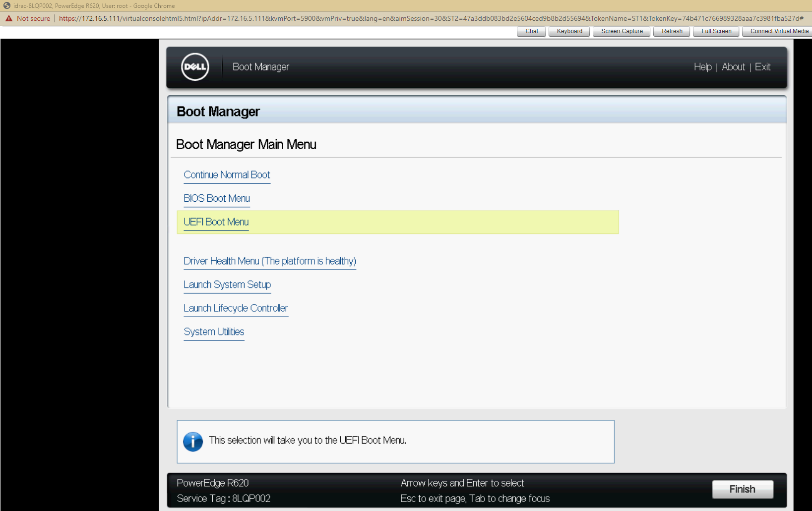
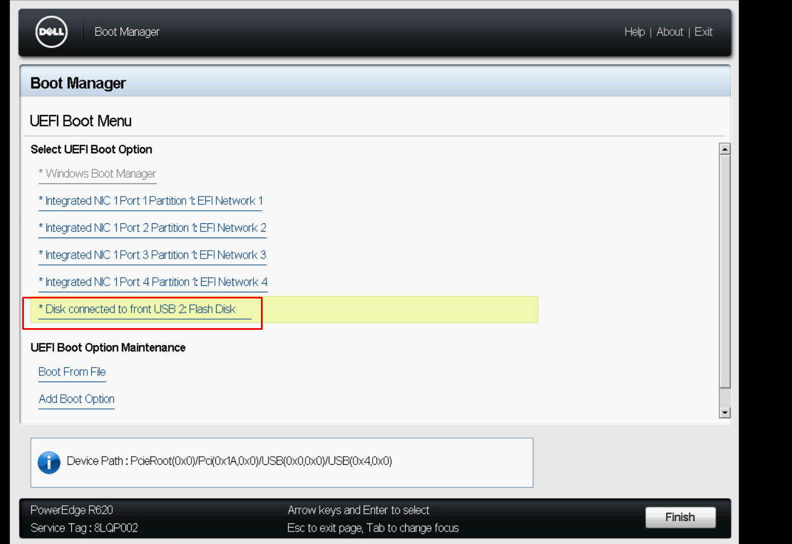
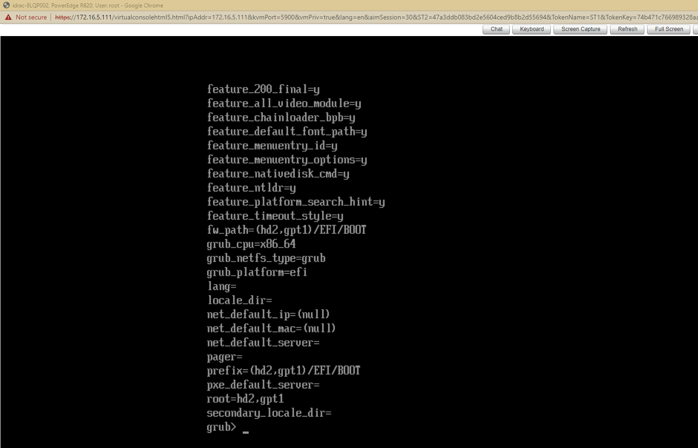
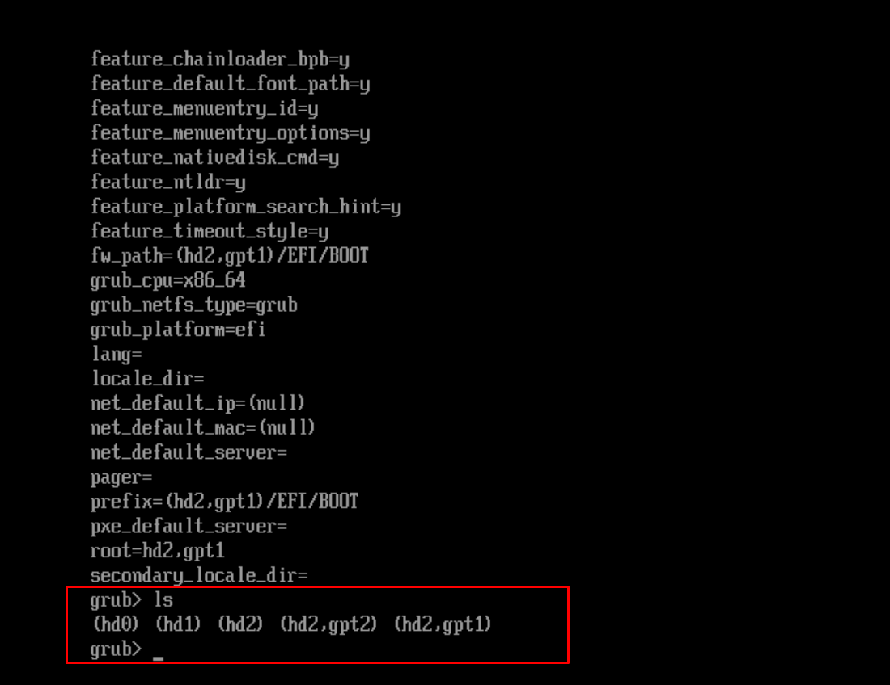
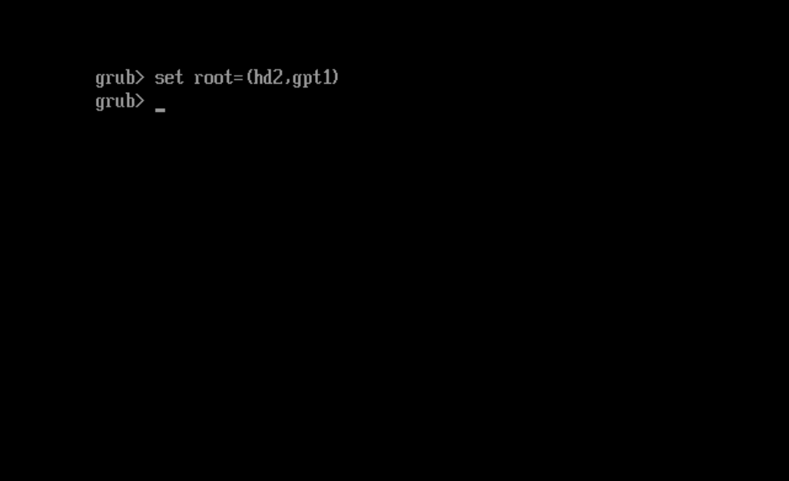

# Cài đặt CentOS 7
- Chuẩn bị USB boot CentOS 7

Bước 1: Khởi động lại máy chủ sau đó nhấn phím F11 để vào Boot Manager

- Tại `Boot Manager` chọn `UEFI Boot Menu` 



- Boot vào USB để cài đặt CentOS 7



- Sau khi boot vào USB ta sẽ thấy hệ thống không thể khởi động do trước đó hệ điều hành Windows đã ghi đè cấu hình. Ta sửa lỗi khởi động bằng cách sau
- Tại Grub Terminal

1. Kiểm tra các biến

```sh
set
```

- Kết quả cho thấy Grub được thiết lập để khởi động từ phân vùng (hd2, gpt1)


	
2. Lệnh `ls` liệt kê các phân vùng có sẵn trên đĩa

```sh
ls
```

- Đầu ra hiển thị danh sách phân vùng




3. Đặt phân vùng khởi động làm giá trị của biến `root`. Ví dụ sử dụng phân vùng có tên `(hd2,gpt1)`

```sh
set root=(hd2,gpt1)
```



4. Tải normal chế độ khởi động
```sh
insmod normal
```

5. Khởi động chế độ `normal`
```sh
normal
```

6. Tải Linux kernal bằng lệnh

```sh
linux /boot/vmlinux-4.2.0-16-generic root=/dev/sda1 ro
```

