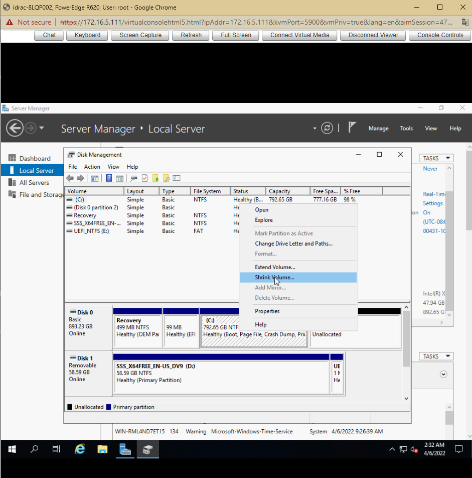

# Cài đặt OS theo yêu cầu

Server có 2 ổ 480:
+ Cài đặt windows server 2019
+ Gom 2 ổ vật lý thành 1 ổ sao cho dung lượng 1 ổ sau khi gom là 960 GB chia: 1 phân vùng OS 100GB, Data 500GB, phân vùng backup còn lại
+ Cấu hình IP 172.16.3.200/20. gateway 172.16.10.1
+ Enable firewall, đổi port remote 6789, chỉ allow cho IP 172.16.3.188 được phép remote vào

## Cài đặt Windows Server 2019

Bước 1: Cấu hình RAID 0 cho OS
- Khởi động lại máy chủ sau đó nhấn tổ hợp phím `Ctrl + R` để vào menu cấu hình RAID


- Nhấn F2 và chọn `Clear Config` -> `Yes` để xóa cấu hình RAID trước đó


- Ta thấy 2 ổ cứng có dung lượng 446.62 GB như nhau


- Cấu hình RAID 0
	+ Nhấn F2 và chọn `Create New VD` và làm theo như hình dưới

	
	
	+ Để lưu cấu hình, ta di chuyển đến ổ mới tạo nhấn F2 -> `Initialization` -> `Fast Init`

	
	
	+ Khởi động lại máy chủ

Bước 2: Cài đặt Windows Server 2019

- Sau khi khởi động lại máy chủ nhấn phím F11 để vào `BIOS Boot Manager`

- Tại `BIOS Boot Manager` chọn `BIOS Boot Menu`


- Thực hiện Boot vào USB để cài đặt Windows Server 2019


- Hệ thống khởi động, chọn ngôn ngữ và thời gian và bàn phím cho hệ điều hành. Sau đó ấn `Next`


- Chọn `Install Now`


- Lựa chọn hệ điều hành muốn cài đặt


- Lựa chọn `Custom: Install Windows only (advanced)` 


- Tiếp đến chọn ví trí mà ta muốn cài đặt hệ điều hành. Ta có thể thêm các đĩa bổ sung bằng cách chọn `New` -> sau chọn `Next`


- Quá trình cài đặt sẽ tiếp tục diễn ra, tùy thuộc vào cấu hình của máy và ổ đĩa, thời gian sẽ diễn ra khoảng 10 phút


- Sau khi quá trình cài đặt hoàn tất và khởi động lại, ta phải đặt mật khẩu cho tài khoản Administrator trước khi đăng nhập vào hệ điều hành


- Ấn `Finish` và đăng nhập vào hệ thống. Sử dụng `Ctrl + Alt + Del` để unlock. Khi sử dụng WMware thì tổ hợp phím sẽ là `Ctrl + Alt + Insert`


## Gom 2 ổ vật lý thành 1 ổ: phân vùng OS 100GB, Data 500GB, phân vùng backup còn lại.
- Bấm tổ hợp phím Win + R -> Nhập diskmnmt.msc. Cửa sổ Disk Management hiện ra 

- Click chuột phải vào ổ đĩa cần chia -> Chọn `Shrink Volume`



- Tại cửa số mới tại `Enter the amount of space to shrink in MB` -> Nhập dung lượng muốn chia từ ổ đĩa vừa chọn sau đó nhấp `Shrink`


- Phân vùng kết thúc, ta có một ổ đĩa mới, click chuột phải vào phân vùng mới chọn `New Simple Volume`. Sau đó chọn `Next`


- Cửa sổ mới hiện ra, ta có thể tùy chỉnh định dạng ổ đĩa và tên sau đó chọn `Next`


- Ấn `Finish` để hoàn thành việc chia ổ cứng


- Tiếp tục tạo các phân vùng Data và Backup


## Cấu hình IP 172.16.3.200/20. gateway 172.16.10.1

- Khởi chạy Server Manager. Chọn `NIC1`


- Nhấp chuột phải vào NIC và chọn `Properties`


- Chọn `Internet Protocol Version 4 (TCP/IPv4)` -> `Use the following IP address`

- Đặt IP và gateway theo yêu cầu, sau đó chọn `OK`


- Sau khi đặt địa chỉ IP tĩnh, các thay đổi sẽ được kích hoạt trên `Server Manager`


## Enable firewall, đổi port remote 6789, chỉ allow cho IP 172.16.3.188 được phép remote vào

1. Enable firewall

- `Start` -> `Settings` -> `Update & Security`


- Chọn `Windows Security` -> `Firewall & network protection`. Tại `Domain network, Private Network, Public network` option `Windows Defender Firewall` chọn `On`


2. Đổi port remote thành 6789
- Remote Desktop sử dụng giao thức RDP và lắng nghe trên port mặc định là TCP 3389. Nhưng nếu ta cần bảo mật dịch vụ `Remote Desktop` thì cần phải thay đổi port mặc định

Bước 1: Mở cửa sổ `Registry Editor`

- Nhấn tổ hợp `Win + R` nhập `regedit.exe`

Bước 2: Truy cập vào đường dẫn sau để thay đổi giá trị port `Remote Desktop`
```sh
HKEY_LOCAL_MACHINE\System\CurrentControlSet\Control\Terminal Server\WinStations\RDP-Tcp\PortNumber
```


- Tại `PortNumber` click chuột phải chọn `Modify`


- Tại cửa sổ `Edit DWORD`, click chọn `Decimal` để chuyển đổi format giá trị cấu hình hiện tại sang format số thập phân. Nhập giá trị port Remote Desktop muốn thay đổi là `6789`. Sau cùng bấm `OK` để hoàn tất việc thay đổi port cho dịch vụ `Remote Desktop` trên Windows Server 2019


