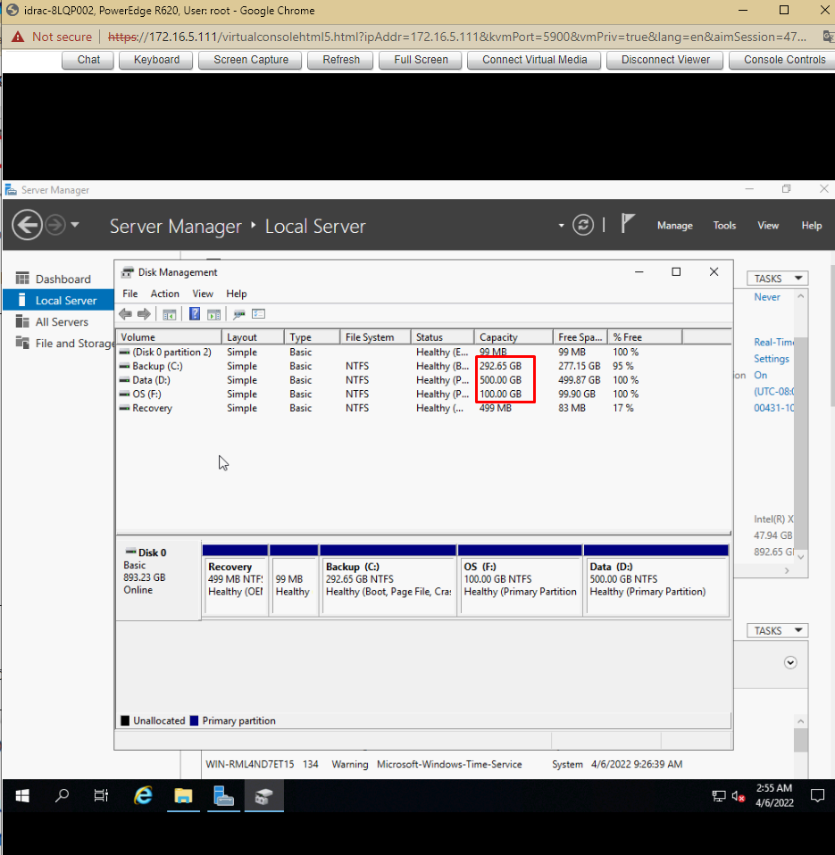

# Cài đặt OS theo yêu cầu

Server có 2 ổ 480:
+ Cài đặt windows server 2019
+ Gom 2 ổ vật lý thành 1 ổ sao cho dung lượng 1 ổ sau khi gom là 960 GB chia: 1 phân vùng OS 100GB, Data 500GB, phân vùng backup còn lại
+ Cấu hình IP 172.16.3.200/20. gateway 172.16.10.1
+ Enable firewall, đổi port remote 6789, chỉ allow cho IP 172.16.3.188 được phép remote vào

## Cài đặt Windows Server 2019

Bước 1: Cấu hình RAID 0 cho OS
- Khởi động lại máy chủ sau đó nhấn tổ hợp phím `Ctrl + R` để vào menu cấu hình RAID


- Nhấn F2 và chọn `Clear Config` -> `Yes` để xóa cấu hình RAID trước đó


- Ta thấy 2 ổ cứng có dung lượng 446.62 GB như nhau


- Cấu hình RAID 0
	+ Nhấn F2 và chọn `Create New VD` và làm theo như hình dưới

	
	
	+ Để lưu cấu hình, ta di chuyển đến ổ mới tạo nhấn F2 -> `Initialization` -> `Fast Init`

	
	
	+ Khởi động lại máy chủ

Bước 2: Cài đặt Windows Server 2019

- Sau khi khởi động lại máy chủ nhấn phím F11 để vào `BIOS Boot Manager`

- Tại `BIOS Boot Manager` chọn `BIOS Boot Menu`


- Thực hiện Boot vào USB để cài đặt Windows Server 2019


- Hệ thống khởi động, chọn ngôn ngữ và thời gian và bàn phím cho hệ điều hành. Sau đó ấn `Next`


- Chọn `Install Now`


- Lựa chọn hệ điều hành muốn cài đặt


- Lựa chọn `Custom: Install Windows only (advanced)` 


- Tiếp đến chọn ví trí mà ta muốn cài đặt hệ điều hành. Ta có thể thêm các đĩa bổ sung bằng cách chọn `New` -> sau chọn `Next`


- Quá trình cài đặt sẽ tiếp tục diễn ra, tùy thuộc vào cấu hình của máy và ổ đĩa, thời gian sẽ diễn ra khoảng 10 phút


- Sau khi quá trình cài đặt hoàn tất và khởi động lại, ta phải đặt mật khẩu cho tài khoản Administrator trước khi đăng nhập vào hệ điều hành


- Ấn `Finish` và đăng nhập vào hệ thống. Sử dụng `Ctrl + Alt + Del` để unlock. Khi sử dụng WMware thì tổ hợp phím sẽ là `Ctrl + Alt + Insert`


## Gom 2 ổ vật lý thành 1 ổ: phân vùng OS 100GB, Data 500GB, phân vùng backup còn lại.
- Bấm tổ hợp phím Win + R -> Nhập diskmnmt.msc. Cửa sổ Disk Management hiện ra 

- Click chuột phải vào ổ đĩa cần chia -> Chọn `Shrink Volume`


- Tại cửa số mới tại `Enter the amount of space to shrink in MB` -> Nhập dung lượng muốn chia từ ổ đĩa vừa chọn sau đó nhấp `Shrink`


- Phân vùng kết thúc, ta có một ổ đĩa mới, click chuột phải vào phân vùng mới chọn `New Simple Volume`. Sau đó chọn `Next`


- Cửa sổ mới hiện ra, ta có thể tùy chỉnh định dạng ổ đĩa và tên sau đó chọn `Next`


- Ấn `Finish` để hoàn thành việc chia ổ cứng


- Tiếp tục tạo các phân vùng Data và Backup



## Cấu hình IP 172.16.3.200/20. gateway 172.16.10.1

- Khởi chạy Server Manager. Chọn `NIC1`


- Nhấp chuột phải vào NIC và chọn `Properties`


- Chọn `Internet Protocol Version 4 (TCP/IPv4)` -> `Use the following IP address`

- Đặt IP và gateway theo yêu cầu, sau đó chọn `OK`


- Sau khi đặt địa chỉ IP tĩnh, các thay đổi sẽ được kích hoạt trên `Server Manager`


## Enable firewall, đổi port remote 6789, chỉ allow cho IP 172.16.3.188 được phép remote vào

1. Enable firewall

- `Start` -> `Settings` -> `Update & Security`


- Chọn `Windows Security` -> `Firewall & network protection`. Tại `Domain network, Private Network, Public network` option `Windows Defender Firewall` chọn `On`


2. Đổi port remote thành 6789
- Remote Desktop sử dụng giao thức RDP và lắng nghe trên port mặc định là TCP 3389. Nhưng nếu ta cần bảo mật dịch vụ `Remote Desktop` thì cần phải thay đổi port mặc định

Bước 1: Mở cửa sổ `Registry Editor`

- Nhấn tổ hợp `Win + R` nhập `regedit.exe`

Bước 2: Truy cập vào đường dẫn sau để thay đổi giá trị port `Remote Desktop`
```sh
HKEY_LOCAL_MACHINE\System\CurrentControlSet\Control\Terminal Server\WinStations\RDP-Tcp\PortNumber
```


- Tại `PortNumber` click chuột phải chọn `Modify`


- Tại cửa sổ `Edit DWORD`, click chọn `Decimal` để chuyển đổi format giá trị cấu hình hiện tại sang format số thập phân. Nhập giá trị port Remote Desktop muốn thay đổi là `6789`. Sau cùng bấm `OK` để hoàn tất việc thay đổi port cho dịch vụ `Remote Desktop` trên Windows Server 2019


3. Cấu hình tường lửa cho cổng RDP tùy chọn 
- Để cấu hình tường lửa cho RDP ta làm như sau
Bước 1: Nhấn tổ hợp `Win + R` để mở `Run` và nhập `wf.msc` rồi nhấn Enter.

Bước 2: Trong cửa sổ `Windows Defender Firewall with Advanced Security` chọn `Inbound Rules` ở menu bên tay trái

Bước 3: Chọn `New Rule` ở thanh bên tay phải 


Bước 4: Trong cửa sổ `New Inbound Rule Wizard` chọn `Port` và nhấn `Next` để tiếp tục


Bước 5: Tại mục `Does this rule apply to TCP or UDP`, chọn TCP. Sau đó tại mục `Does this rule apply to all local ports or specifi local ports`, ta chọn `Special local ports` và nhập vào ô giá trị cổng mà ta thiết lập (6789). Nhấn `Next` để tiếp tục 


Bước 6: Tại menu `Action` chọn `Allow the Connection` rồi chọn `Next` 


Bước 7: Trong menu `Profile`, chọn tất cả các mục để tối đa khả năng truy cập hoặc bỏ chọn ở mục `Public` để chặn các truy cập từ mạng công cộng. Nhấn `Next` để tiếp tục


Bước 8: Đặt tên cho quy tắc mới và mô tả quy tắc mới (tùy chọn) rồi nhấn Finish để hoàn thành


4. Kết nối Remote Desktop bằng một cổng tùy chỉnh

Bước 1: Mở `Run` nhập `mstsc` rồi nhấn Enter

Bước 2: Trong cửa sổ Remote Desktop Connection, nhập địa chỉ `IP:port` để kết nối. Ở đây ta nhập
```sh
172.16.3.200:6789
```


- Nhập User và Password để kết nối


5. Chỉ allow cho IP 172.16.3.188 được phép remote vào

- Tiến hành xóa Rule cũ để chặn tất cả các IP remote đến Windows Server 2019
- Tạo rule mới chỉ Allow cho IP 172.16.3.188 và 172.16.2.27 được phép remote thông qua port 6789

- New Rule -> chọn `Custom` -> `Next` 


- Tại tab `Program`. Chọn `All programs` -> `Next`


- Tại tab `Protocol and Ports`, option `Protocol type` chọn `TCP`, tại option `Local port` chọn `Specific Ports` và nhập port muốn thiết lập


- Tại tab `Scope` option `Which remote IP addresses does this rule apply to`, chọn `These IP addresses` và thêm IP muốn allow


- Tại tab `Action`. Chọn `Allow the connection` -> `Next`


- Tại tab `Profile` -> `Next`


- Nhập tên cho rule


