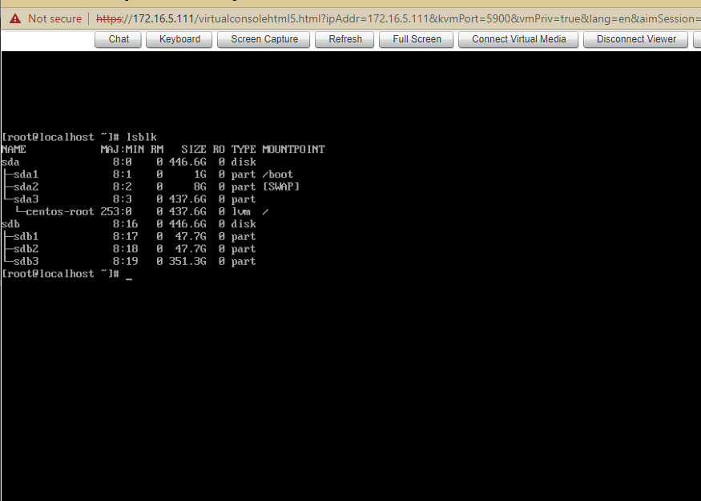
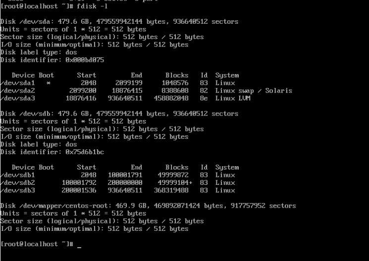
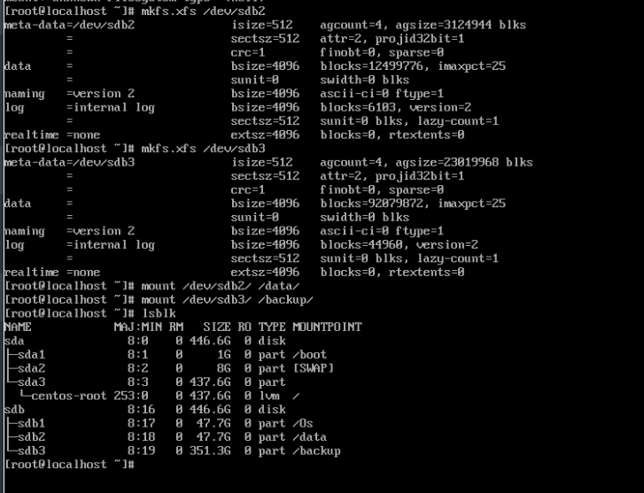

# Phân vùng ổ cứng trên CentOS 7

- Đăng nhập với quyền root và kiểm tra ổ cứng đã tạo

```sh
lsblk
```



- Tạo thêm phân vùng mới

```sh
fdisk /dev/sdb
```

- Sau đó nhập `n` -> `p` , chọn số thứ tự phân vùng mới muốn tạo sau đó nhận `w` để lưu và thoát

- Kiểm tra bằng lệnh

```sh
fdisk -l
```



- Định dạng phân vùng đĩa cứng
```sh
mkfs.xfs /dev/sdb1
mkfs.xfs /dev/sdb2
mkfs.xfs /dev/sdb3
```


- Tạo các thư mục muốn mount

```sh
mkdir Os
mkdir data
mkdir backup
```

- Mount ổ cứng với thư mục

```sh
mount /dev/sdb1/ /Os/
mount /dev/sdb2/ /data/
mount /dev/sdb3/ /backup/
```

- Kiểm tra 


