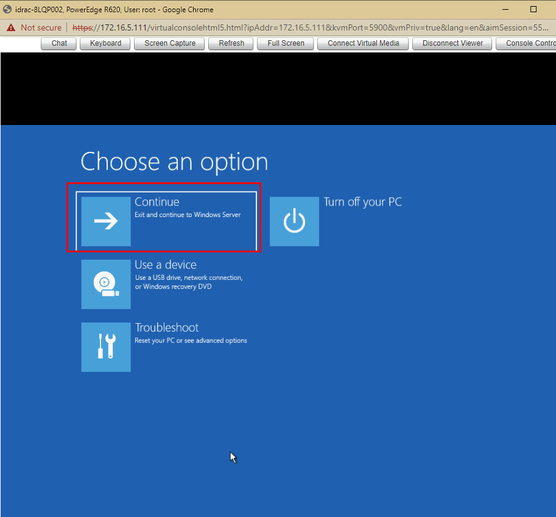

# Reset mật gốc trong Windows Server

Ta làm giống như reset mật khẩu Administrator Windows Server trên VMware

https://github.com/Tubui160999/thuctap_nhanhoa/blob/master/C%C3%A0i%20%C4%91%E1%BA%B7t%20Windows%20Server/Reset%20password%20Administrator%20tr%C3%AAn%20Windows%20Server.md

Bước 1: Khởi động lại server và boot vào USB. Sau đó chọn `Next`


Bước 2: Chọn `Repair your computer` để tiếp tục


Bước 3: Kế tiếp, chọn `Troubleshoot` -> `Command Prompt` để mở cửa sổ dòng lệnh


Bước 4: Tại cửa sổ `Command Prompt` và thực hiện chạy các lệnh sau

- Tìm ổ đĩa chứa thư mục `Windows`
```sh
C:
cd Windows\system32
ren Utilman.exe Utilman.exe.old
copy cmd.exe Utilman.exe 
```


Bước 6: Tắt cửa sổ và chọn `Continue`



Bước 5: Sau khi khởi động lại Windows Server, nhấn tổ hợp `Windows + U` hoặc nhấn vào biểu tượng đồng hồ tại màn hình đăng nhập để mở cửa sổ Command Prompt và chạy lệnh
```sh
net user administrator Tubui57091	/ Với user là administrator, password là Tubui57091
```


>> Bây giờ ta có thể đăng nhập vào Windows Server bằng tài khoản Administrator với mật khẩu vừa thay đổi