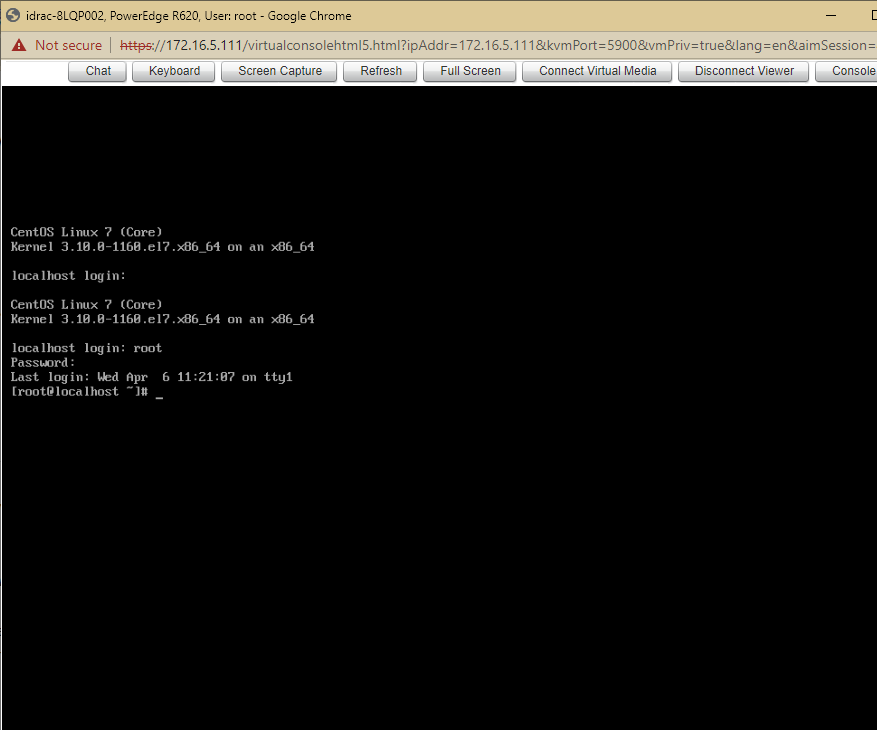

# Reset mật gốc trong CentOS

Ta làm giống như reset mật khẩu gốc CentOS trên VMware

https://github.com/Tubui160999/thuctap_nhanhoa/blob/master/C%C3%A0i%20%C4%91%E1%BA%B7t%20CentOS/Reset%20password%20tr%C3%AAn%20CentOS.md

- Khởi động lại hệ thống đến màn hình boot GRUB menu


- Chọn `e` để thay đổi chế độ boot. Tìm dòng có chữ `ro` và thay `ro` thành `rw init=/sysroot/bin/bash`


- Để lưu thay đổi ta nhấn `Ctrl + X` và đăng nhập vào chế độ 1 người dùng


- Tiến hành truy cập vào hệ thống bằng lệnh 

```sh
chroot /sysroot
```

- Tiến hành thay đổi mật khẩu root
```sh
passwd root
```

- Update thông tin selinux
```sh
touch /.autorelabel
```

- Thoát và khởi động lại hệ thống
```sh
exit
reboot
```


- Đăng nhập với mật khẩu mới


