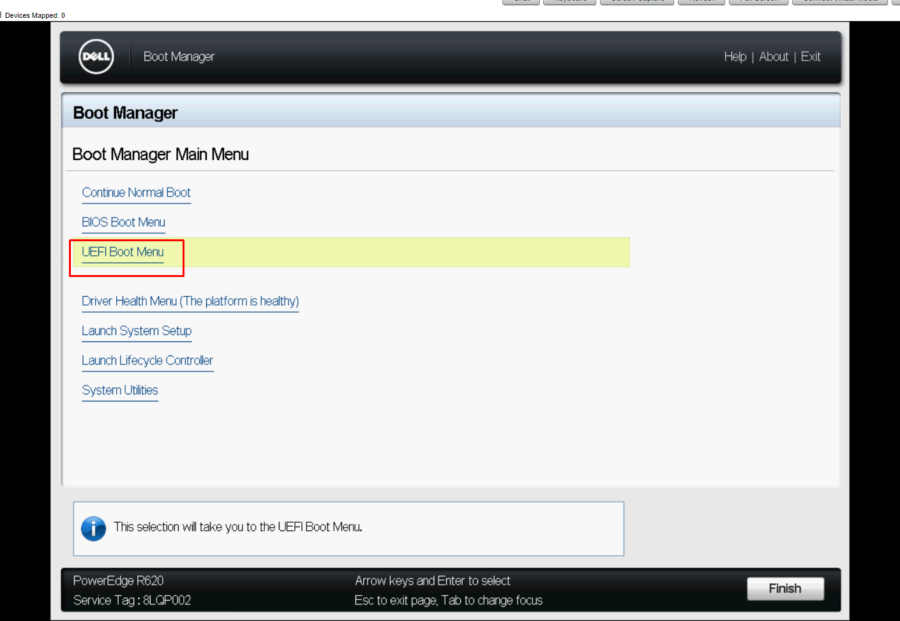
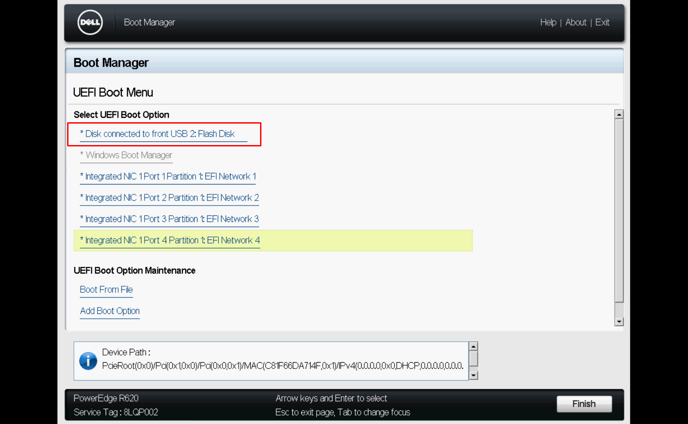
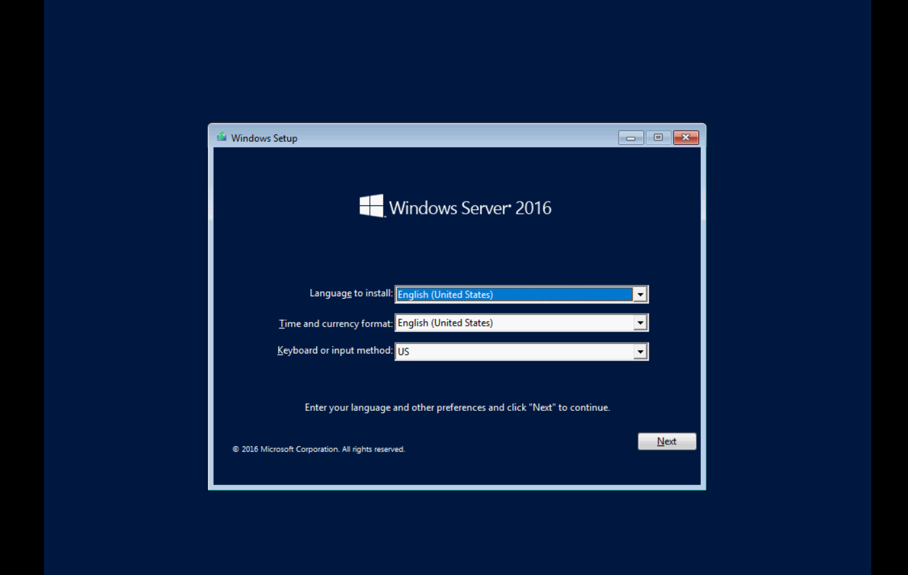

# Cài đặt Windows Server 2016
## Cấu hình Raid
Thao tác giống với khi cài Windows Server 2019

## Cài đặt Windows Server 2016
Bước 1: Khởi động lại máy chủ sau đó nhấn phím F11 để vào Boot Manager

Bước 2: Tại Boot Manager, chọn UEFI Boot Menu

- Tiến hành boot vào USB để cài đặt Windows Server 2016

- Hệ thống khởi động, chọn ngôn ngữ và thời gian và bàn phím cho hệ điều hành. Sau đó ấn `Next`

- Chọn `Install Now` để tiến hành cài đặt

- Lựa chọn hệ điều hành muốn cài đặt

- Đồng ý với điều khoản của Microsoft

- Lựa chọn `Custom: Install Windows only (advanced)`

- Tiếp đến lựa chọn vị trí ta muốn cài đặt hệ điều hành

- Quá trình cài đặt sẽ tiếp tục diễn ra, tùy thuộc vào cấu hình của máy và ổ đĩa, thời gian sẽ diễn ra khoảng 10 phút

- Sau khi quá trình cài đặt hoàn tất và khởi động lại, ta phải đặt mật khẩu cho tài khoản Administrator trước khi đăng nhập vào hệ điều hành

- Sử dụng Ctrl + Alt + Del để unlock 

