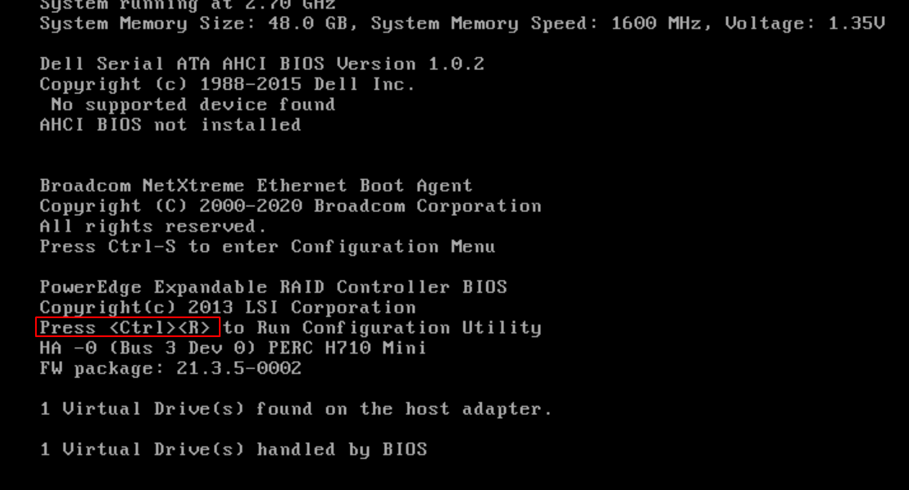
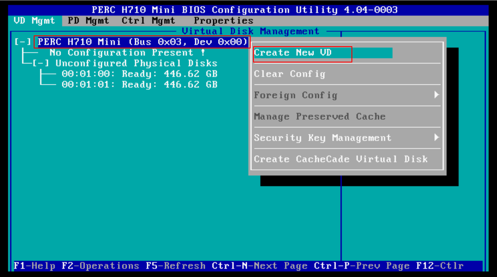
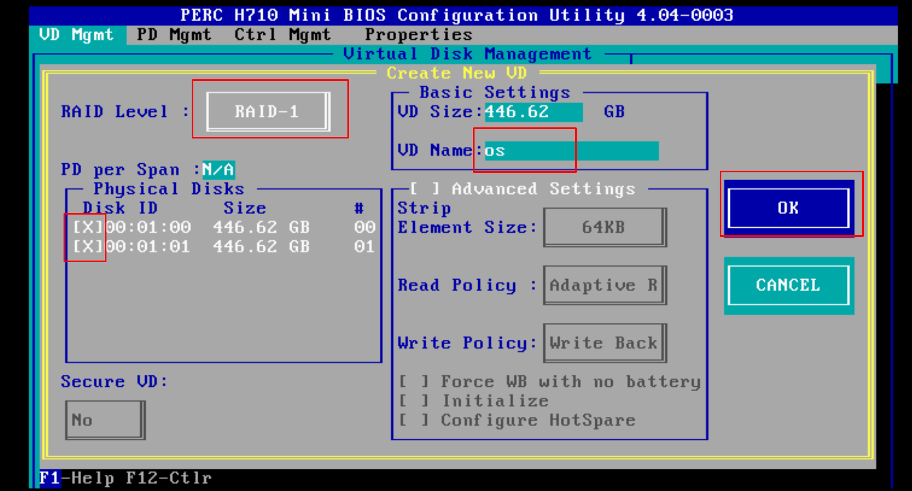
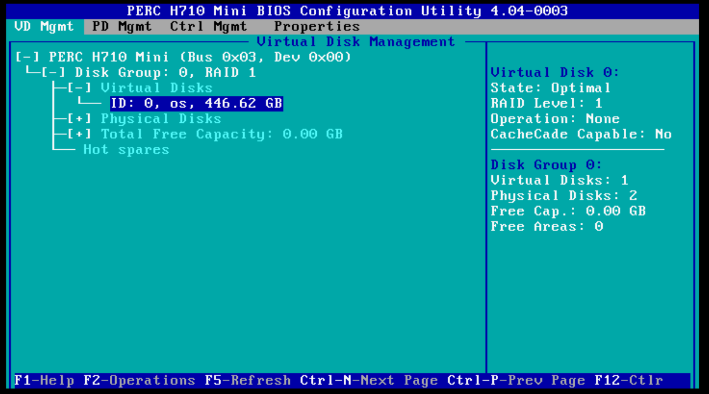
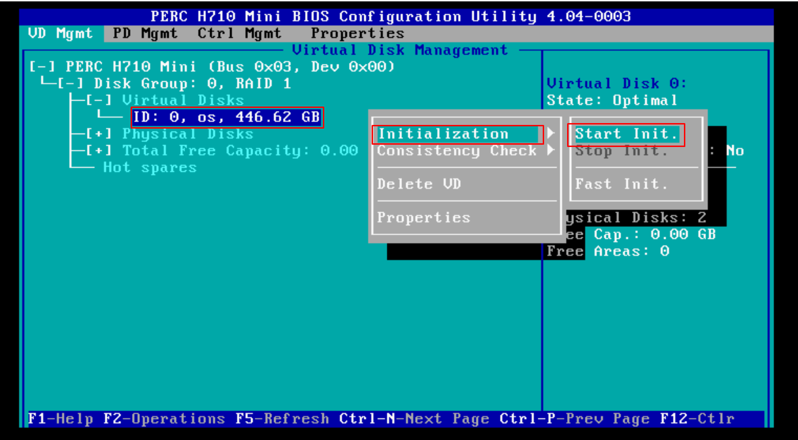
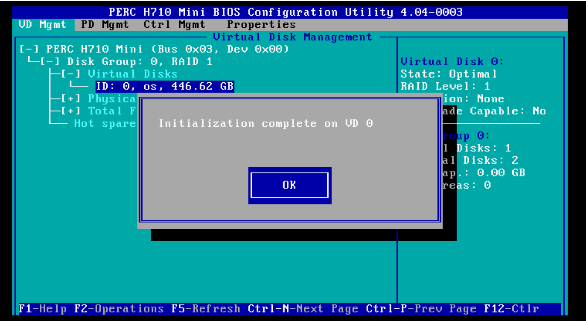
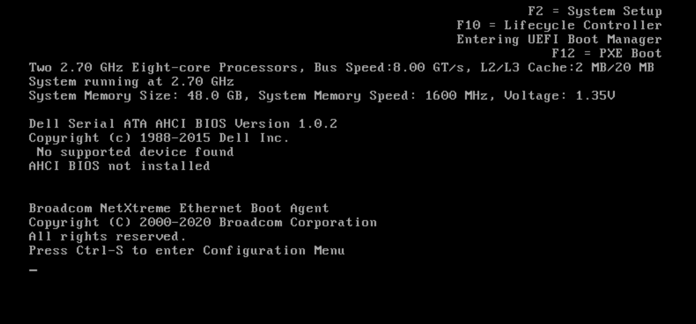
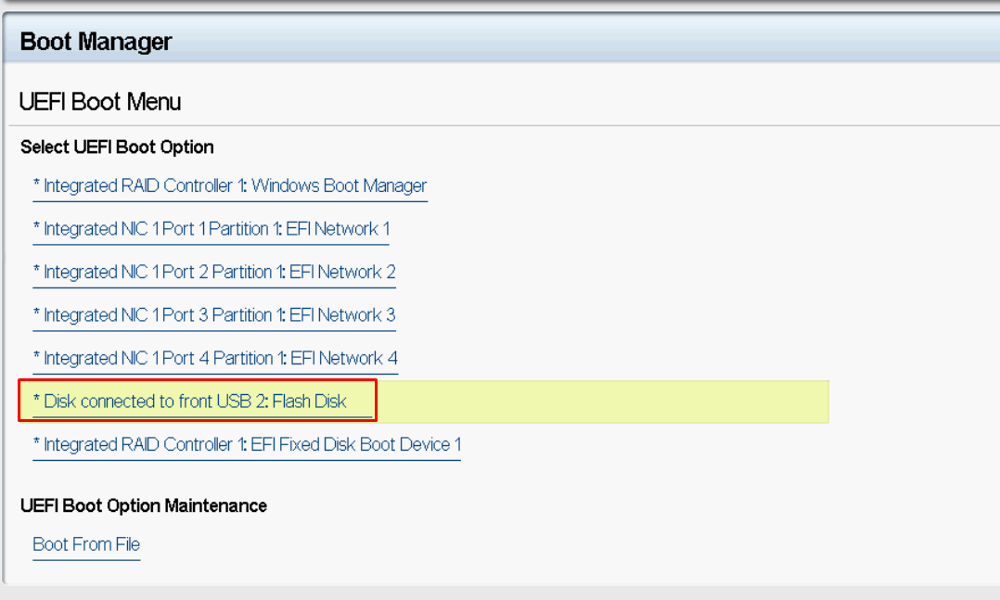
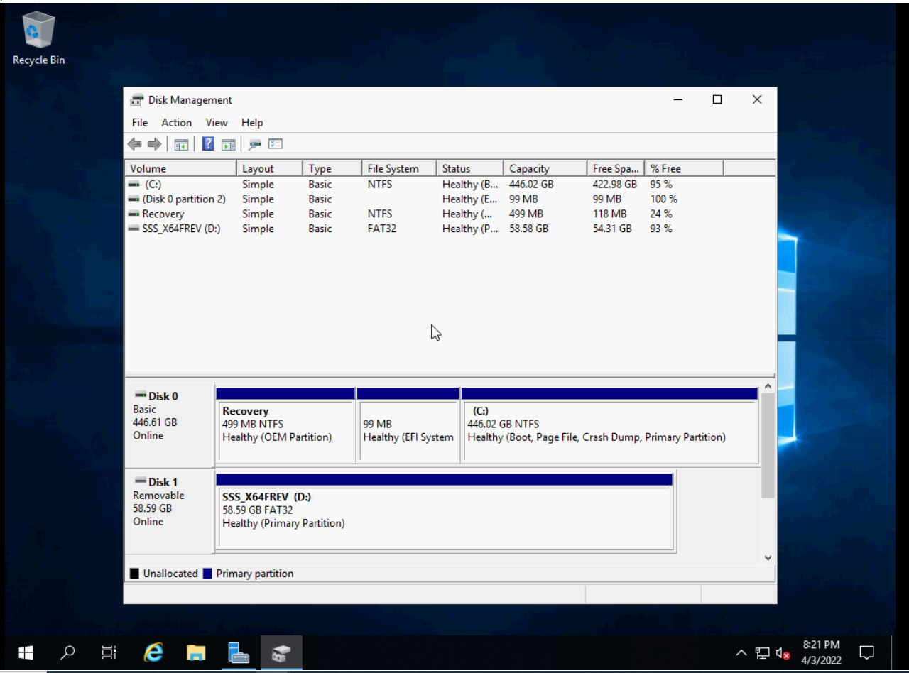

# Cài đặt Windows Server 2019 trên máy chủ vật lý

## Cấu hình raid
Bước 1: Khởi động lại máy chủ sau đó nhấn tổ hợp phím `Ctrl + R` để vào menu cấu hình raid

Bước 2: Cấu hình raid

- Di chuyển lên dòng đầu tiên và nhấn F2 sau đó chọn `Create New VD`

- Chọn RAID level, chọn ổ cứng muốn cấu hình RAID, sau đó đặt tên cho đĩa ảo và cuối cùng chọn `OK`

- Sau khi cấu hình xong Virtual Disks sẽ được hiển thị

- Để lưu cấu hình ta di chuyển đến đĩa vừa tạo và nhấn F2 -> Initiallization -> Fast Init -> YES

## Cài đặt Windows Server 2019

Bước 1: Khởi động lại máy chủ sau đó nhấn phím F11 để vào Boot Manager

Bước 2: Tại Boot Manager, chọn UEFI Boot Menu

- Boot vào USB để cài đặt Windows Server 2019

Bước 3 Cài đặt Windows Server 2019

- Thực hiện cài đặt Windows Server 2019 như đã cài trước đó 

https://github.com/Tubui160999/thuctap_nhanhoa/blob/master/C%C3%A0i%20%C4%91%E1%BA%B7t%20Windows%20Server/1.%20Windows%20Server%202019.md

