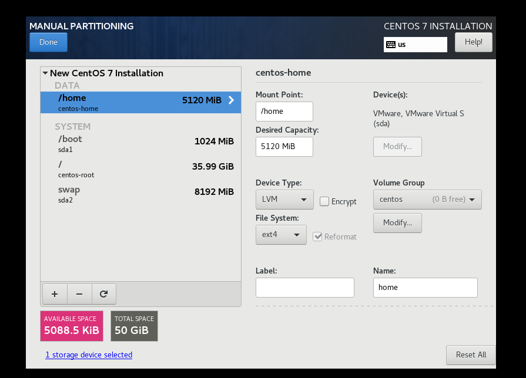
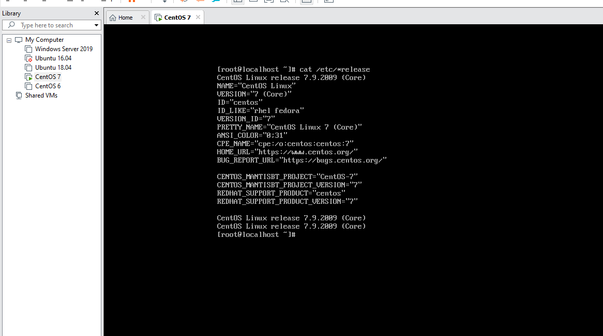

# Cài đặt CentOS 7.9.2009
Bước 1: Tải file iso của CentOS 6 tại

https://mirrors.nhanhoa.com/centos/7.9.2009/isos/x86_64/CentOS-7-x86_64-DVD-2009.iso

Bước 2: Cài đặt CentOS 7.9
- Tạo máy ảo trên môi trường VMware
- Máy ảo sẽ bắt đầu boot vào ISO và bắt đầu quá trình cài đặt CentOS 7.9

- Lựa chọn Install CentOS 7

- Thiết lập ngôn ngữ. Mặc định `English`, sau đó chọn `Continue`

- Thiết lập ngày giờ `Date & Time` -> Trỏ chuột vào bản đồ để chọn giờ Việt Nam -> `Done`

- Ở mục `Software Selection`, chọn `Minimal Install` để không dùng GUI cho hệ điều hành này. Sau đó chọn `Done`

- Chọn mục `Installation Destination` để chọn ổ cứng 

- Tiến hành phân vùng ổ cứng
	+ /boot: 1 Gb
		+ Device type: Standard Partition
		+ File System: ext4
	+ /swap: 5 Gb
		+ Device type: Standard Partition
		+ File System: swap
	+ /home: 10 Gb
		+ Device System: LVM
		+ File System: ext4
	+ /: Tổng dung lượng còn lại
		+ Device System: LVM
		+ File System: ext4

- Tiếp tục chọn Network & Hostname. Ta click vào nút OFF để máy có kết nối về network. Nhập hostname tùy ý

- Chọn `Begin Instalation` để thực hiện cài đặt

- Sau đó nhập mật khẩu cho tài khoản `root` và chờ các bước cài đặt diễn ra
- Sau khi cài đặt hoàn tất, chọn `Reboot System` để máy khởi động lại và bắt đầu đăng nhập vào OS với tài khoản root và mật khẩu nhập trước nó
- Đăng nhập vào máy sau khi cài

- Kiểm tra hệ điều hành

