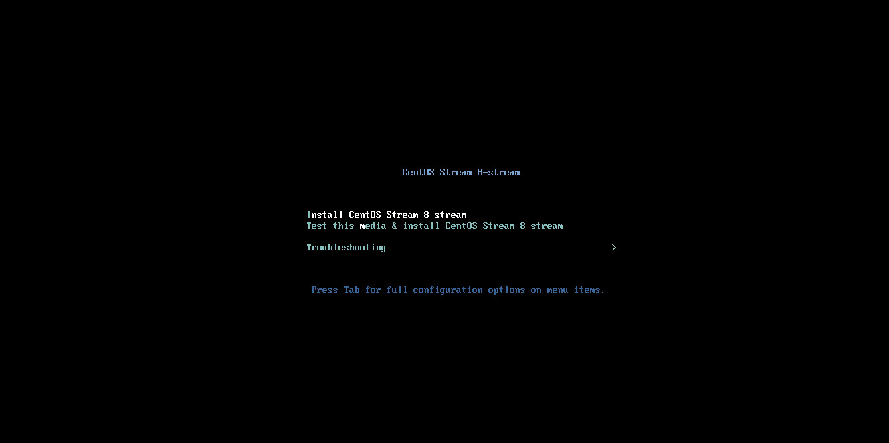
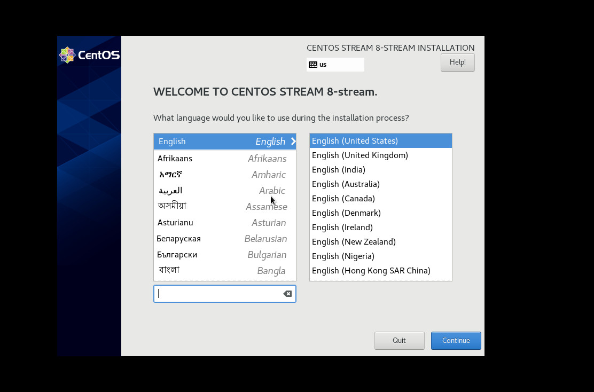
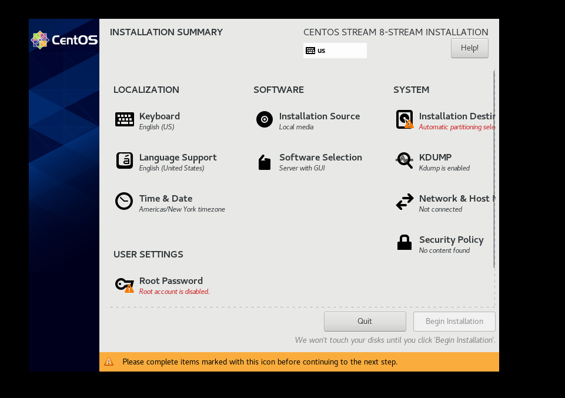
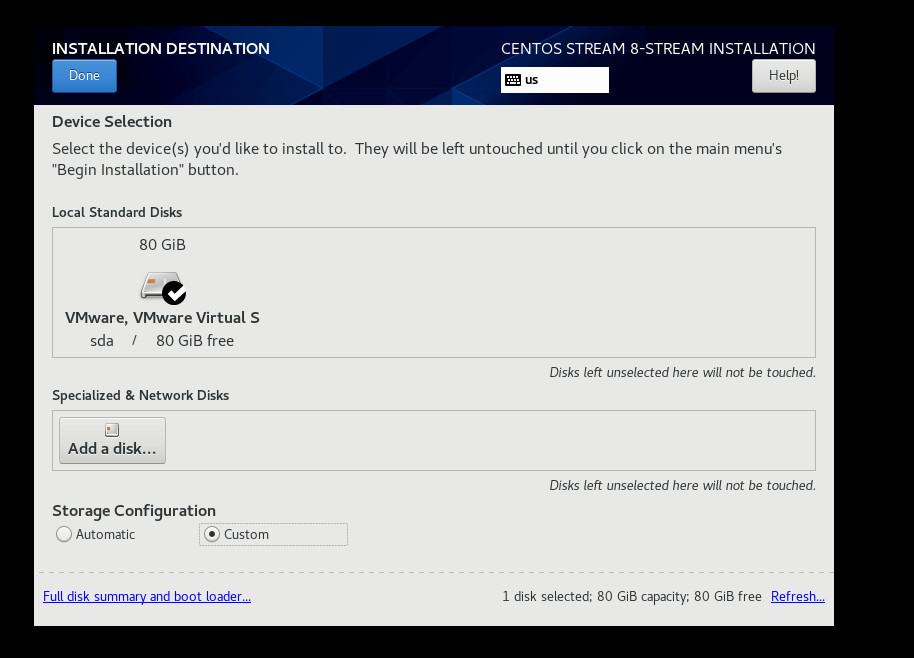
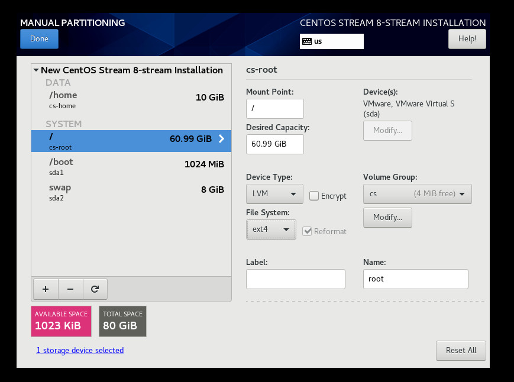
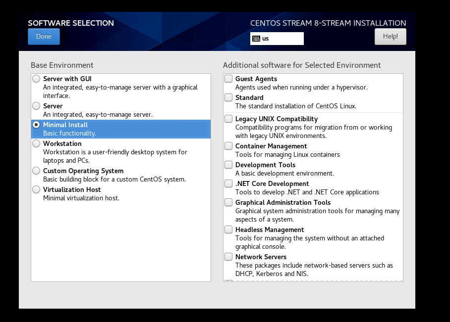
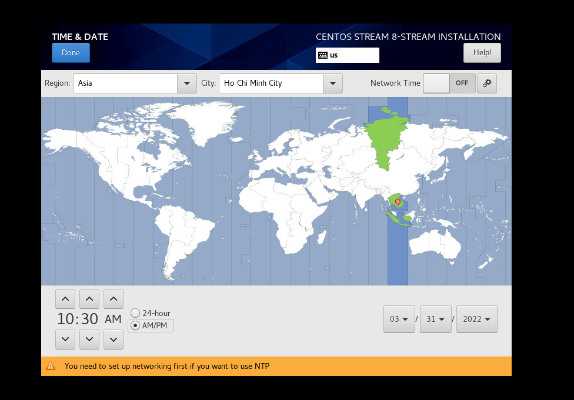
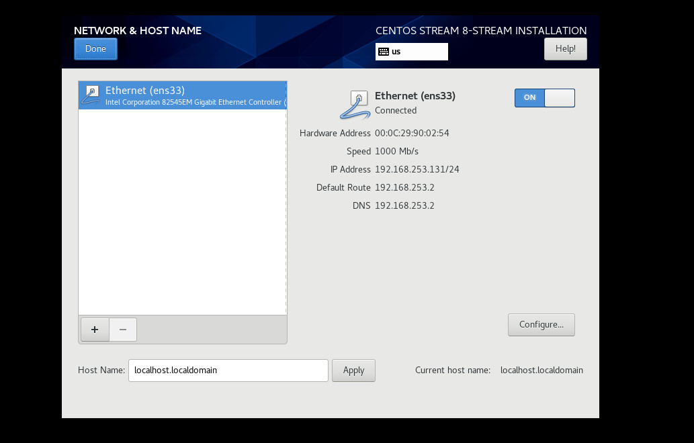
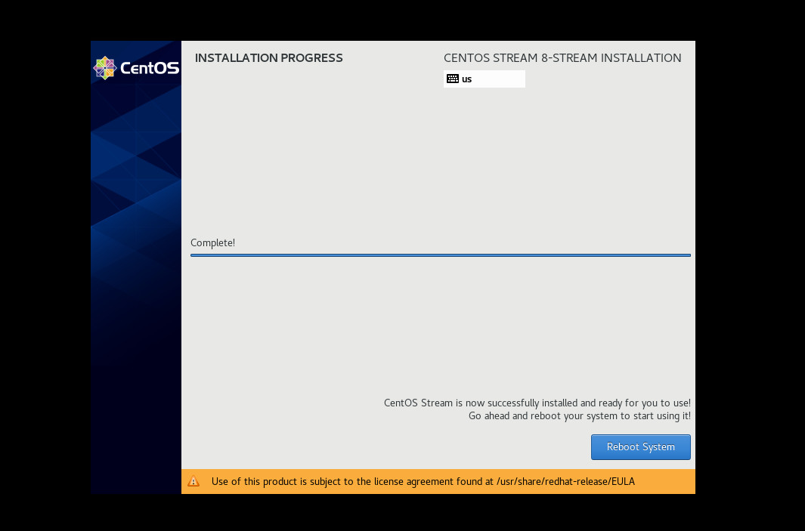
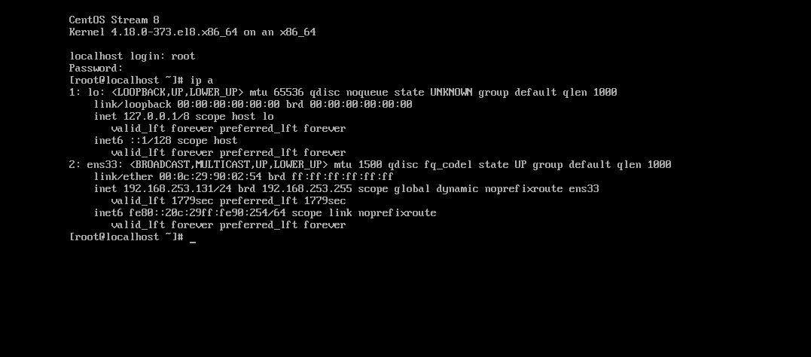

# Cài đặt CentOS 8 trên VMware
Bước 1: Tải file iso của CentOS 8
```sh
http://mirrors.nhanhoa.com/centos/8-stream/isos/x86_64/CentOS-Stream-8-x86_64-20220328-dvd1.iso
```

Bước 2: Cài CentOS 8
- Tạo máy ảo trên môi trường VMware
- Khởi động máy và chọn boot vào CentOS. Lựa chọn dòng `Install Centos Stream 8-stream`



- Chọn ngôn ngữ cho hệ điều hành, ở đây chọn `English`. Sau đó chọn `Continue`



- Chọn ổ cứng để cài OS, ở đây lựa chọn mục `Installation Destination`



- Chọn `Done`



- Tiến hành phân vùng ổ cứng:
	+ /boot: 1 Gb
		+ Device type: Standard Partition
		+ File System: ext4
	+ /swap: 8 Gb
		+ Device type: Standard Partition
		+ File System: swap
	+ /home: 10 Gb
		+ Device System: LVM
		+ File System: ext4
	+ /: Tổng dung lượng còn lại
		+ Device System: LVM
		+ File System: ext4



- Sau khi chọn Done, ta sẽ quay về giao diện tiếp và chọn mục `Software Selection` để lựa chọn chế độ không dùng GUI



- Chọn `Minimal Install` để không dùng GUI cho hệ điều hành sau này. Sau đó chọn `Done`

- Sau khi chọn `Done`, ta quay về màn hình lúc trước và chọn `Time & Date`. Nên chọn timezone chuẩn với giờ Việt Nam



- Di chuột vào khu vực Việt Nam ở bản đò, tab `region` và `city` sẽ tự chọn đúng chuẩn. Sau đó chọn `Done`

- Tiếp tục chọn Network & Hostname

- Sau khi chọn Network & Host name ta sẽ có giao diện chọn hostname và IP bên dưới. Ta click vào nút OFF để máy có kết nối về network. Nhập hostname tùy ý

- Ta có thể chọn mục `Configure` để cấu hình card mạng ở chết độ `Start` cùng OS hoặc có thể cấu hình sau



- Chọn `Begin Instalation` để thực hiện cài đặt
- Sau đó nhập mật khẩu cho tài khoản `root` và chờ các bước cài đặt diễn ra
- Sau khi cài đặt hoàn tất, chọn `Reboot System` đê máy khởi động lại và bắt đầu đăng nhập vào OS với tài khoản root và mật khẩu nhập trước nó



- Đăng nhập vào máy sau khi cài




