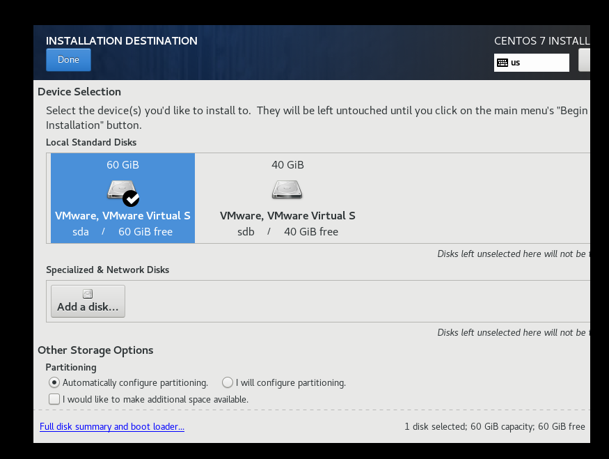
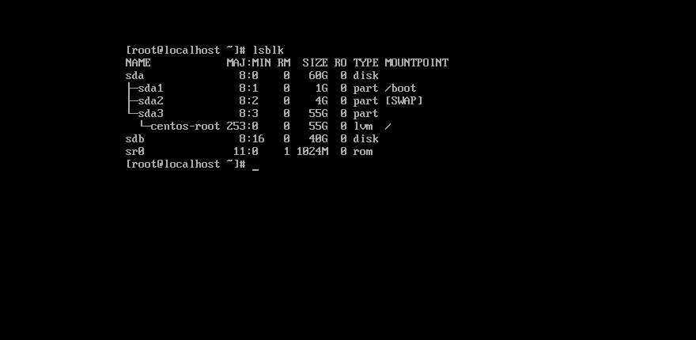
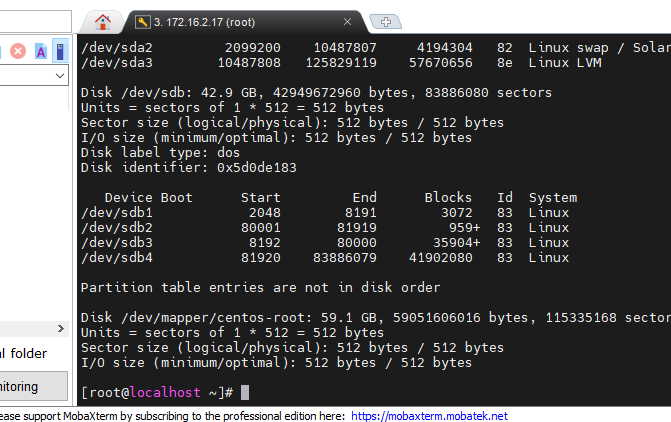
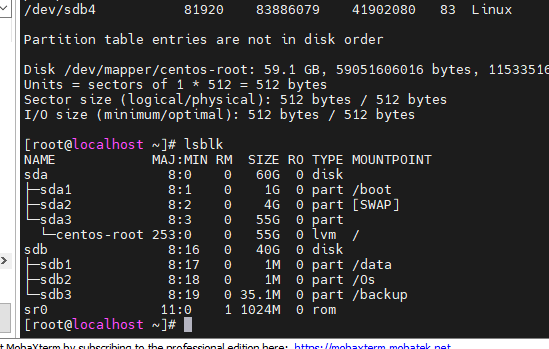

# Phân vùng ổ cứng trên CentOS 7
- Tạo 2 ổ cứng



- Cài đặt CentOS 7 như đã làm trước đó

https://github.com/Tubui160999/thuctap_nhanhoa/blob/master/C%C3%A0i%20%C4%91%E1%BA%B7t%20CentOS/CentOS%207.md

- Đăng nhập với quyền root và kiểm tra ổ cứng đã tạo
```sh
lsblk
```



- Tạo thêm phân vùng mới

```sh
fdisk /dev/sdb
```

- Sau đó nhập `n` -> `p` , chọn số thứ tự phân vùng mới muốn tạo sau đó nhận `w` để lưu và thoát
- Kiểm tra



- Tạo các thư mục muốn mount

```sh
mkdir Os
mkdir data
mkdir backup
```

- Mount ổ cứng với thư mục
```sh
mount -t ext4 /dev/sdb1

mount /dev/sdb1/ /data/
mount /dev/sdb2/ /Os/
mount /dev/sdb3/ /backup/
```

- Kiểm tra 
```sh
lsblk
```


