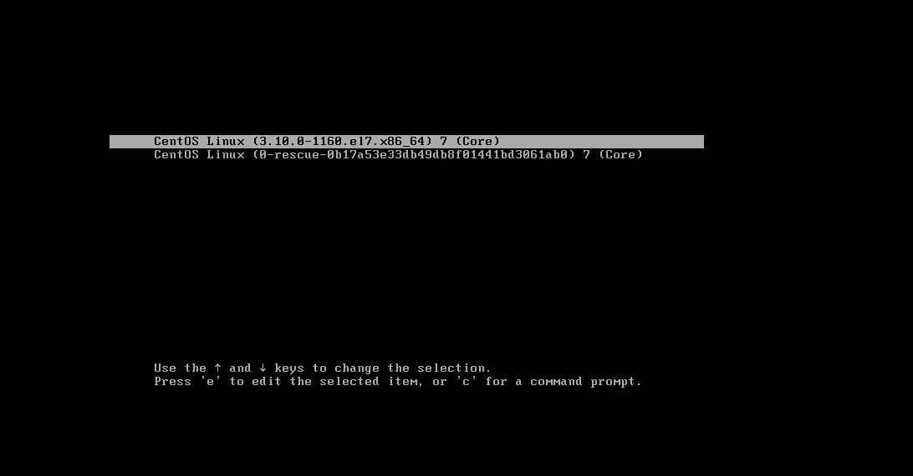
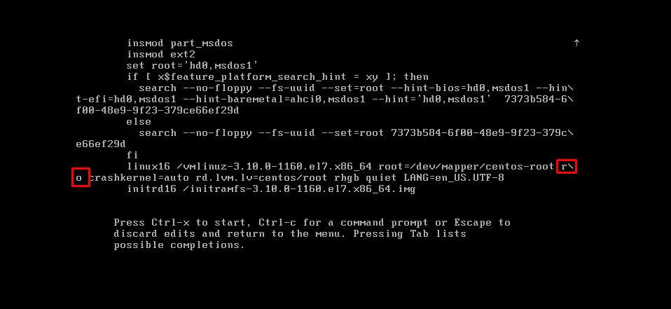
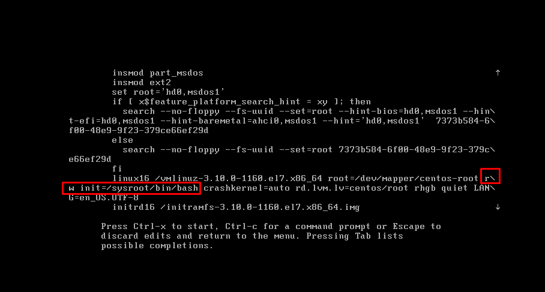
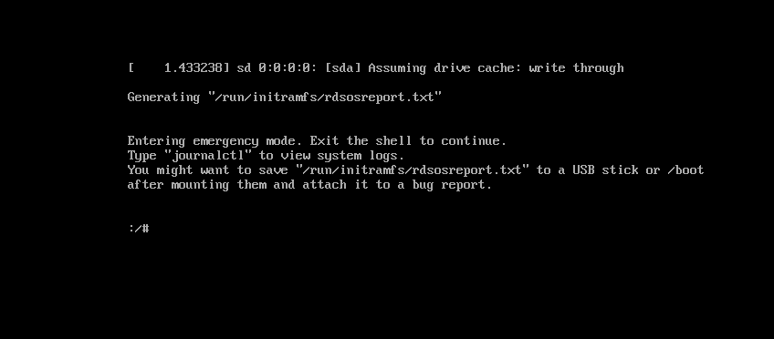
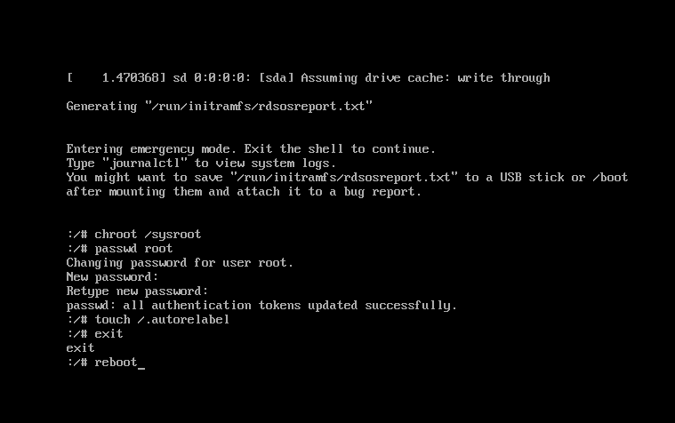

# Reset mật khẩu gốc trong CentOS
- Trong một số tình huống, ta quên mật khẩu root của CentOS vì thể ta cần phải reset lại mật khẩu

Khởi động lại hệ thống 
- Khởi động lại hệ thống đến màn hình boot GRUB menu



- Chọn `e` để thay đổi chế độ boot

- Tại đây tìm ký tự `ro` và sửa thành `rw init=/sysroot/bin/bash`





- Để lưu thay đổi ta nhấn `Ctrl + X` và ta sẽ đăng nhập được vào chế độ 1 người dùng 



- Tiến hành truy cập vào hệ thống bằng lệnh 
```sh
chroot /sysroot
```

- Tiến hành thay đổi mật khẩu root
```sh
passwd root
```

- Update thông tin selinux
```sh
touch /.autorelabel
```

- Thoát chroot và khởi động lại hệ thống
```sh
exit
reboot
```



