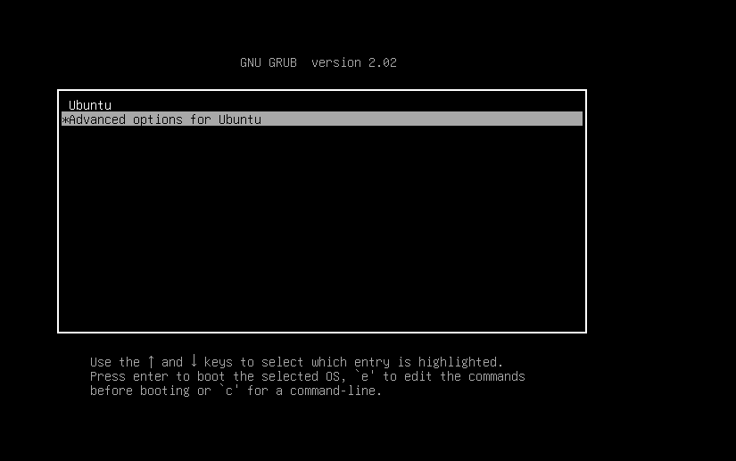
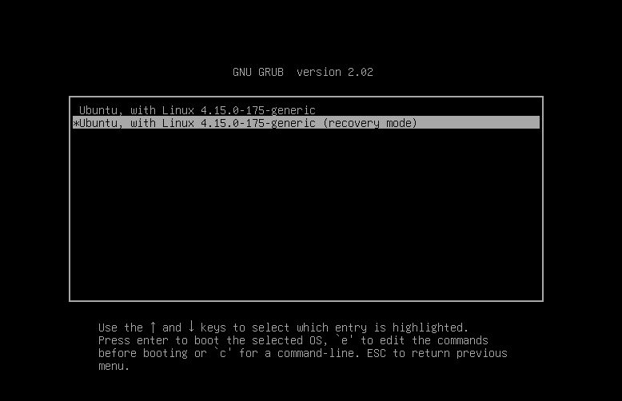
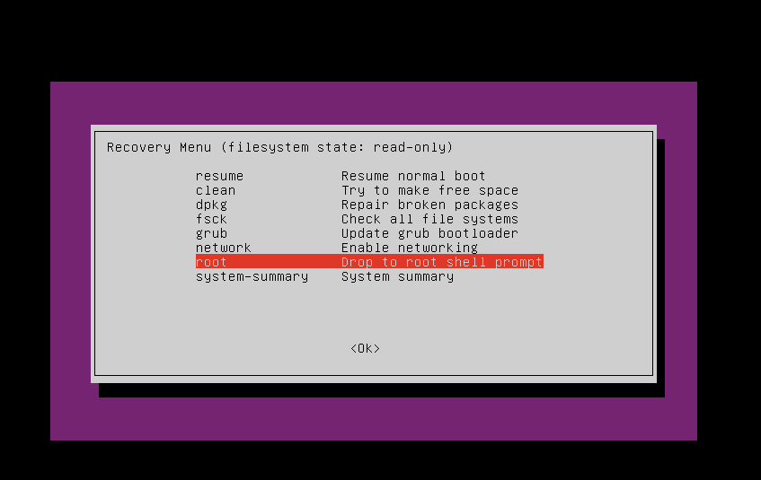
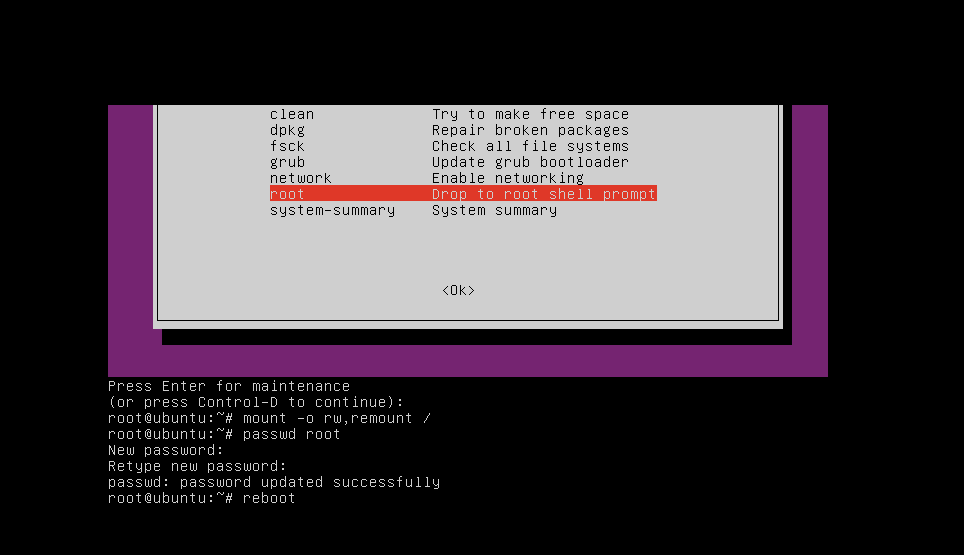

# Reset mật khẩu gốc trong Ubuntu 
- Trong một số tình huống, ta quên mật khẩu root của ubuntu vì thể ta cần phải reset lại mật khẩu

Khởi động vào `Recovery Mode`
- Khởi động lại hệ thống. Khi nhìn thấy màn hình hiển thị, hãy giữ phím `Shift`. Hệ thống sẽ đưa đến `GRUB` hoặc menu khởi động với các phiên bản nhân Linux khác nhau được hiển thị



- Chọn `Recovery mode`



- Sau khi vào `Recovery Mode` sẽ có giao diện sau. Chọn root



- Nhập lệnh
```sh
mount -o remount,rw /
```

- Sau đó thực hiện đặt lại mật khẩu cho root và khởi động lại
```sh
passwd root			/Nhập mật khẩu và xác nhận lại mật khẩu
reboot
```


