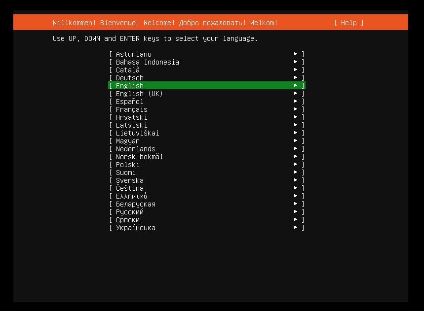
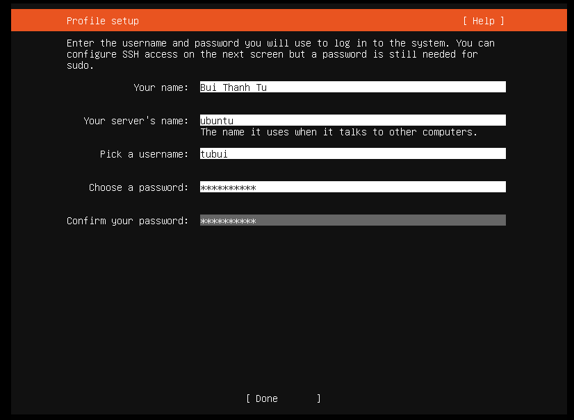

# Cài đặt Ubuntu server 18.04 
Bước 1: Tải file iso của Ubuntu 18.04 tại

https://mirrors.nhanhoa.com/ubuntu-releases/18.04/ubuntu-18.04.6-live-server-amd64.iso

Bước 2: Cài đặt Ubuntu server 18.04
- Tạo máy ảo trên môi trường VMware
- Máy ảo sẽ bắt đầu boot vào ISO và bắt đầu quá trình cài đặt Ubuntu Server

- Chọn ngôn ngữ để bắt đầu



- Nếu bản iso download đã cũ rồi, có thể đã có một vài cập nhật rồi, ta có thể lựa chọn cập nhật trước khi cài đặt hoặc có thể bỏ qua với lựa chọn `Continue without updating`


- Chọn bàn phím để tiếp tục. Khuyến nghị nên sử dụng English (mặc định). Chọn `Done` để tiếp tục 


- Tiếp đến là phần cấu hình IP cho máy ảo để có thể kết nối với Internet hoặc mạng nội bộ. Ta có thể sử dụng IP động do DHCP cấp hoặc IP tĩnh để đặt. Ở đây ta đặt IP tĩnh. Sau đó `Save` -> `Done`


- Cài đặt proxy. Ta có thể chọn `Done` để nhận proxy theo mặc định


- Cài đặt địa chỉ mirror cho ubuntu. Nhấn `Done` để nhận mặc định


- Phân vùng ổ cứng. Chọn `Done` để phân vùng ổ cứng tự động


- Chọn `Done` để hệ thống tự động phân vùng ổ cứng. Hệ thống sẽ cần ta xác nhận trước khi chuyển tới bước tiếp theo. Ấn `Continue` để tiếp tục


- Tiếp tục, ta sẽ khai báo thông tin về username để đăng nhập sử dụng Ubuntu sau khi cài đặt xong



- Lựa chọn OpenSSH để có thể SSH vào Ubuntu server


- Cài đặt thêm một số gói. Có thể chọn `Done` để bỏ qua


- Quá trình cài đặt sẽ tiếp tục diễn ra, sẽ mất khoảng 10 phút để quá trình này kết thúc. Sau khi kết thúc ta sẽ cần khởi động lại để hoàn tất quá trình cài đặt Ubuntu Server


- Chọn `Reboot Now` để khởi động lại sau khi hoàn tất cài đặt


- Quá trình cài đặt Ubuntu Server đã hoàn tất. Ta có thể đăng nhập vào Ubuntu để sử dụng

- Kiểm tra phiên bản của hệ điều hành và IP tĩnh đã đặt trước đo


# Đổi mật khẩu root Ubuntu 

```sh
sudo passwd root
```


