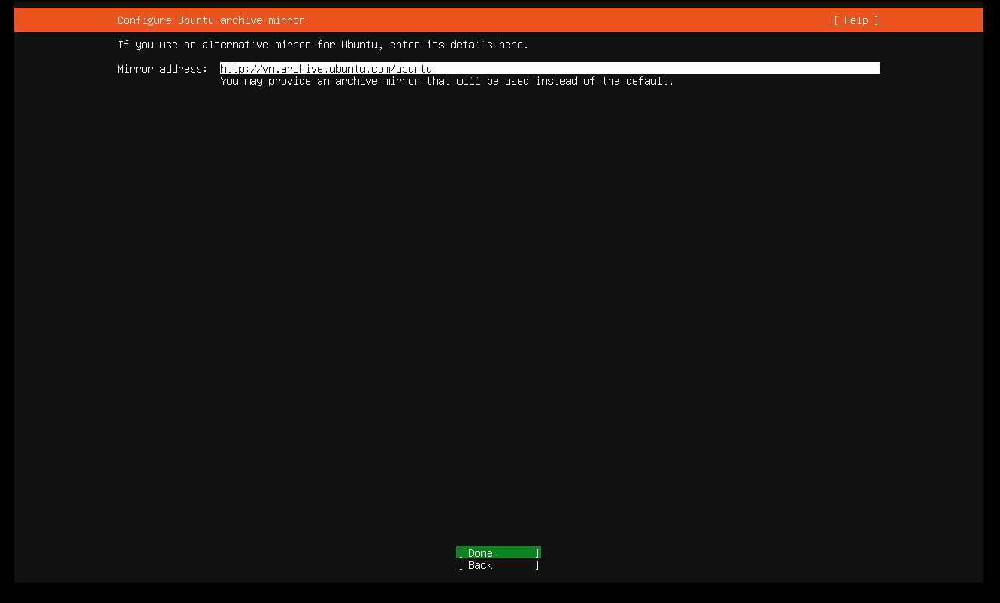

# Cài đặt Ubuntu server 21.10
Bước 1: Tải file iso của Ubuntu

http://mirrors.nhanhoa.com/ubuntu-releases/21.10/ubuntu-21.10-live-server-amd64.iso

Bước 2: Cài đặt Ubuntu server 21.10
- Tạo máy ảo trên môi trường VMware
- Sau khi boot thì màn hình sẽ hiện lên như sau
- Ta chọn ngôn ngữ cho hệ điều hành của mình muốn sử dụng

- Chọn bàn phím muốn sử dụng

- Chọn loại ubuntu muốn cài đặt: Có 2 loại là
	+ Ubuntu Server
	+ Ubuntu Server (minimized)

- Ta sẽ cài đặt IP cho máy tính muốn sử dụng
	+ Chọn done để nhận IP theo DHCP
	+ Chọn vào edit để có thể cài IP static

> Ở đây ta chọn đặt IP tĩnh

- Cài đặt proxy. Ta có thể chọn `Done` để nhận proxy theo mặc định

- Cài đặt địa chỉ mirror cho ubuntu. Nhấn `Done` để nhận mặc định

- Phân vùng ổ cứng. Chọn done để không chia, chỉ sử dụng 1 phân vùng

- Chọn phân vùng để cài đặt hệ điều hành, chọn `Done` sau đó chọn `Continue` để xác nhận tiếp tục cài đặt

- Cài đặt tên máy sử dụng, đặt user và password để đăng nhập vào máy. Rồi chọn `Done` để hoàn thành việc cài đặt

- Lựa chọn cài đặt dịch vụ SSH cho máy hay là không. Nếu có cài đặt thì có sử dụng mật khẩu cho dịch vụ ssh hay là không. Và chọn có cho ssh bằng password hay là không. Rồi chọn `Done`

- Cài đặt thêm 1 số gói, nếu không cần thì chọn `Done`

- Đợi hệ thống cài đặt

- Sau khi cài đặt xong chọn `Reboot` để hoàn thành
- Đăng nhập với user và password.