# Cài đặt Windows Server 2019
- Windows Server 2019 là phiên bản hệ điều hành cho máy chủ được Microsoft phát triển mới nhất tính đến thời điểm hiện tại. So với các bản phát hành trước Windows Server 2019 có sự cải tiến rất nhiều về bảo mật, hiệu suất cho người dùng
- Windows Server 2019 có tất cả 3 phiên bản chính là: Essentials, Standard, Datacenter. Nhưng thông dụng nhất hiện nay là Standard và Datacenter 
## Tính năng mới trong Windows Server 2019
- Đây là phiên bản mới nhất của hệ điều hành máy chủ Microsoft, được xây dựng trên nền tảng vững chắc của Windows Server 2016
- Mang đến nhiều đổi mới khác nhau trên bốn chủ đề khác nhau, đó là Nền tảng ứng dụng, Đám mây, Bảo mật	và Cơ sở hạ tầng siêu hội tụ (HCI)
- Có nhiều tính năng mới như System Insight mang lại khả năng phân tích dự đoán cục bộ cho Windows Server
## Yêu cầu hệ thống
- Bộ xử lý 64-bit 1.4 GHz
- Bộ nhớ: RAM 4 GB
- Dung lượng ổ đĩa 64 GB
## Cài đặt Windows Server 2019
Bước 1: Download file iso Windows Server 2019

Bước 2: Sau khi Download Windows Server 2019, ta bắt đầu quá trình cài đặt Windows Server 2019 với việc khởi động VMWare Workstation và tạo máy ảo
- Chọn `Typical`

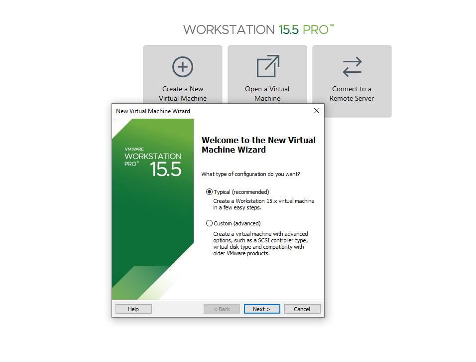

- Lựa chọn `I will install the operating system later. The virtual machine will be created with a blank hard disk`

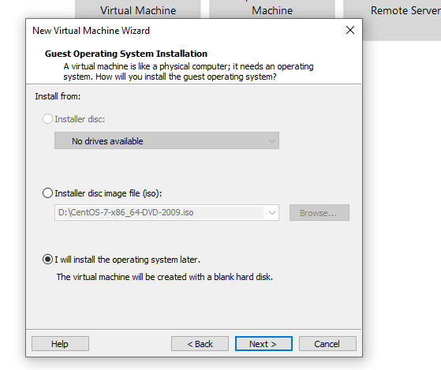

- Lựa chọn hệ điều hành cài đặt, chọn `Microsoft Windows` và `Windows Server 2016` (Vì phiên bản VMWare cũ nên chưa được cập nhật vì thế ta có thể chọn 2016 vì 2016 và 2019 là tương tự)

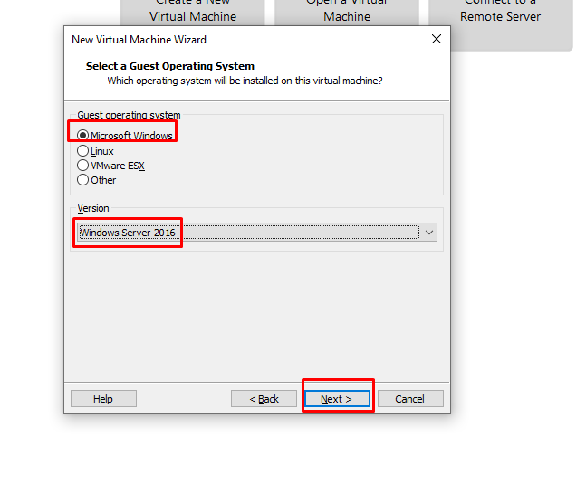

- Tiếp đến, ta cần đặt tên cho máy ảo Windows Server 2019 để phân biệt với các máy ảo khác và nơi lưu trữ máy ảo

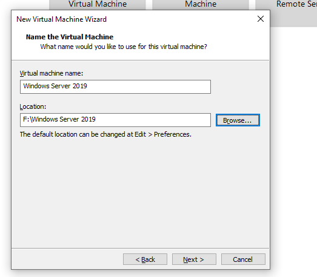

- Khai báo thông số dung lượng ổ đĩa trên máy ảo khi tạo ra và lựa chọn `Store virtual disk as a single file`

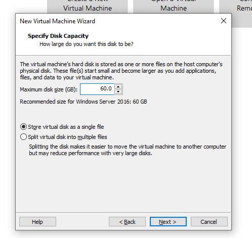

- Nhấn `Finish` để hoàn tất

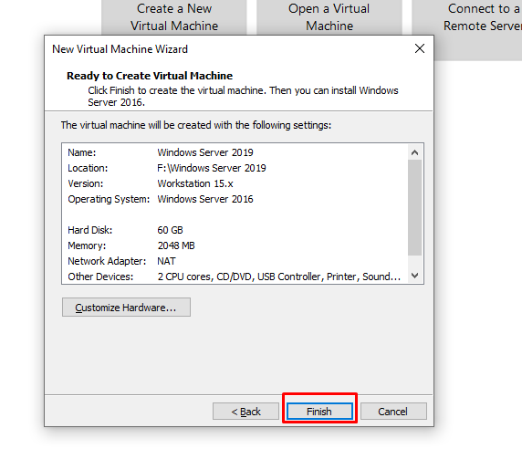

- Chọn `Edit virtual machine settings` để thêm iso vào trước khi bật máy ảo

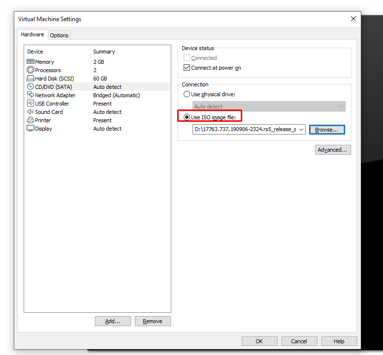

- Hệ thống khởi động, chọn ngôn ngữ và thời gian và bàn phím cho hệ điều hành. Sau đó ấn `Next`

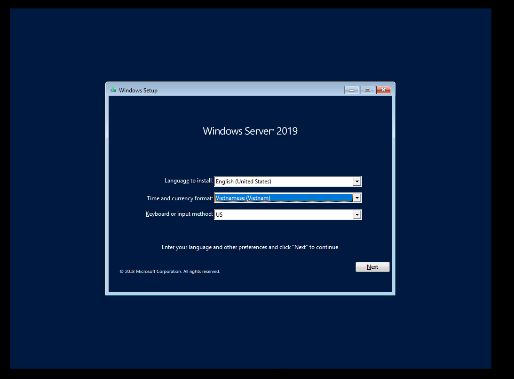

- Chọn `Install Now`

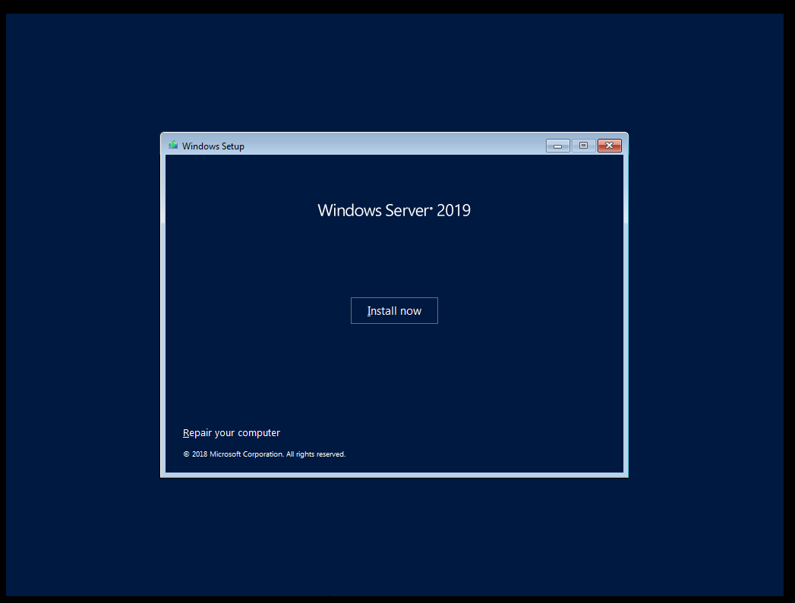

- Lựa chọn hệ điều hành muốn cài đặt

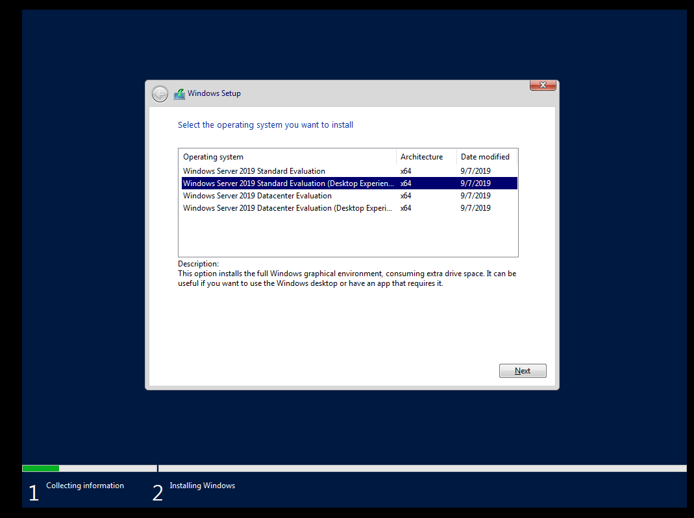

- Đồng ý với điều khoản của Microsoft

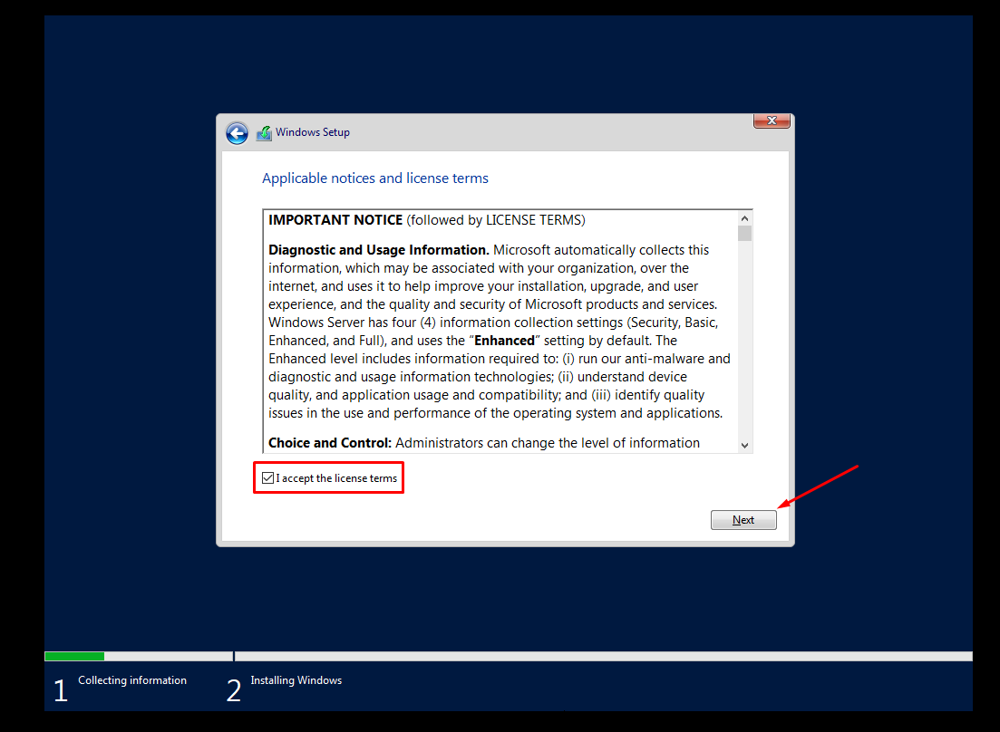

- Lựa chọn `Custom: Install Windows only (advanced)` 

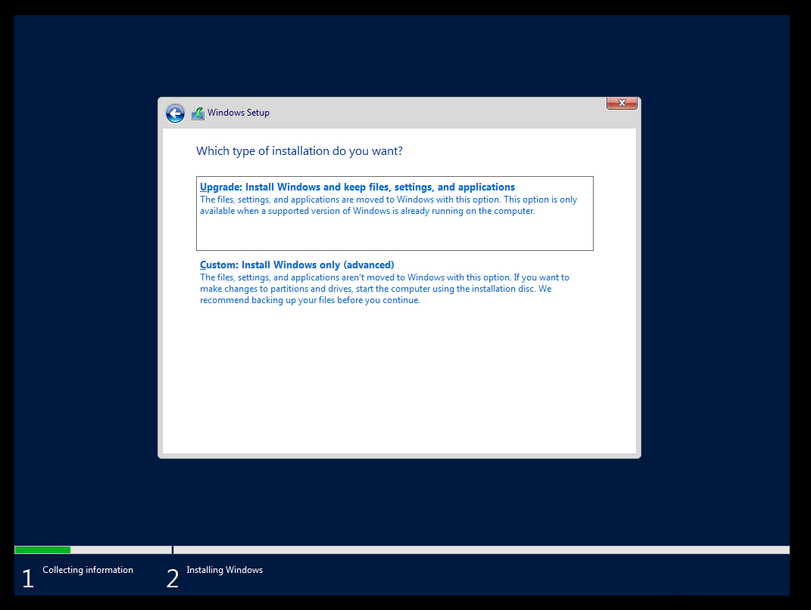

- Tiếp đến chọn ví trí mà ta muốn cài đặt hệ điều hành. Ở đây ta chỉ có 1 đĩa trong quá trình tạo máy ảo, nên chỉ có một đĩa được hiển thị ở đây. Ta có thể thêm các đĩa bổ sung bằng cách chọn `New` -> sau chọn `Next`

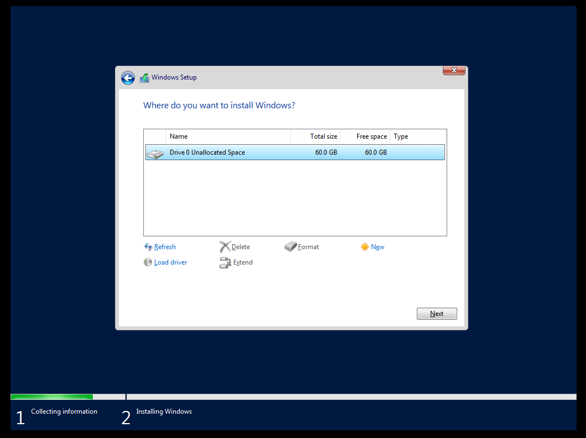

- Quá trình cài đặt sẽ tiếp tục diễn ra, tùy thuộc vào cấu hình của máy và ổ đĩa, thời gian sẽ diễn ra khoảng 10 phút

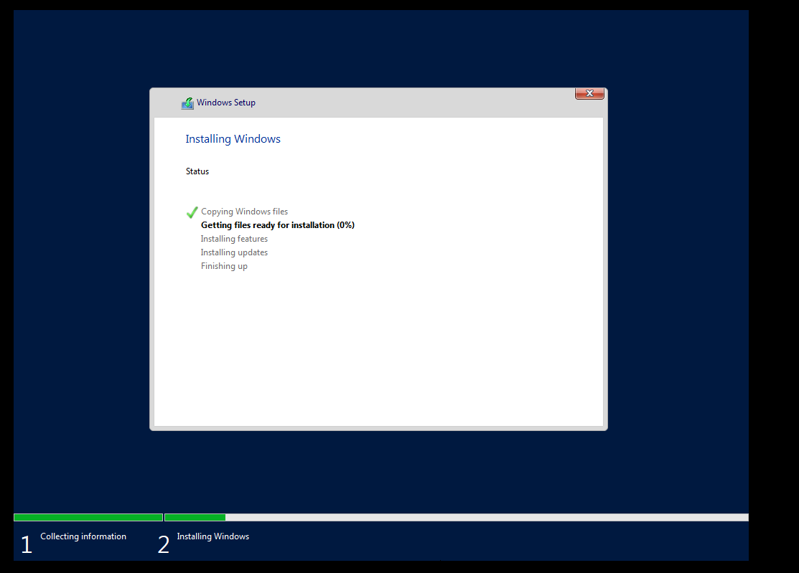

- Sau khi quá trình cài đặt hoàn tất và khởi động lại, ta phải đặt mật khẩu cho tài khoản Administrator trước khi đăng nhập vào hệ điều hành

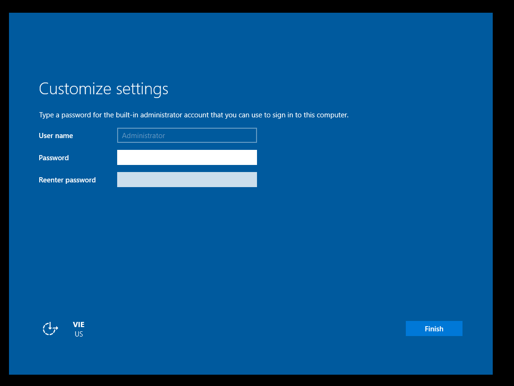

- Ấn `Finish` và đăng nhập vào hệ thống. Sử dụng `Ctrl + Alt + Del` để unlock. Khi sử dụng WMware thì tổ hợp phím sẽ là `Ctrl + Alt + Insert`

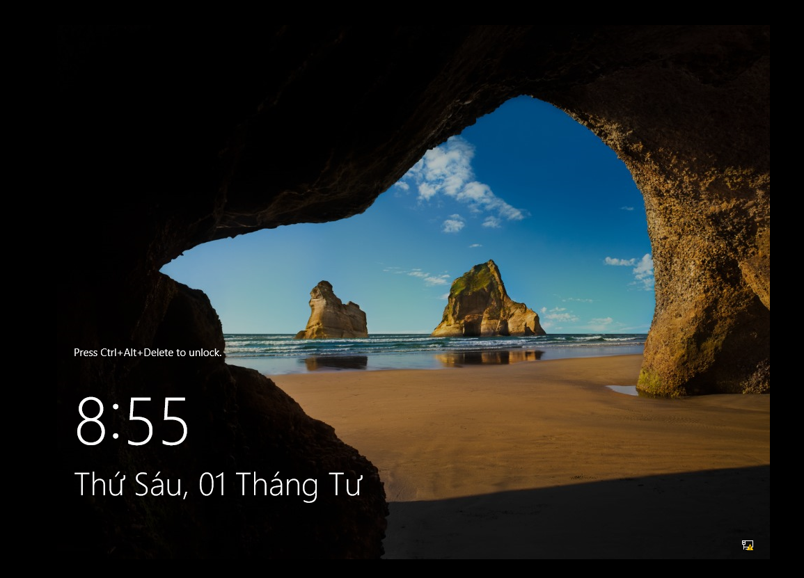

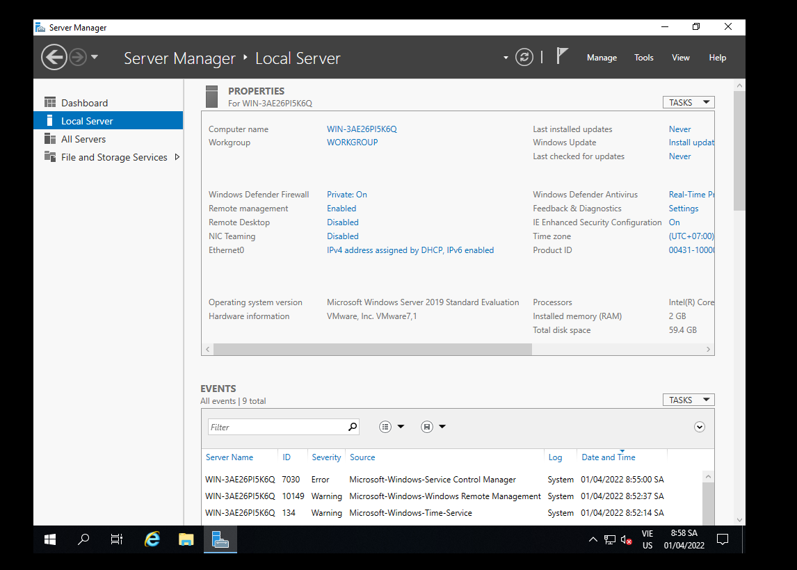
