# Đặt địa chỉ IP tĩnh
- Địa chỉ IP được DHCP gán theo mặc định, vì vậy ta cần đặt địa chỉ IP tĩnh cho việc sử dụng Server
Cách 1: Chạy PowerShell với quyền admin và cấu hình như sau:
```sh
Get-NetIPInterface -AddressFamily IPv4 
Set-NetIPInterface -InterfaceIndex 6 -Dhcp Disabled
New-NetIPAddress -InterfaceIndex 6 -AddressFamily IPv4 -IPAddress "172.16.10.100" -PrefixLength 24 -DefaultGateway "172.16.10.1"
Set-DnsClientServerAddress -InterfaceIndex 6 -ServerAddresses "8.8.8.8" -PassThru
ipconfig /all
```

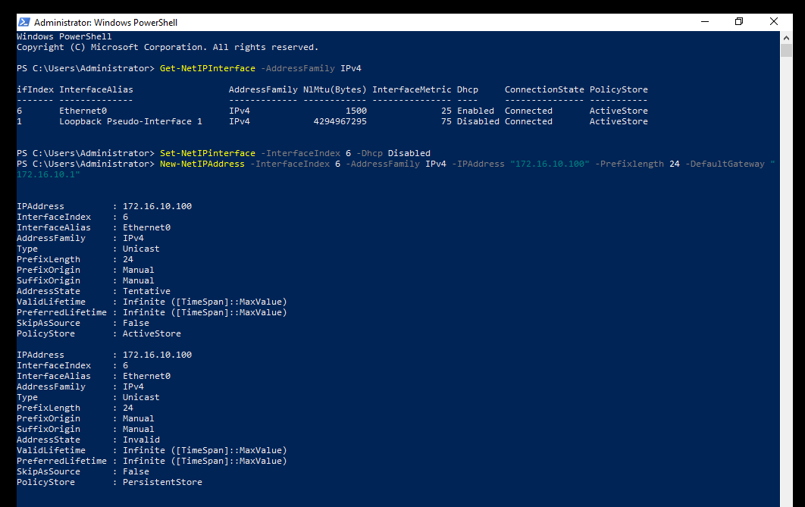

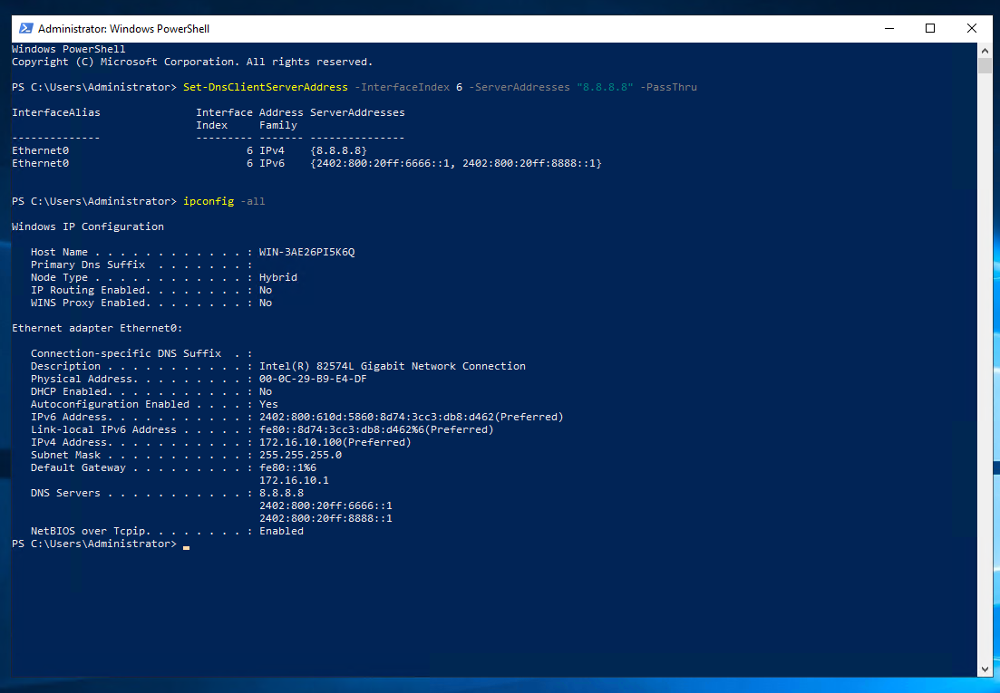

Cách 2: Chạy `Server Manager` và chọn `Local Server` trên bảng điều khiển bên trái, rồi nhấp vào phần `Ethernet` trên bảng điều khiển bên phải

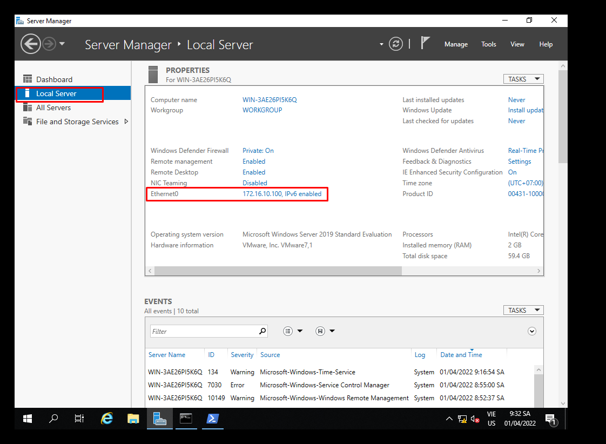

- Nhấp chuột phải vào biểu tượng `Ethernet` và mở `Properties` 

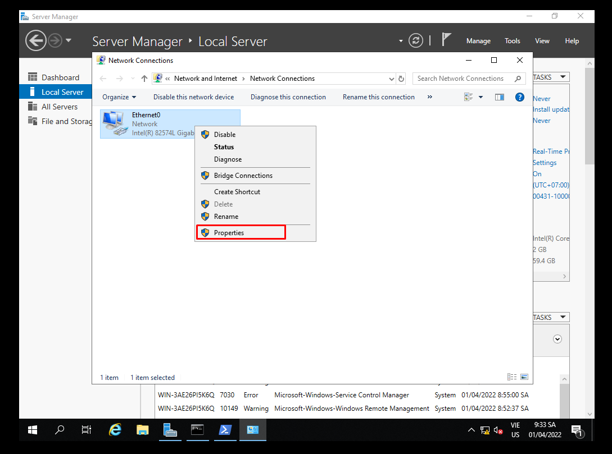

- Đặt địa chỉ IP tĩnh, gateway và các địa chỉ khác cho mạng cục bộ 

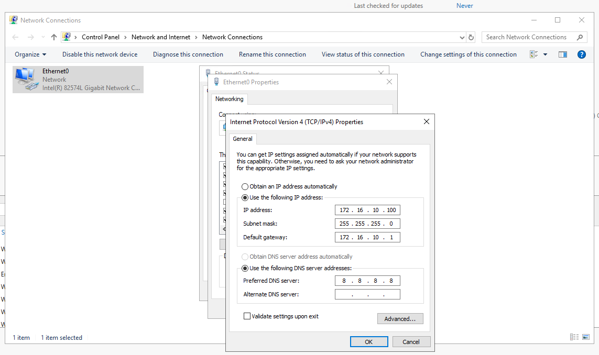

- Sau khi đặt địa chỉ IP tĩnh, các thay đổi sẽ được kích hoạt trên `Server Manager`

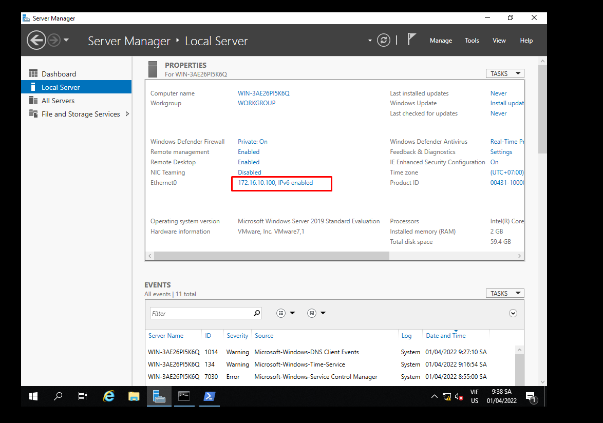

# Thêm người dùng cục bộ
Bước 1: Chạy `Server Manager` và mở `Tools` -> `Computer Management`

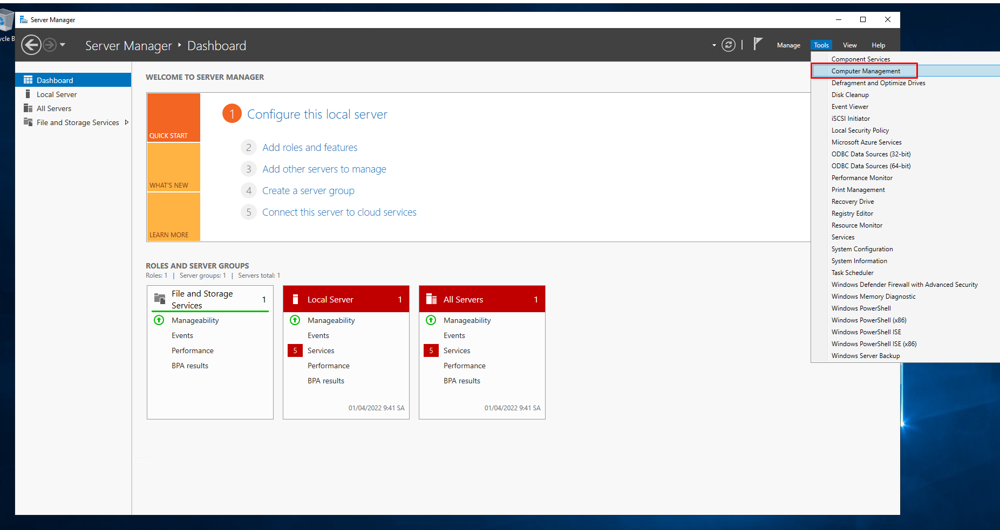

Bước 2: Nhấp chuột vào `Users` bên dưới `Local Users and Groups` ở bên trái và chọn `New Users`

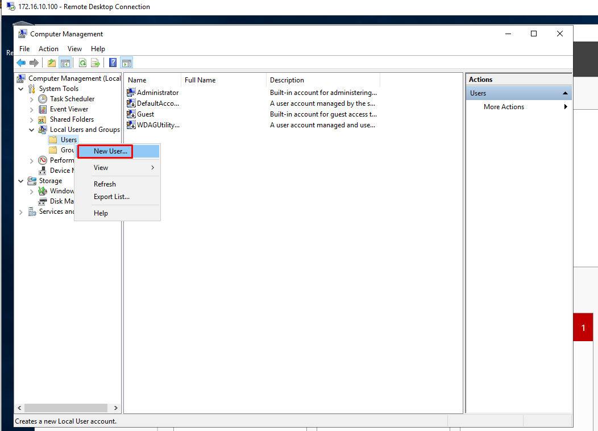

Bước 3: Nhập `Username` và `Password` cho người dùng mới, rồi nhấp vào nút `Create`. Các mục khác là tùy chọn để thiết lập

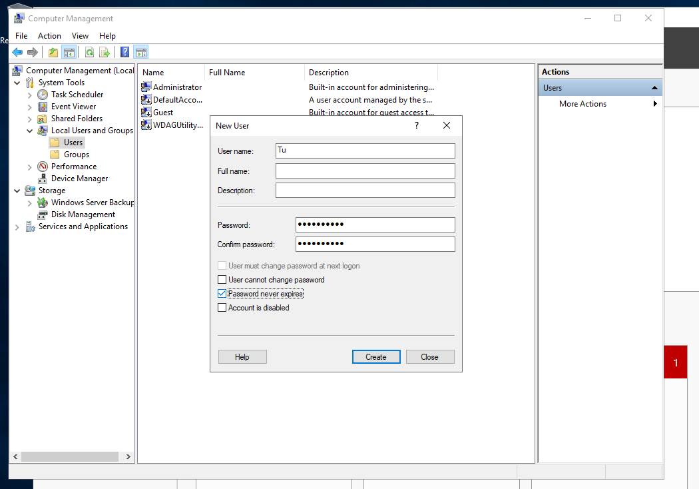

- Sau khi tạo người dùng mới được hiển thị trên danh sách như sau

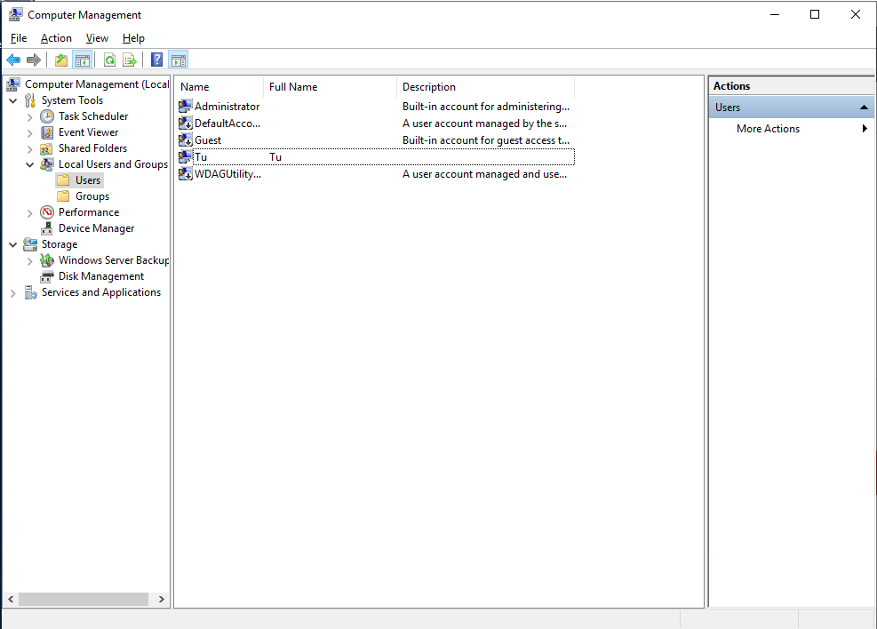

# Đặt quyền admin cho người dùng
- Nếu muốn đặt quyền admin cho người dùng mới, ta nhấp chuột phải vào người dùng và chọn `Properties`

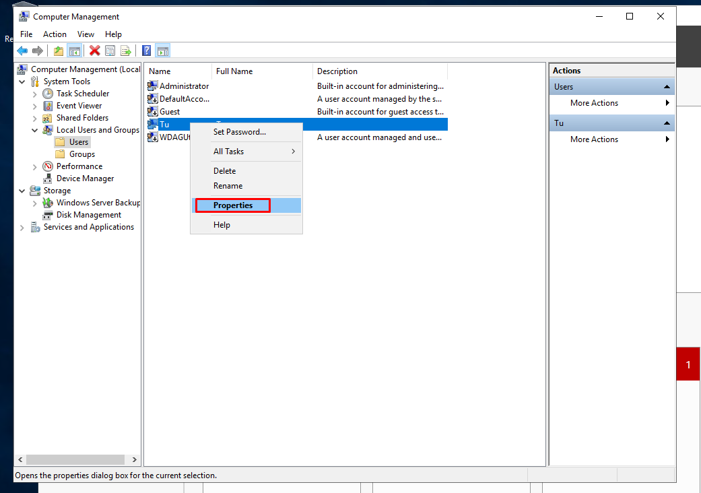

- Di chuyển đến `Member of` và nhấp vào nút `Add`

- Chỉ định nhóm `Administrator` như sau

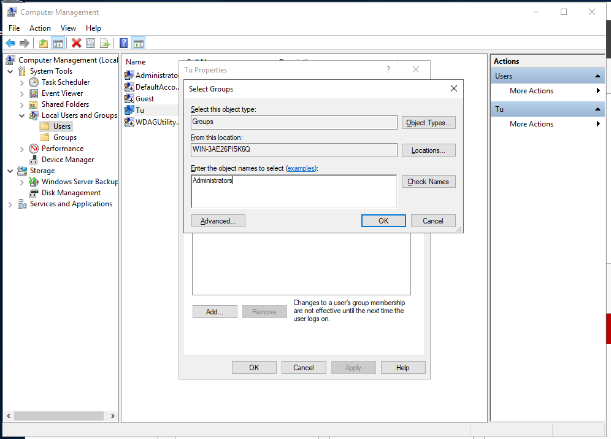

- Đảm bảo rằng nhóm `Administrators` được thêm vào danh sách và nhấp vào nút `OK` để hoàn tất cài đặt

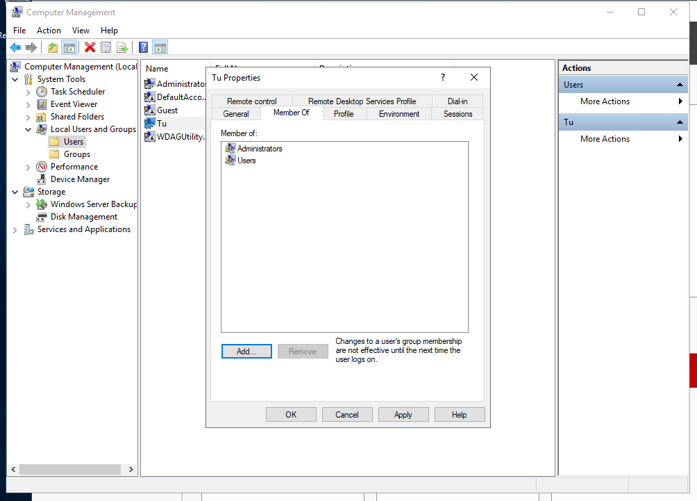

# Thay đổi username admin
Bước 1: Chạy `Server Manager` và mở `Tools` -> `Computer Management`

Bước 2: Mở `Local Users and Group` -> `Users` ở bên trái và nhấp chuột phải vào `Administrator`, rồi chọn `Rename` ở bên phải. Sau đó thay đổi bất kỳ tên nào mà ta muốn

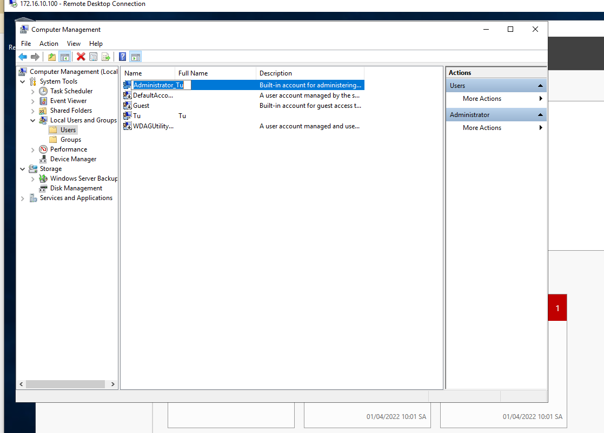

# Thay đổi tên máy tính
Tên máy tính được gán tự động theo mặc định, ta cần thay đổi nó

- Chạy `Server Manager` và chọn `Local Server` ở bên trái, rồi kích vào phần `Computer Name` ở bên phải

- Tại tab `Computer Name` click vào nút `Change` và nhập tên mà ta muốn thay đổi vào trường `Computer Name`

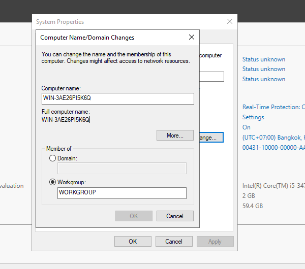

- Sau đó ta cần khởi động lại máy tính để áp dụng các thay đổi

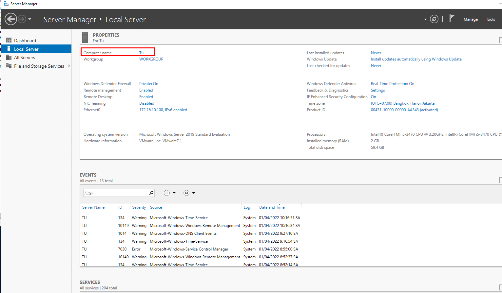
