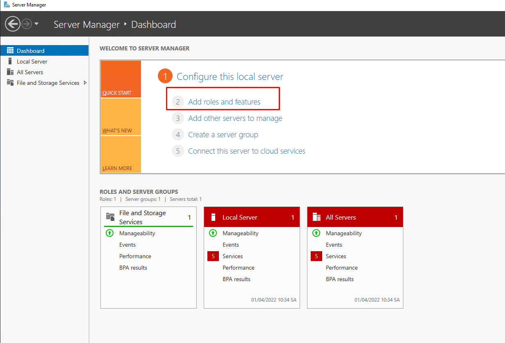

# Install DNS Server
- Chạy `Server Manager` và click `Add roles and features`

- Nhấn `Next`

- Chọn `Role-based or feature-based installation`

- Chọn host mà ta muốn thêm dịch vụ sau đó chọn `Next`

- Chọn `DNS Server`

- Chọn `Add Features` và sau đó chọn `Next`

- Tiếp tục `Next`

- Click vào nút `Install` 

- Quá trình cài đặt hoàn tất

