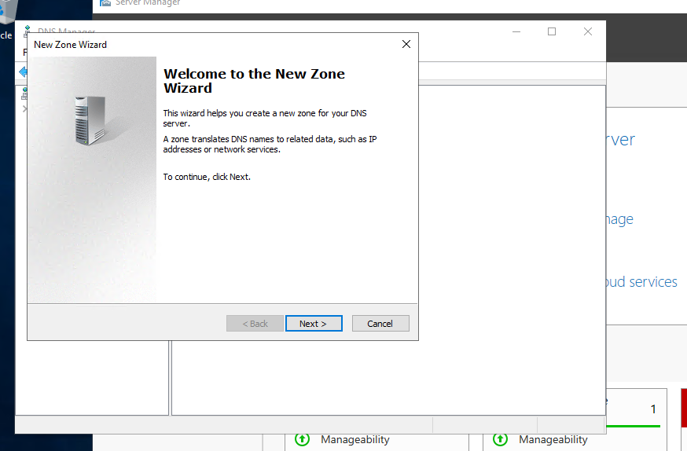

# Add Forward Lookup Zone
Forward Lookup Zone là một loại zone trong DNS, có chức năng phân giải tên máy ra địa chỉ IP

Forward Lookup Zone có 3 loại
- Primary zone: Là máy chủ DNS chính
- Secondary zone: Là máy chủ dùng để cân bằng tải cho DNS chính
- Stub zone: Là loại rất đặc biệt, nó chỉ tạo ra 1 bản copy từ DNS chính, 3 loại bản ghi là NS, SOA và new host A

- Chạy trình quản lý máy chủ và chọn `Tools` -> `DNS`

- Chọn `Tên máy chủ (Tu)` ở góc trái màn hình và nhấp chuột phải vào. Sau đó chọn `New Zone`

- Chọn `Next`

- Chọn `Primary zone` và nhấp vào nút `Next`

- Chọn `Forward Lookup Zone` và nhấp vào `Next`

- Nhập tên vùng 

- Đặt zone-file-name và nhấp vào `Next`. Ta có thể giữ mặc định cho zone-file-name

- Nhấp vào `Next` với việc giữ nguyên mặc định

- Nhấp vào `Finish` để hoàn tất

- Vùng mới được tạo ra trong `Forward Lookup Zones`

