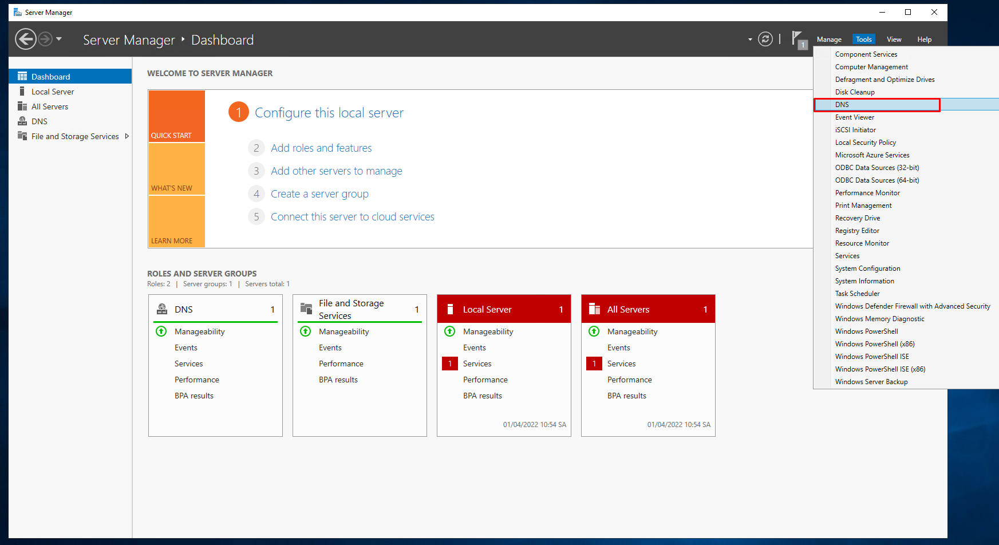
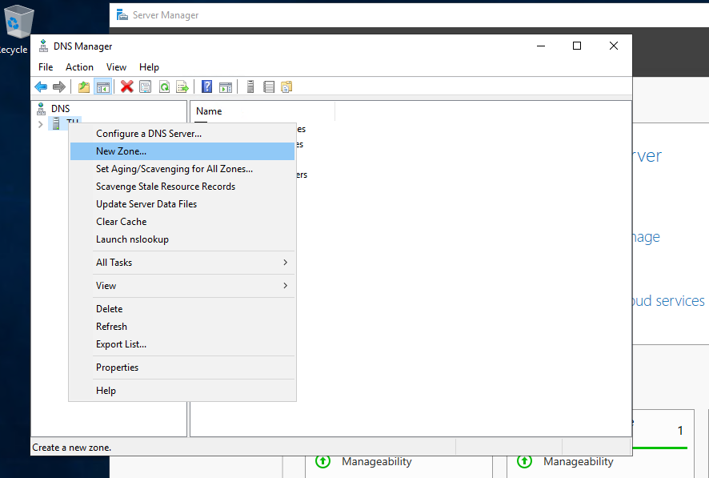
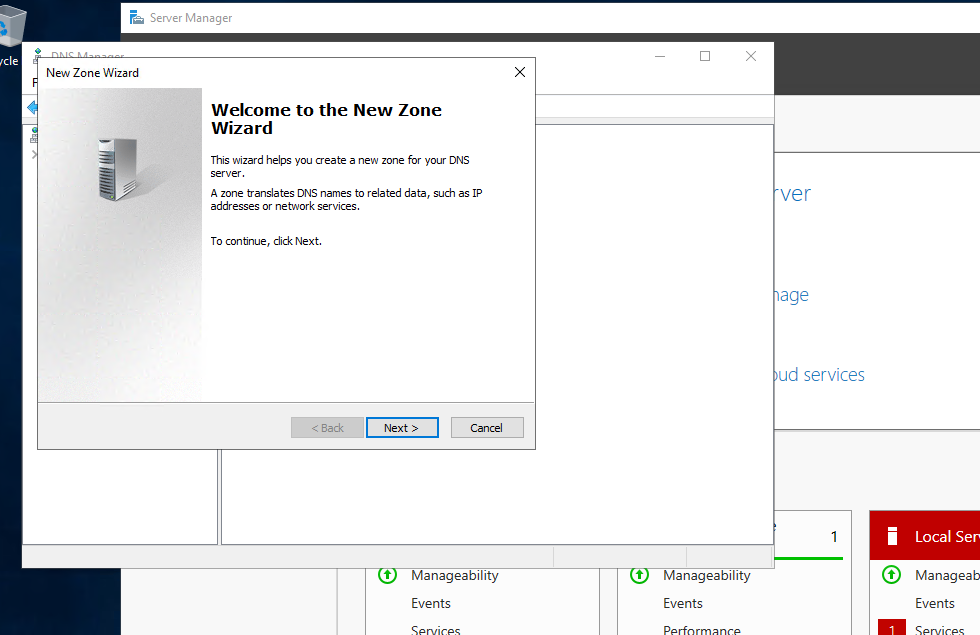
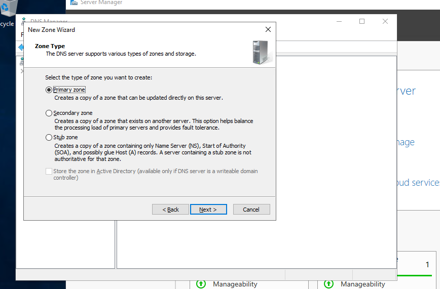
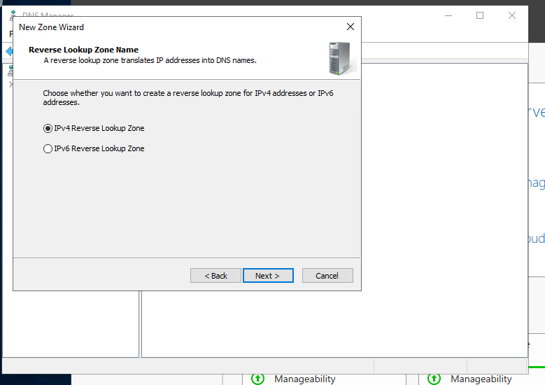
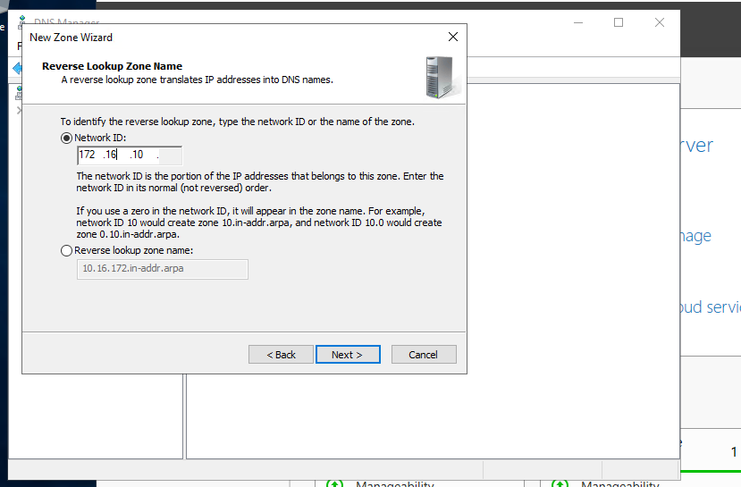
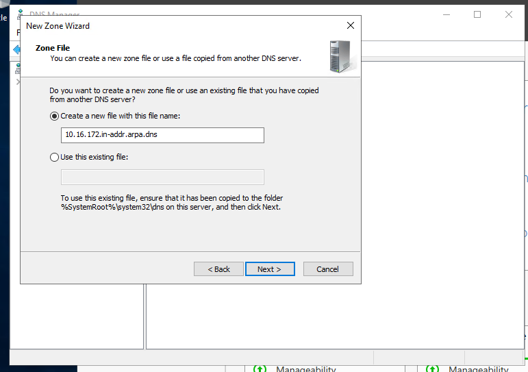
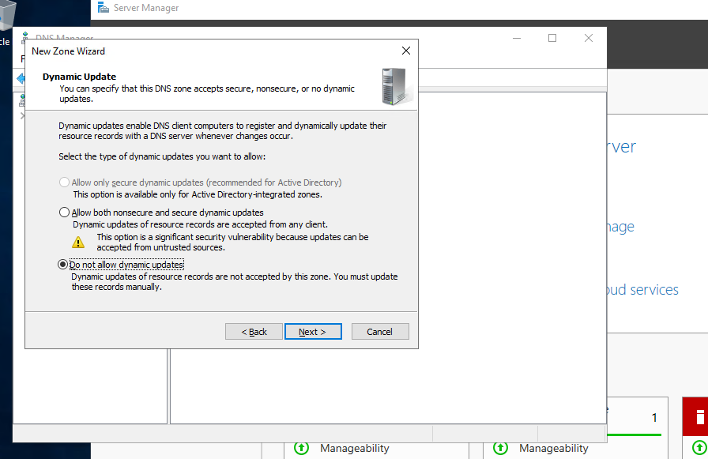
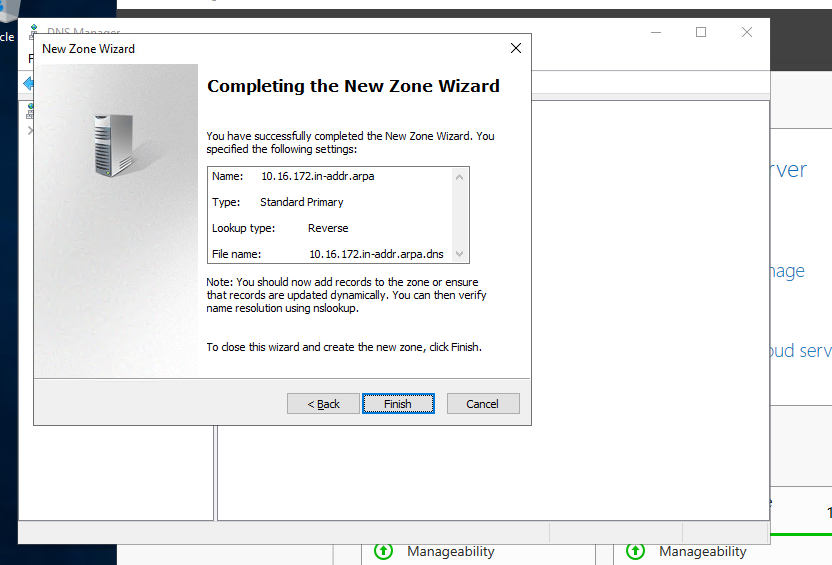
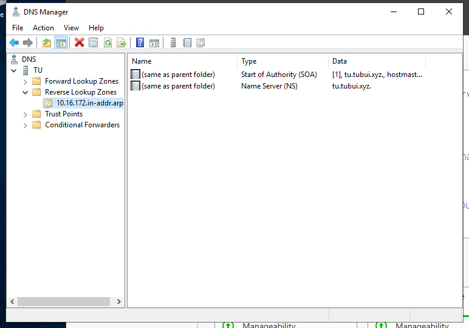

# Add Reverse Lookup Zone
Reverse Lookup Zone là một loại zone trong DNS, có chức năng dịch các địa chỉ số của trang web - địa chỉ IP, thành tên miền/tên máy chủ, trái ngược lại với DNS Forward

Reverse Lookup Zone chứa các bản ghi nguồn PTR. Một bản ghi PTR cho phép thực hiện tra cứu ngược bằng cách trỏ địa chỉ IP tới một máy chủ/tên miền. Khi thực hiện tìm kiếm đảo ngược, các bản ghi PTR này được sử dụng để trỏ đến bản ghi tài nguyên A.

- Chạy trình quản lý máy chủ và chọn `Tools` -> `DNS`

- Chọn `Tên máy chủ (Tu)` ở góc trái màn hình và nhấp chuột phải vào. Sau đó chọn `New Zone`

- Chọn `Next`

- Chọn `Primary Zone` và chọn `Next`

- Chọn `Reverse Lookup Zone` và nhấp vào `Next`

- Chọn `IPv4 Reverse Lookup Zone` và chọn `Next`

- Nhập `Network ID` Ví dụ dưới là cho trường hợp 172.16.1.0/24

- Đặt tên zone-file-name và nhấp vào `Next`

- Nhấn vào `Next` với việc giữ nguyên mặc định

- Chọn `Finish` để hoàn tất

- Vùng mới được tạo ra trong `Reverse Lookup Zones`

