# Thêm bản ghi A/PTR
- Chạy `Server Manager` sau đó chọn `Tools` -> `DNS`, tiếp theo click chuột phải vào tên miền riêng, sau đó chọn `New Host (A or AAAA)`

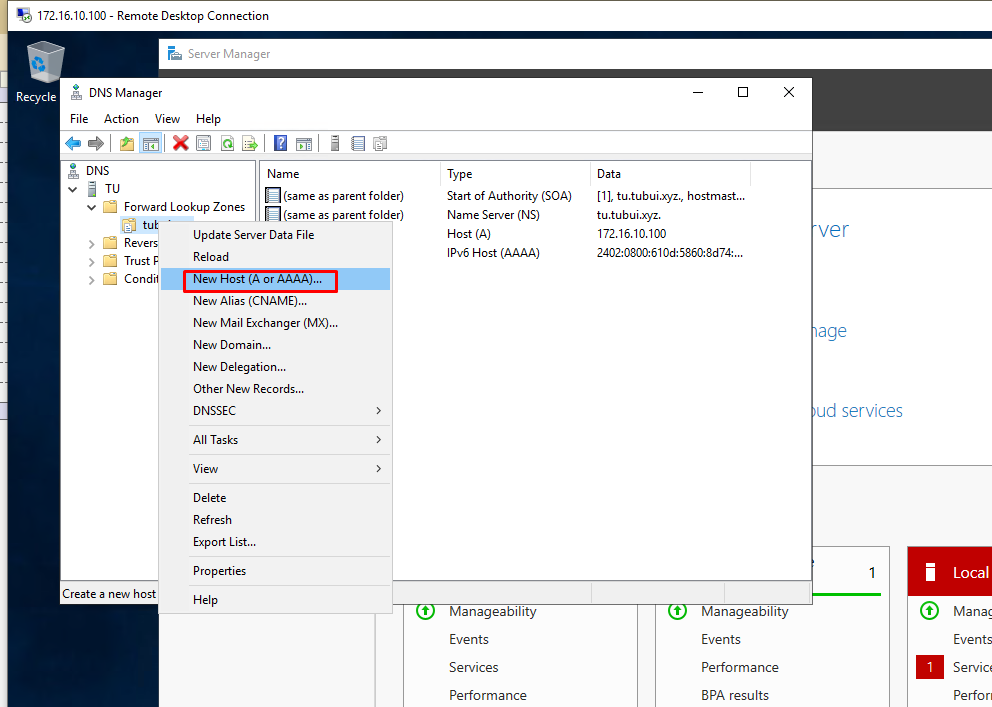

- Nhập hostname và địa chỉ IP . Ngoài ra hãy chọn `Create associated pointer (PTR) record`

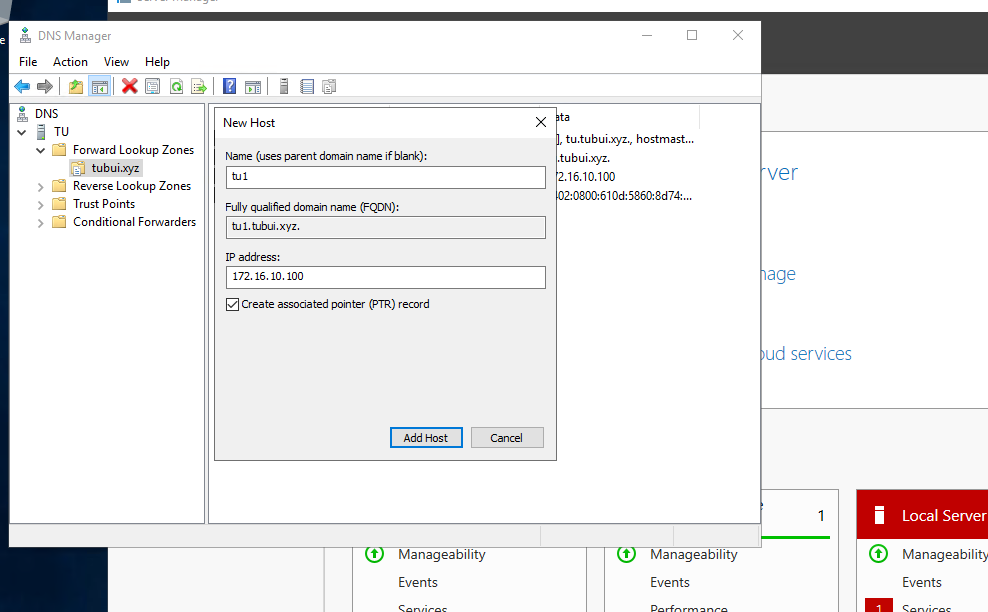

- Bản ghi A/PTR mới được thêm vào

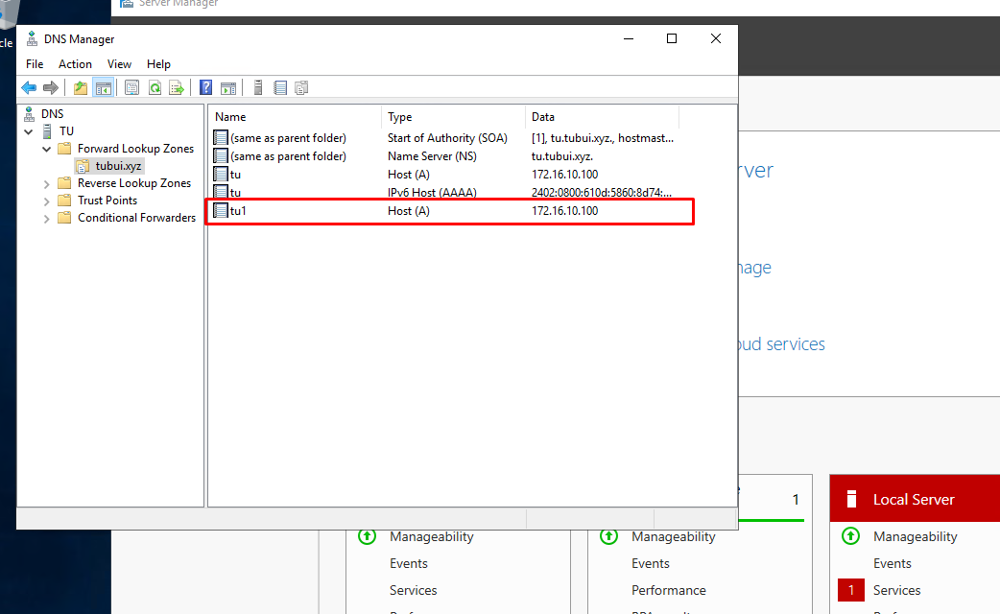

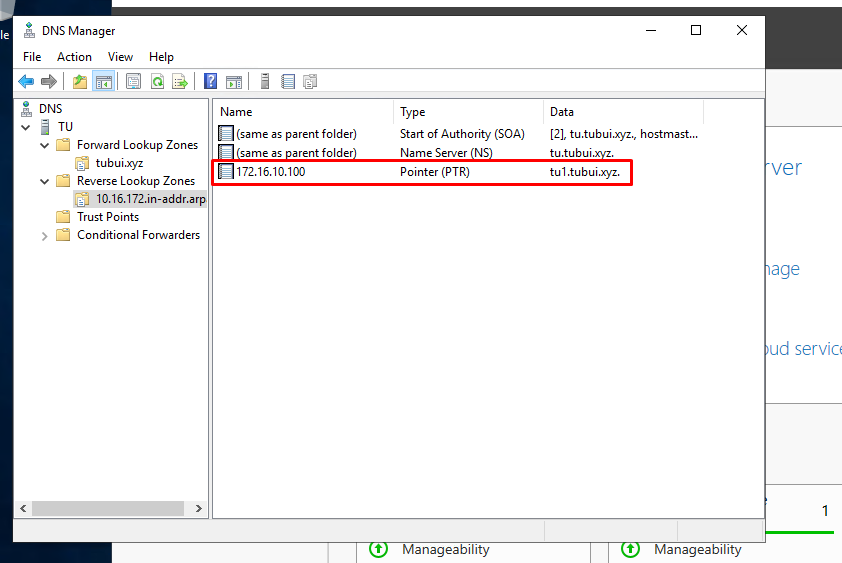

# Thêm bản ghi MX
- Chạy `Server Manager` sau đó chọn `Tools` -> `DNS`, tiếp theo click chuột phải vào tên miền, sau đó chọn `New Mail Exchanger (MX)`

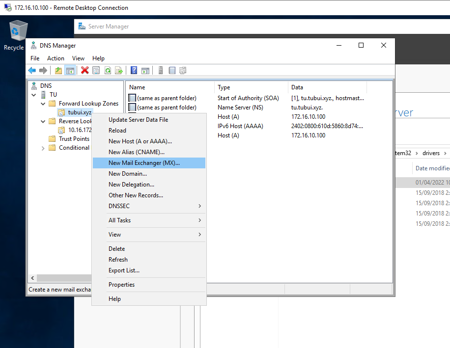

- Nhập tên máy chủ và `Fully qualified domain name (FQDN)`

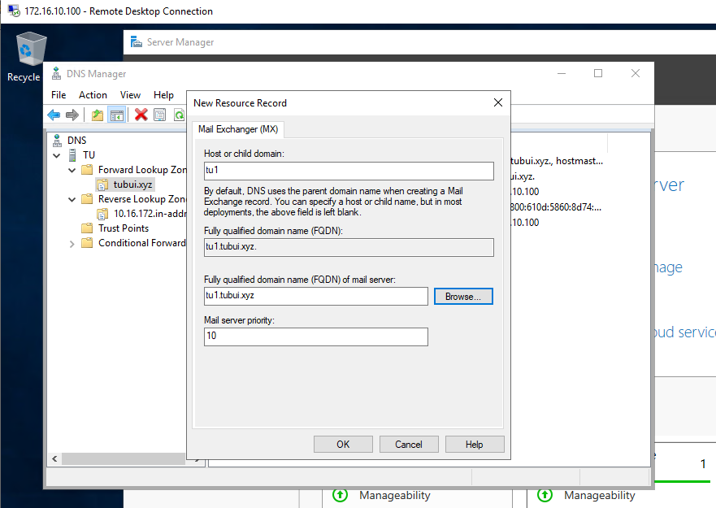

- Bản ghi MX đã được thêm vào

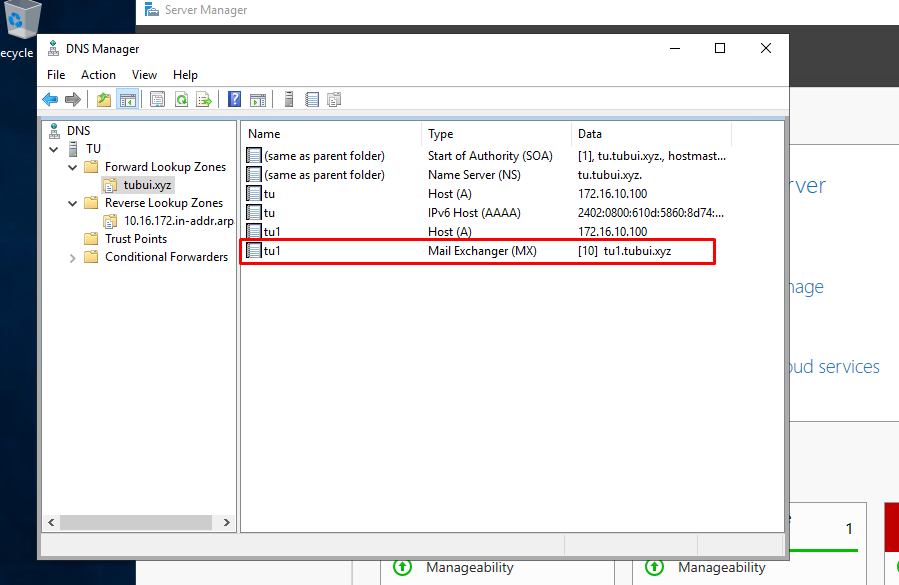

# Thêm bản ghi CNAME
- Click chuột phải vào tên miền, sau đó chọn `New Alias (CNAME)`

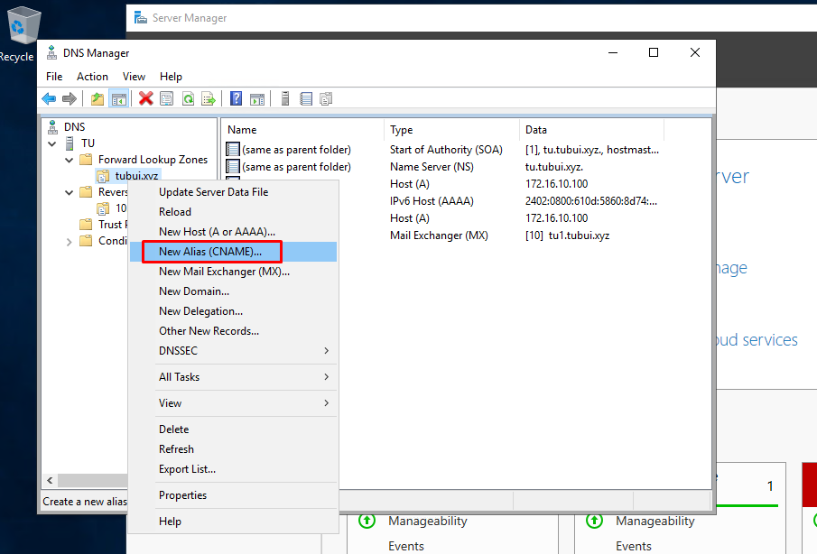

- Nhập tên bí danh và FQDN

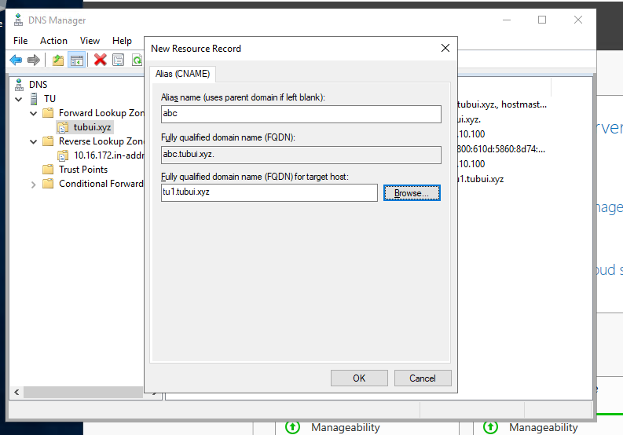

- Bản ghi CNAME đã được thêm vào

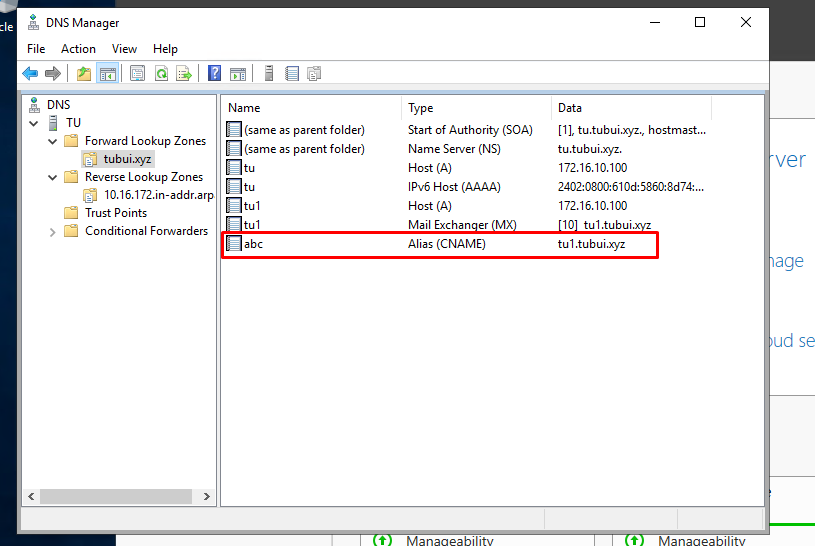

# Xác minh phân giải Hostname hoặc địa chỉ IP

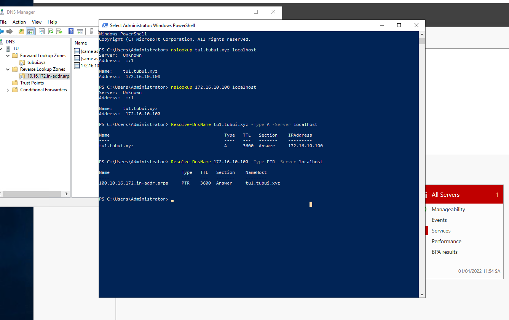
