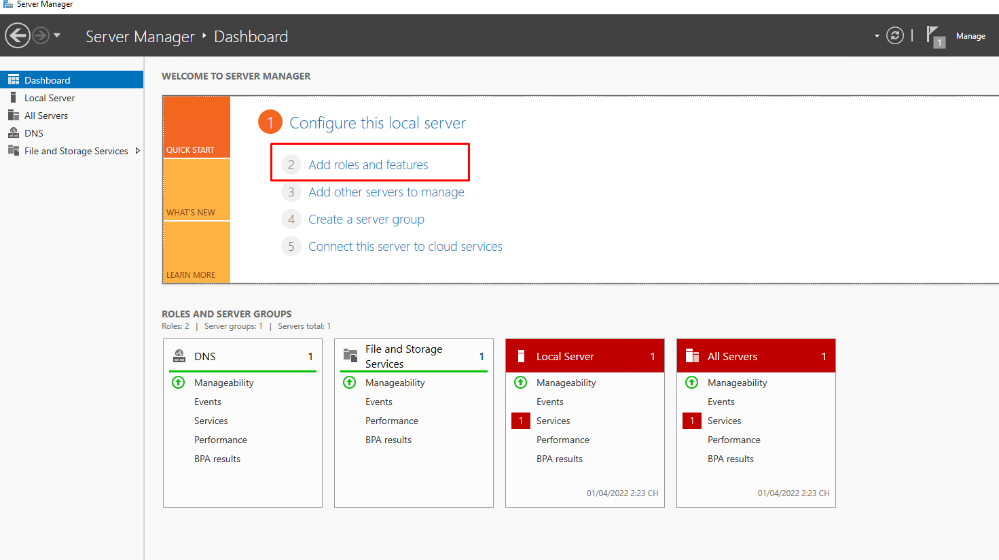
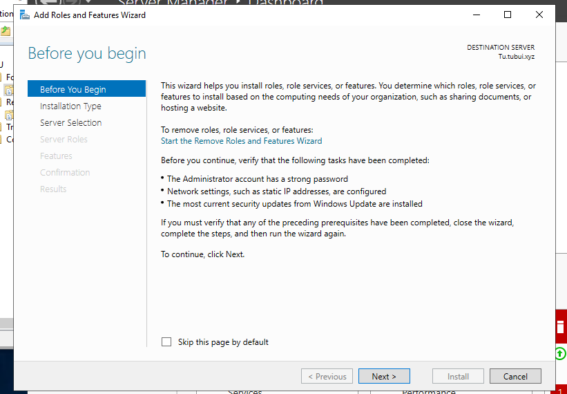
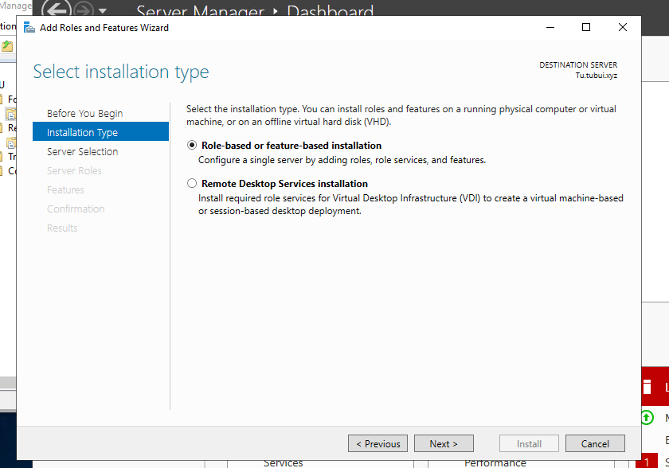
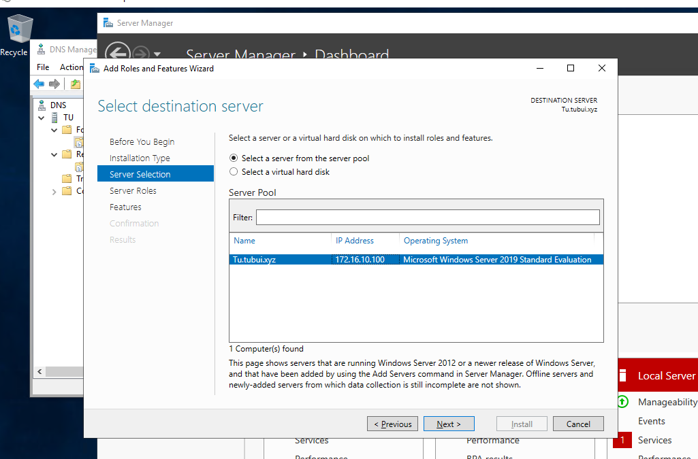
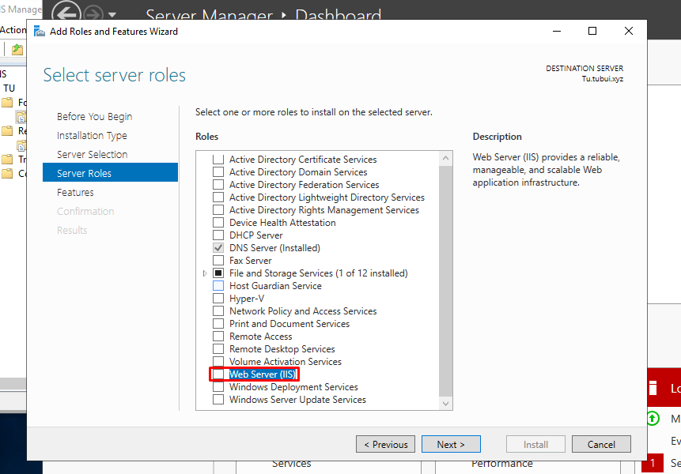
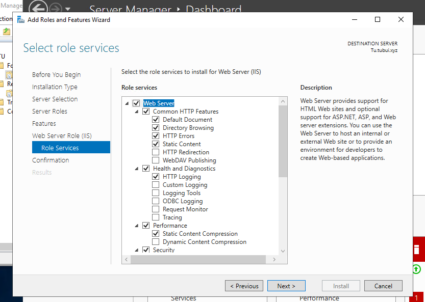
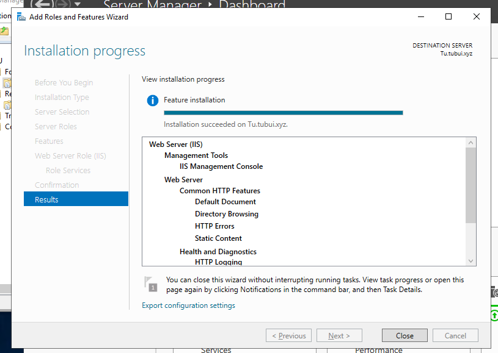
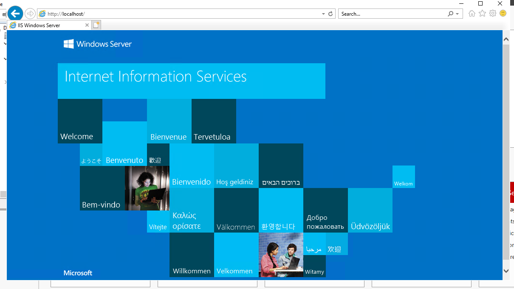

# IIS là gì
- IIS (Internet Information Service) được đính kèm với các phiên bản của Windows là các dịch vụ dành cho máy chủ chạy trên nền Hệ điều hành Window nhằm cung cấp và phân tán các thông tin lên mạng, nó bao gồm nhiều dịch vụ khác nhau như Web Server, FTP Server...
- Nó có thể sử dụng để xuất bản nội dung của các trang Web lên Internet bằng việc sử dụng phương thức chuyển giao siêu văn bản (HTTP)

# IIS có thể làm được gì
- Nhiệm vụ của IIS là tiếp nhận yêu cầu của máy trạm và đáp ứng lại yêu cầu đó bằng cách gửi về máy trạm những thông tin mà máy trạm yêu cầu
- Ta có thể sử dụng IIS để 
	+ Xuất bản một Website trên Internet
	+ Tạo các giao dịch thương mại điện tử
	+ Chia sẻ file dữ liệu thông qua giao thức FTP
	+ Cho phép người ở xa có thể truy xuất database của bạn (Database remote access)

# Hoạt động của IIS
- IIS sử dụng các giao thức mạng phổ biến là HTTP và FTP (File Transfer Protocol) để tiếp nhận yêu cầu và truyền tải thông tin trên mạng với các định dạng khác nhau
- Một trong những dịch vụ phổ biến nhất của IIS là dịch vụ WWW (World Wide Web)
- Dịch vụ Web sử dụng giao thức HTTP để tiếp nhận yêu cầu (Requests) của trình duyệt Web (Web browser) dưới dạng một địa chỉ URL của một trang Web và IIS phản hồi lại các yêu cầu bằng cách gửi về cho Web browser nội dung của trang Web tương ứng

# Các tính năng của IIS 
- Một trong những tính năng được sử dụng nhiều nhất của IIS là tạo một ứng dụng web bằng ASP .NET. Bên cạnh đó, IIS hoàn toàn có thể chạy được với các trang web viết bằng ngôn ngữ khác như PHP, Perl...
- IIS hỗ trợ một số loại xác thực như Basic access authentication, Digest access authentication, Windows Authentication, Certificate Authentication... các tính năng bảo mật khác bao gồm hỗ trợ SSL/TLS, Thiết lập bảo mật cho máy chủ FTP...

# Cài đặt IIS
- Chạy `Server Manager` sau đó nhấp vào `Add roles and features`

- Click vào `Next` 

- Chọn `Role-based or feature-based installation`

- Chọn máy chủ lưu trữ mà ta muốn thêm dịch vụ

- Chọn mục `Web server (IIS)` và click vào `Add Features` sau đó click `Next`

- Tiếp tục chọn `Next`

- Tại phần `Role Services`. Đây là phần chọn các tính năng của Web Server ta có thể giữ nguyên mặc định và chọn `Next`

- Click vào `Install` 

- Sau khi hoàn tất cài đặt, chọn `Close`

- Chạy trình duyệt Web và truy cập vào `localhost`, sau đó có thể xác minh IIS đang chạy bình thường

