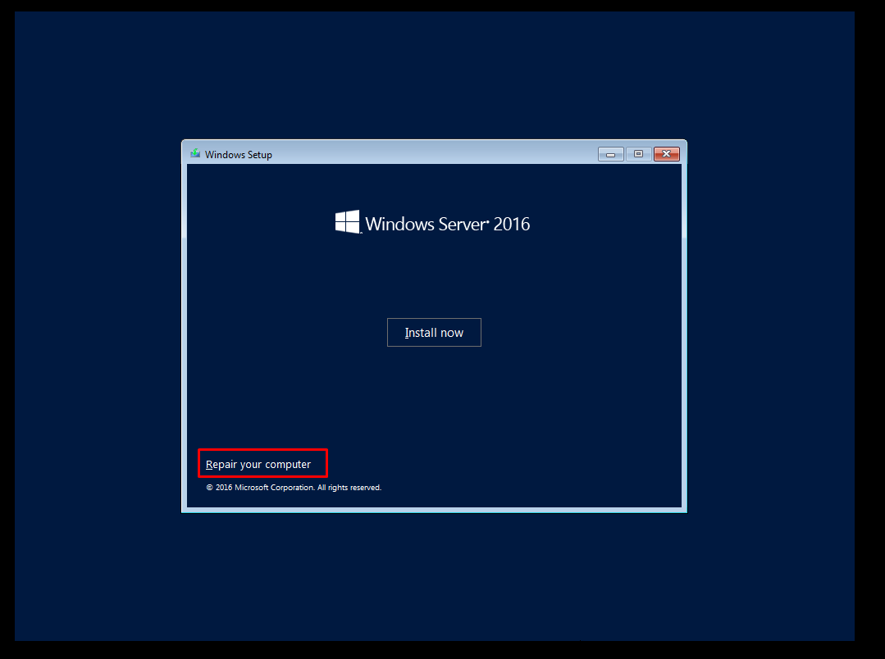
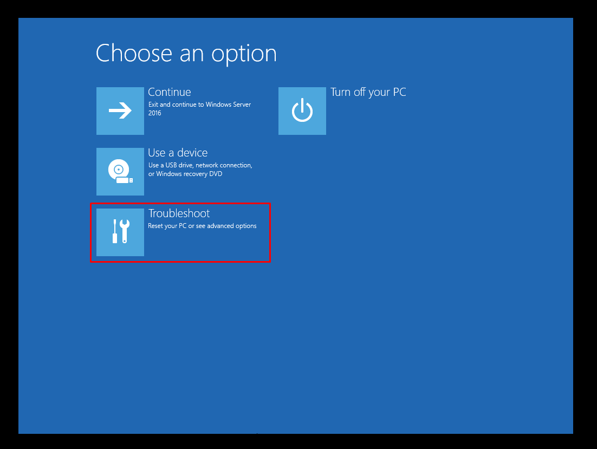
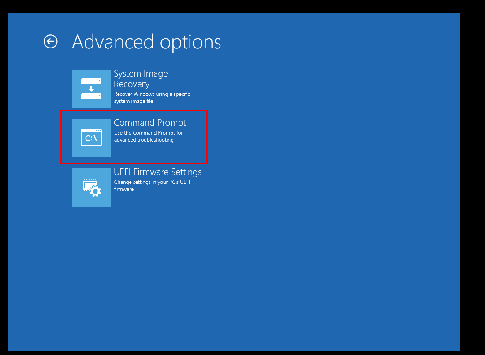
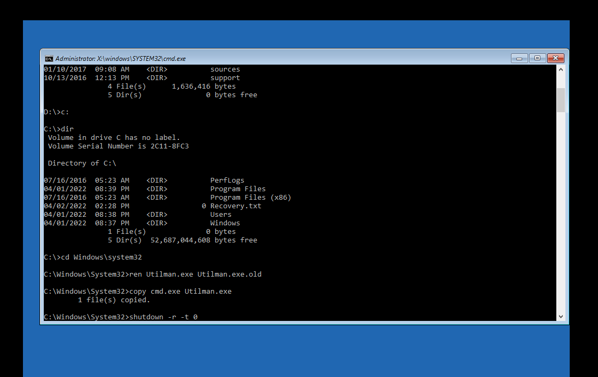
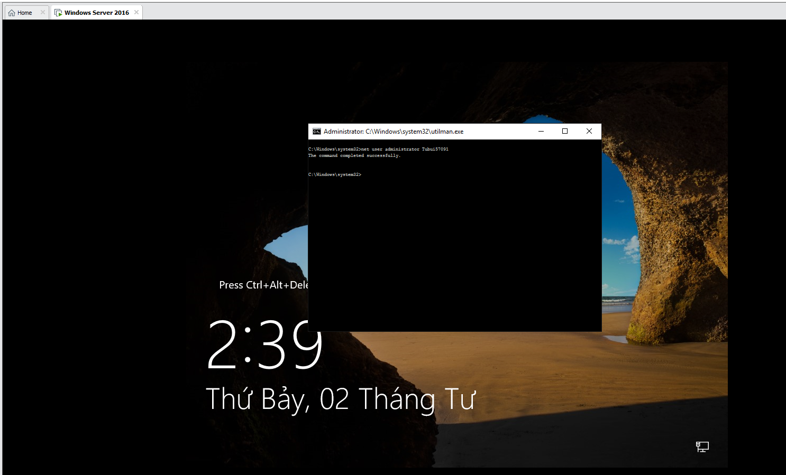

# Reset Password Administrator trên Windows Server
Bước 1: Khởi động lại hệ thống và tiến hành vào `Boot Manager` bằng cách bấm phím 1 trong các phím `ESC, F2, DEL, F12`

Bước 2: Chọn `EFI VMware Virtual SATA CDROM Drive (1.0)` 

Bước 3: Tại Window Setup chọn `Next`, sau đó chọn `Repair your computer`



Bước 4: Kế tiếp, chọn `Troubleshoot` -> `Command Prompt` để mở cửa sổ dòng lệnh





Bước 5: Tại cửa sổ `Command Prompt` và thực hiện chạy các lệnh sau
- Tìm ổ đĩa chứa Directory `Windows`

```sh
C:
cd Windows\system32
ren Utilman.exe Utilman.exe.old
copy cmd.exe Utilman.exe 
```



Bước 7: Sau khi khởi động lại Windows Server, nhấn tổ hợp `Windows + U` tại màn hình đăng nhập để mở cửa sổ Command Prompt và chạy lệnh
```sh
net user administrator Tubui57091	/ Với user là administrator, password là Tubui57091
```



>> Bây giờ ta có thể đăng nhập vào Windows Server bằng tài khoản Administrator với mật khẩu vừa được thay đổi
