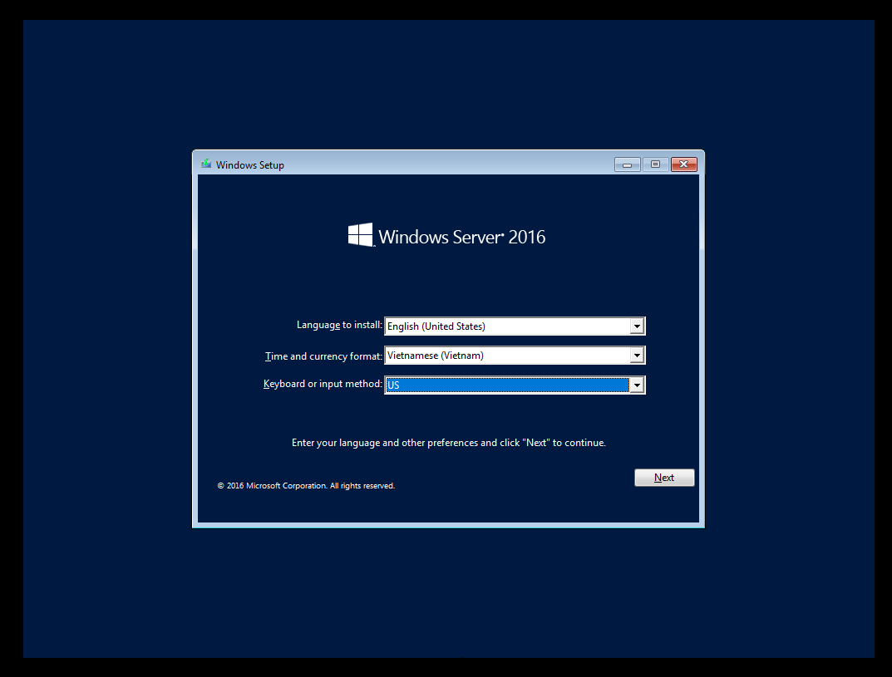
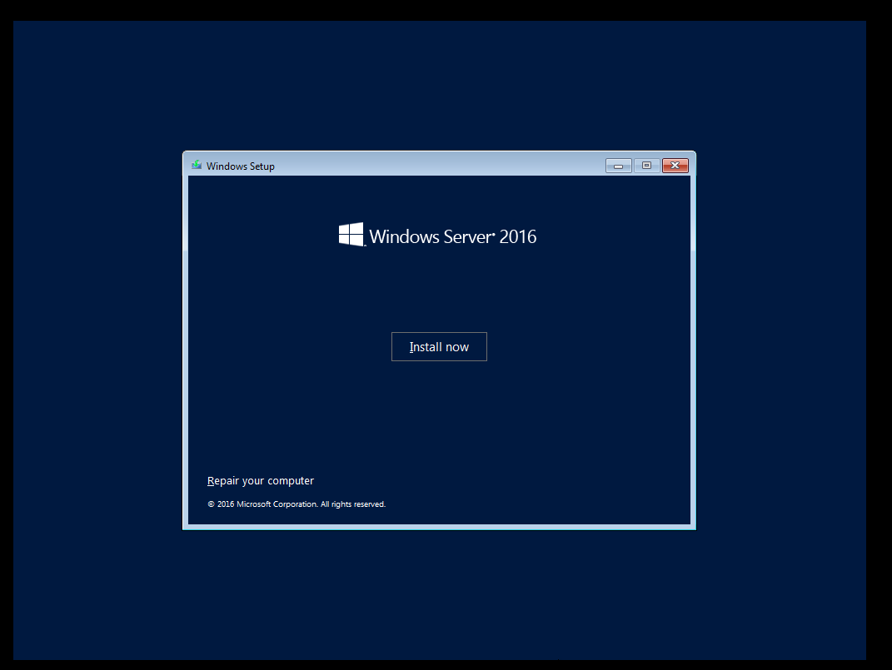
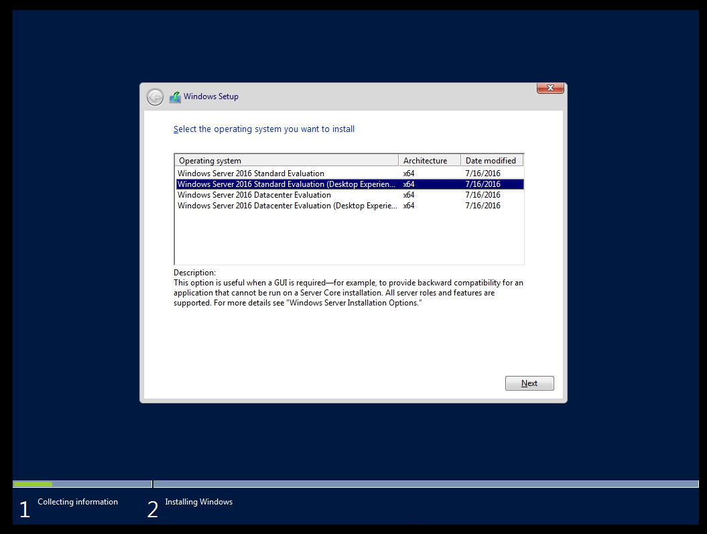
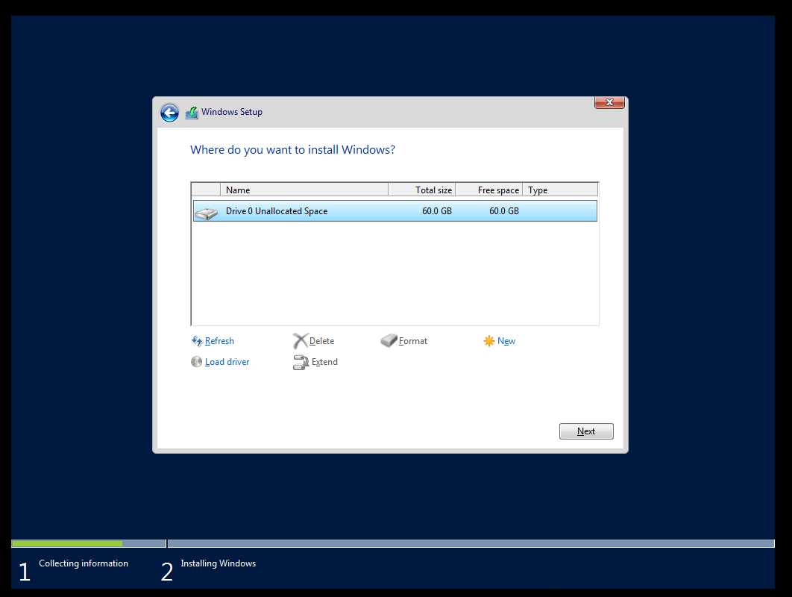
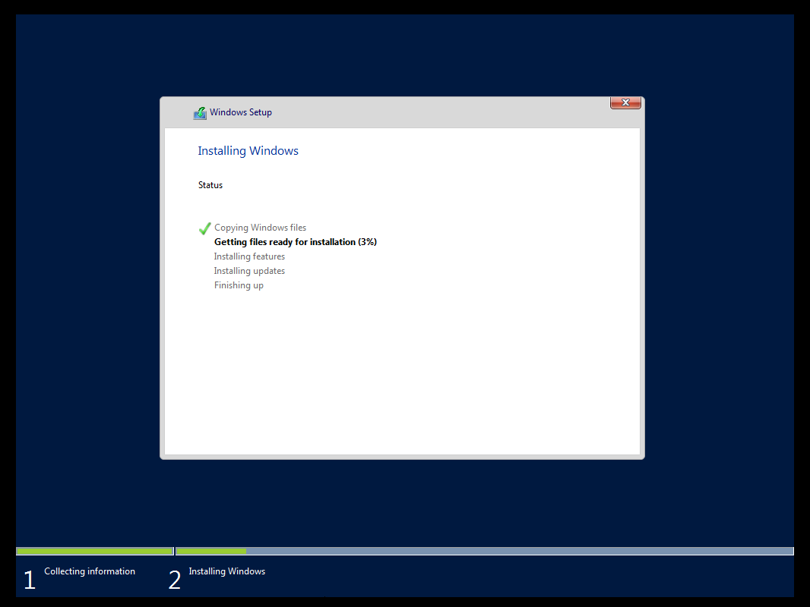
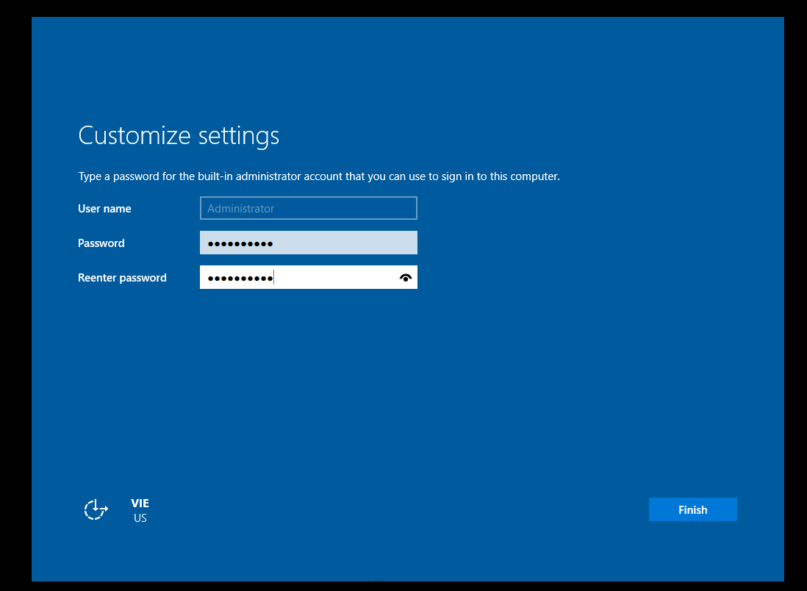
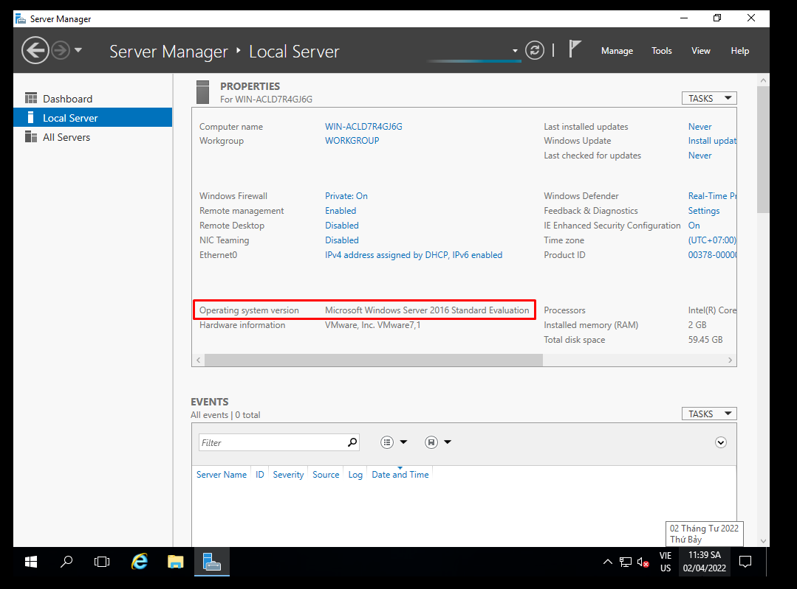

# Cài đặt Windows Server 2016
Bước 1: Download file iso Windows Server 2016 tại

https://download.com.vn/download/windows-server-2016-technical-preview-93340?linkid=72544

Bước 2: Sau khi Download Windows Server 2016, ta bắt đầu quá trình cài đặt Windows Server 2019 với việc khởi động VMWare Workstation và tạo máy ảo

Bước 3: Cài đặt Windows Server 2016
- Chọn ngôn ngữ, time zone và bàn phím hoặc phương thực nhập. Sau đó ấn `Next`

- Chọn `Install Now` để tiến hành cài đặt

- Lựa chọn hệ điều hành muốn cài đặt và chọn `Next`

- Đồng ý với điều khoản của Microsoft

- Lựa chọn `Custom: Install Windows only (advanced)`

- Tiếp đến chọn ví trí mà ta muốn cài đặt hệ điều hành. Ở đây ta chỉ có 1 đĩa trong quá trình tạo máy ảo, nên chỉ có một đĩa được hiển thị ở đây. Ta có thể thêm các đĩa bổ sung bằng cách chọn `New` -> sau chọn `Next`

- Quá trình cài đặt sẽ tiếp tục diễn ra, tùy thuộc vào cấu hình của máy và ổ đĩa, thời gian sẽ diễn ra khoảng 10 phút

- Sau khi quá trình cài đặt hoàn tất và khởi động lại, ta phải đặt mật khẩu cho tài khoản Administrator trước khi đăng nhập vào hệ điều hành

- Ấn `Finish` và đăng nhập vào hệ thống. Sử dụng `Ctrl + Alt + Del` để unlock. Khi sử dụng WMware thì tổ hợp phím sẽ là `Ctrl + Alt + Insert`

