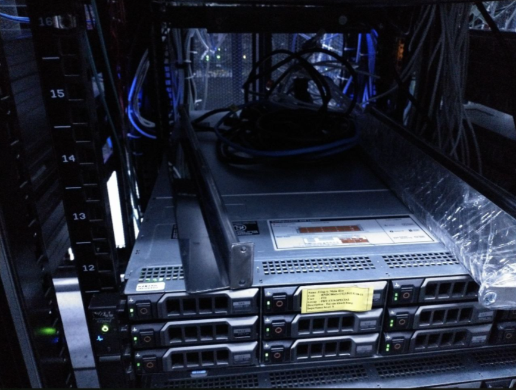

# Data center là gì?
- Data center (Trung tâm dữ liệu) là khu vực chuyên biệt chứa server. Đây là nơi đặt, vận hành và quản lý server và các thành phần liên quan như hệ thống hay hệ thống dữ liệu. Các doanh nghiệp và công ty có nhu cầu thuê máy chủ, thuê chỗ đặt máy chủ hoặc thuê không gian, tủ rack sẽ cần phải tìm kiếm dịch vụ Data Center của các nhà cung ứng

# Vài trò của Data Center
- Data Center có vai trò tạo ra một môi trường chuẩn cho phép người dùng thuê không gian cùng các dịch vụ hỗ trợ kèm theo mà không cần thiết lập các cài đặt phức tạp. Người dùng chỉ cần cài đặt kết nối đến trung tâm dữ liệu thông qua các đường truyền như PSTN/ISD, xDSL...

- Như vậy có thể thấy tầm quan trọng của Datacenter liên quan chặt chẽ đến việc hoạt động liên tục cũng như tính bảo mật của hệ thống network. Chính vì vậy mà vấn đề an toàn, độ tin cậy của Data Center là ưu tiên hàng đầu cần phải có ở một đơn vị cung ứng

# Các yếu tố cần của một Data Center
- Cở sở vật chất: Cơ sở vật chất của một Data Center cần phải đáp ứng đủ không gian cho các thiết bị cũng như có sẵn không gian dự phòng. Thêm vào đó, luôn phải đảm bảo không gian sạch sẽ, được kiểm soát môi trường, nhiệt độ...
- Trang thiết bị hỗ trợ: 
	+ Nguồn điện liên tục (UPS, Uninterruptible Power Sources): ngân hàng năng lượng, máy phát điện và nguồn điện dự phòng
	+ Kiểm soát môi trường (Environmental Control): Điều hòa không khí phòng máy (CRAC), hệ thống sưởi, thông gió, điều hòa không khí (HVAC), hệ thống ống xả
	+ Hệ thống an ninh vật lý (Physical Security Systems): hệ thống giám sát sinh trắc học và video
- Bên cạnh các thiết bị hỗ trợ trên, thiết bị IT cũng là một bộ phận không thể thiếu vì chúng được sử dụng cho hoạt động CNTT và lưu trữ dữ liệu của hệ thống. Các thiết bị IT bao gồm: Server, phần cứng lưu trữ, cáp và giá đỡ, và công cụ bảo mật
- Nhân viên điều hành: Các nhân viên này có vai trò giám sát, kiểm tra hoạt động của các thiết bị cũng như phát hiện và xử lý sự cố xảy ra trong Data Center kịp thời để hệ thống luôn được hoạt động liên tục
# Những trung tâm dữ liệu lớn nhất ở Việt Nam
- Trung tâm dữ liệu FPT
- Trung tâm dữ liệu VIETTEL
- Trung tâm dữ liệu CMC
- Trung tâm dữ liệu ECO
# Phần cứng của Data Center
## Máy chủ 
- Máy chủ là trái tim của Data Center. Các đơn vị phần cứng này chịu trách nhiệm lưu trữ, phân tích và truyền dữ liệu. Ba loại máy chủ chính là:
	+ Blade Server
	+ Rack Server
	+ Tower Server
- Các trung tâm dữ liệu hiện đại sử dụng máy chủ rack, trong đó nhiều máy chủ được xếp chồng lên nhau trong một tủ rack.
## Giá đỡ
- Lựa chọn giá đỡ phù hợp là một cân nhắc quan trọng trong việc thiết lập hoặc quản lý trung tâm dữ liệu. Giá đỡ máy chủ có hai loại chính là Giá mở và Tủ, Trong giá đỡ gồm các server được xếp chồng thành các ngăn và còn có thiết bị chuyển mạch Switch. 
## Cáp 
- Cáp đồng trục, cáp xoắn và cáp quang được sử dụng trong các trung tâm dữ liệu để kết nối thiết bị Switch, thiết bị lưu trữ và Server. Cáp quang cho phép truyền tải nhanh hơn, và do đó chúng được sử dụng nhiều trong các trung tâm dữ liệu hiện đại. Vì cáp là đơn vị chịu trách nhiệm cuối cùng trong việc truyền dữ liệu thông suốt và kịp thời trên toàn mạng, nên chúng đóng vai trò trung tâm trong hoạt động của một trung tâm dữ liệu
## Công tắc
- Các đơn vị đầu nối của phần cứng trung tâm dữ liệu, công tắc có nhiệm vụ liên kết nhiều thiết bị với nhau. Công tắc hoạt động dựa trên địa chỉ phần cứng của thiết bị
## Kho
- NAS (Network Attached Storage) và SAN (Storage Area Network) là hai loại hệ thống lưu trữ được sử dụng phổ biến nhất trong các trung tâm dữ liệu hiện đại, với SAN cung cấp tốc độ cao hơn và truy cập hiệu quả hơn vào các tệp được lưu trữ và dữ liệu mức khối
## Thiết bị điện
- Các trung tâm dữ liệu yêu cầu khả năng cung cấp điện 24x7 và do đó phải sử dụng máy phát điện dự phòng và nhiều tuyến dữ liệu để đảm bảo Nguồn điện liên tục (UPS)
## Hệ thống an ninh
- Không gian vật lý nơi trung tâm dữ liệu được thiết lập phải có khả năng chống lại các thảm họa thiên nhiên như lũ lụt, động đất, hỏa hoạn...
## Hệ thống làm mát
- Các trung tâm dữ liệu yêu cầu nhiều máy chủ phải được đặt gần nhau, trong một không gian hạn chế. Trong trường hợp đó, có nhiều khả năng thiết bị quá nóng nhanh chóng, bất chấp các quạt bên trong của thiết bị. Do đó, các phòng máy chủ phải được duy trì ở nhiệt độ cụ thể theo quy định

# Những lưu ý khi đi up Server và đặt máy chủ tại Data Center
- Trước khi đặt 1 máy chủ lên giá đỡ ta cần lắp 2 thanh đỡ máy chủ bằng cách vặn ốc vít thật chặt để cố định 2 thanh sát sao cho 2 thanh sắt đỡ máy chủ không chạm vào máy chủ đã đặt phía dưới (cách khoảng 2cm). Lưu ý cần vặn ốc thật chặt và thanh sắt không được chạm vào máy chủ phía dưới
- Sau khi cố định được 2 thanh sắt đỡ máy chủ vào tủ rack, ta thực hiện đặt máy chủ và khởi động máy chủ
- Sau khi khởi động máy chủ ta thực hiện cắm dây Cáp vào đúng các port đã được quy định trước để kết nối Máy chủ với thiết bị chuyển mạch (Switch - Thường được đặt ở trên cùng)
- Sau khi cắm dây Cáp vào đúng các Port ta dùng dây rút để bó các dây lại Cáp lại với nhau để tránh bị rối
- Sau khi bó Cáp lại bằng dây rút ta thực hiện kiểm tra xem Server đã kết nối được ra ngoài chưa bằng cách kết nối server với màn hình và bàn phím, sau đó Ping đến DNS 8.8.8.8 của Google. Nếu ping thành công có nghĩa là Server đã kết nối được ra ngoài Internet
- Sau khi xác nhận Server đã kết nối được ra ngoài Internet ta thực hiện quản lý dây Cáp bằng cách dán nhãn lên dây Cáp. Nhãn sẽ cho ta biết thông tin về cổng cắm của dây Cáp (Ví dụ: `em 3`), số thứ tự khe mà dây Cáp cắm vào (Ví dụ: `u12`)...

