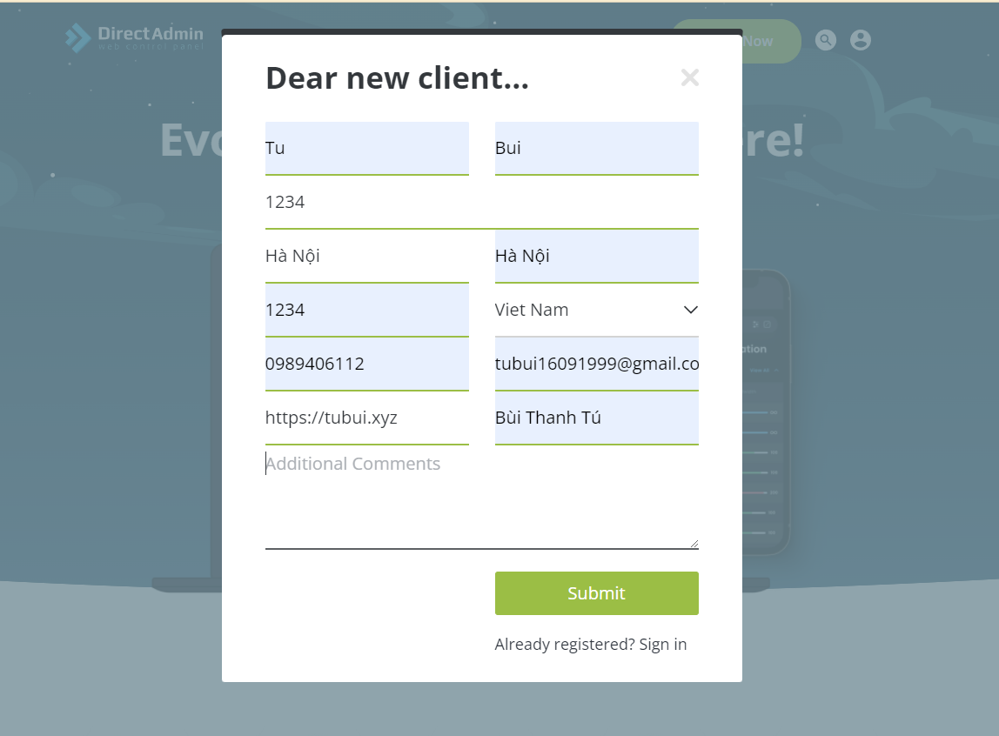
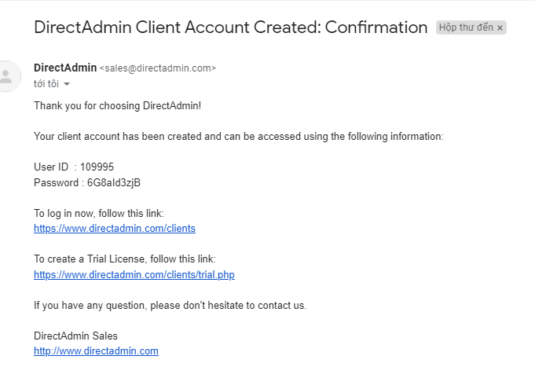
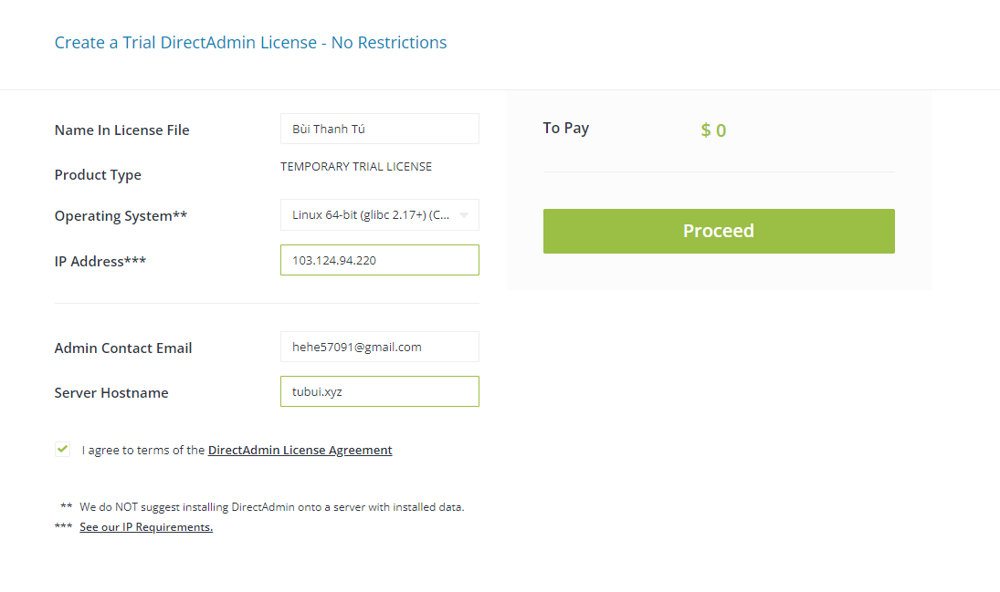
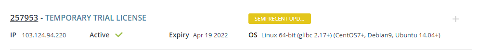
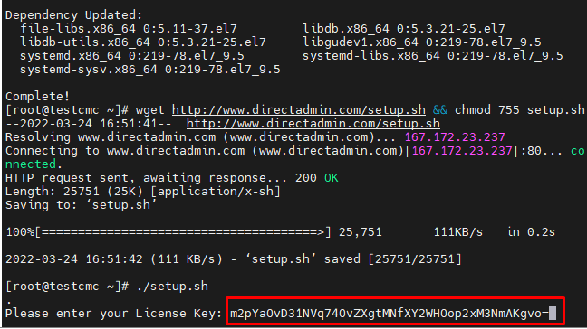
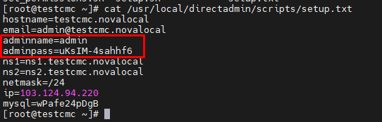
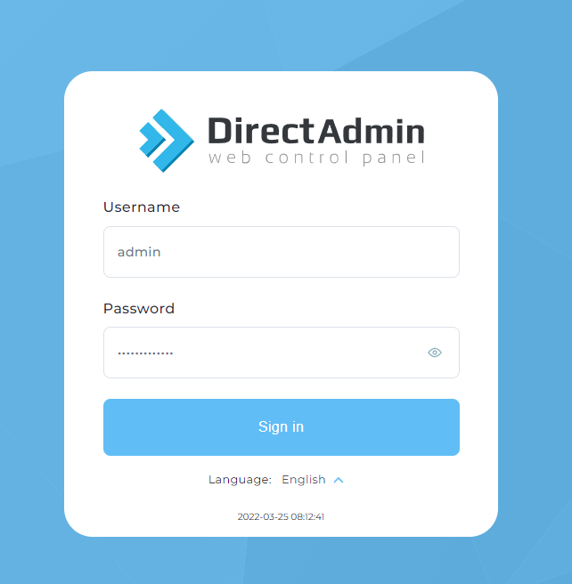
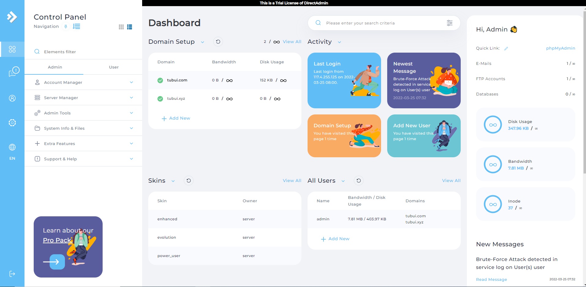

# Giới thiệu về DirectAdmin
- DirectAdmin là một trong những Bảng điều khiển (Control Pannel) dành cho người quản trị Web Hosting được ưa chuộng hiện nay với giao diện trực quan, dễ dàng sử dụng. DirectAdmin cung cấp các tính năng như xem, thay đổi thiết lập phần cứng và phần mềm máy chủ. Đồng thời nâng cao tính bảo mật và kiểm soát tài khoản người dùng.
- DirectAdmin hướng đến sự đơn giản, tiện dụng, tốc độ và sự ổn định. Nhưng vẫn có đầy đủ các tính năng cần thiết cho một quản trị hosting server. Việc quản trị máy chủ và chia sẻ trang web sẽ được thực hiện một cách dễ dàng hơn
# Ưu và nhược điểm của DirectAdmin
## Ưu điểm 
- Phương thức sử dụng đơn giản: DirectAdmin được phân cấp thành 3 loại tài khoản, thứ tự cấp quyền cao đến thấp là Administrator, Reseller và User. Người dùng có thể dễ dàng chuyển đổi giữa 3 loại tài khoản 1 cách dễ dàng
- Tốc độ xử lý nhanh, ít tiêu tốn tài nguyên: DirectAdmin có tốc độ xử lý nhanh chóng và khả năng thích ứng cao. Bên cạnh đó giao diện của phần mềm này cũng được thiết kế theo hướng tối giản, dễ sử dụng và ít tiêu tốn tài nguyên hệ thống
- Ổn định: Tính ổn định của DirectAdmin rất cao. Nó có thể hoạt động trong thời gian dài mà không mắc phải lỗi hệ thống như các phần mềm quản trị hosting khác. DirectAdmin còn có khả năng tự phục hồi trong trường hợp xảy ra lỗi bằng cách khởi động lại hệ thống.
- Gía bản quyền thấp: Giá cả hợp lý là điều vẫn giữ cho DA cạnh tranh trong khi thị trường nơi tồn tại các giải pháp hoàn thiện hơn nhiều. DA còn cung cấp một tài khoản dùng thử miễn phí
## Nhược điểm
- Không hỗ trợ tiếng việt
- Khả năng thêm các chức năng: Về mặt này DirectAdmin còn khá hạn chế. Tuy nhiên, vẫn có thể thêm các chức năng nhưng sẽ tốn thêm chi phí cho việc này
- Cộng đồng người dùng ít: Sẽ khó để tìm được các câu trả lời hướng dẫn cho DirectAdmin khi gặp một vấn đề khó khăn nào đó vì không có quá nhiều cộng động sử dụng DirectAdmin.
# Các tính năng của DirectAdmin
## Chức năng của Administrator trong DirectAdmin
- Create/Modify Admins and Resellers:
	+ Admin có thể tạo Reseller hoặc bổ sung một Admin mới một cách nhanh chóng và dễ dàng
- Reseller Package:
	+ Admin có thể tạo các gói tài khoản với các thông số được xác định trước bằng cách sử dụng tính năng `Reseller Package`. Đến khi tạo tài khoản, Admin chỉ cần chọn 1 gói thay vì thiết lập thử công từng tính năng cho tài khoản
- Show All User: Tính năng này cho phép Admin xem nhanh từng tài khoản trên hệ thống và sắp xếp danh sách này theo nhiều cách khác nhau
- DNS Administration: Cho phép Admin tạo, sửa đổi hoặc xóa bất kỳ bản ghi DNS nào trên máy chủ
- IP Manager: Đây là nơi Admin đặt địa chỉ IP có sẵn cho máy chủ. Admin cũng có thể phân bổ địa chỉ IP cho Reseller từ menu này
- Mail Queue Administration: Công cụ để xem danh sách mail và message. Bao gồm các công cụ để thực hiện hành động đối với các message đó
- System/Services Info: Admin có thể xem, dừng, bắt đầu và khởi động lại các dịch vụ từ menu này
- Complete Usage Statistics: Tính năng này cung cấp cho Admin  một cái nhìn tổng quan đầy đủ về việc sử dụng hệ thống. Đầu vào và đầu ra chính xác từ card Ethernet của máy chủ cũng được giám sát
- DNS Clustering: DirectAdmin giao tiếp với các máy DirectAdmin khác để tự động chuyển dữ liệu DNS giữa chúng. Nó có khả năng kiểm tra máy chủ khác để tìm tên miền và không cho phép các tên miền trùng lặp trên DirectAdmin của bạn
- SPAM fighting tools in DirectAdmin: Nhiều công cụ chống SPAM được cung cấp bởi DirectAdmin
- Licensing/Updates: Admin có thể xem trạng thái giấy phép của mình và tải xuống các bản nâng cấp phần mềm và bảo mật DirectAdmin mới nhất từ menu này
## Chức năng của Reseller trong DirectAdmin
- Create/List/Modify Accounts: Việc tạo, liệt kê, sửa đổi và xóa tài khoản được thực hiện nhanh chóng và dễ dàng
- User Packages: Reseller có thể tạo các Packages được xác định trước bằng cách sử dụng tính năng này. Khi tạo tài khoản, Reseller chỉ cần chọn một Package thay vì thiết lập từng tính năng tài khoản theo cách thủ công
- Reseller Statistics: Reseller được cung cấp thông tin tổng quan đầy đủ về tổng mức sử dụng của họ. Reseller cũng có thể sắp xếp dữ liệu theo User để nhanh chóng đánh giá tình hình tổng thể
- Message All Users: Reseller có thể nhanh chóng gửi tin nhắn đến tất cả khách hàng của họ bằng cách sử dụng hệ thống hỗ trợ ticket được tích hợp sẵn của DirectAdmin
- Import/Manage Skins: Với tùy chọn menu này, Reseller có thể nhanh chóng import và áp dụng giao diện mới chỉ bằng một nút bấm
- IP Assignment: Reseller có thể phân bổ địa chỉ IP cho khách hàng của họ bằng cách sử dụng tùy chọn menu này
- System/Services Information: Bằng cách nhấp vào tính năng này, Reseller có quyền truy cập tức thì vào trạng thái máy chủ và thông tin hệ thống
- Name Servers: Reseller có thể tạo nameservers được cá nhân hóa cho khách hàng của họ từ menu này
## Chức năng của User trong DirectAdmin
- E-mail Administration: User có thể tạo tài khoản POP/IMAP, địa chỉ e-mail, forwarder, danh sách gửi thư, thư trả lời tự động và webmail. Bộ lọc cho phép người dùng chặn mail theo tên miền, từ khóa và kích thước
- FTP Management: User có thể tạo tài khoản FTP và thiết lập quyền thư mục cho từng tài khoản. FTP ẩn danh cũng được hỗ trợ
- DNS Menu: User có thể thêm và xóa các bản ghi, thay đổi cài đặt MX và bất kỳ thứ gì khác với toàn quyền kiểm soát DNS
- Statistics Menu: User có sẵn mọi thống kê về tài khoản của họ. Các tùy chọn nâng cao hơn và Webalizer cũng được bao gồm
- Subdomains Menu: User có thể liệt kê, tạo, xóa và lấy số liệu thống kê về các subdomains
- File Manager: Một sự thay thế nhanh chóng và thân thiện với người dùng cho FTP. Bao gồm mọi tính năng cần thiết để xây dựng và duy trì một trang web
- MySQL Databases: User có thể dễ dàng tạo, sửa đổi và xóa cơ sở dữ liệu MySQL từ menu này
- Site Backup: Sử dụng công cụ hữu ích này, User có thể sao lưu và khôi phục những gì họ muốn
- Error Pages: User có thể tạo các thông báo và kết quả đầu ra tùy chỉnh cho các mã lỗi 401, 403, 404 và 500
- Directory Password Protection: User có thể đặt mật khẩu bảo vệ bất kỳ thư mục nào bằng tên username và password
- PHP Selector: Cho phép khách hàng chọn phiên bản PHP nào sẽ được liên kết với phần mở rộng .php
- Advanced Tools: User có thể cài đặt chứng chỉ SSL, xem thông tin máy chủ và các mô-đun perl đã cài đặt, đặt cron job, mime types và trình xử lý apache, đồng thời cho phép chuyển hướng trang web và trỏ tên miền
## Chức năng chung trong DirectAdmin
- Integrated Ticket Support System: Với hệ thống tích hợp hỗ trợ ticket của DA, bạn sẽ được cung cấp dịch vụ hỗ trợ khách hàng tốt hơn và ít rắc rối hơn. "Bạn có XX tin nhắn đang chờ" được hiển thị mỗi khi đăng nhập và bạn có thể đặt DA thông báo cho bạn về các yêu cầu hỗ trợ qua email, đảm bảo rằng không có yêu cầu nào bị bỏ qua. Nếu muốn cung cấp hỗ trợ theo một cách khác, chỉ cần tắt tính năng này.
- Two-Factor Authentication: Cho phép bất kỳ tài khoản DirectAdmin nào yêu cầu Xác thực hai yếu tố bằng mã từ ứng dụng trên smartphone
- Plugin System: Cho phép mở rộng chức năng DirectAdmin một cách dễ dàng
- Live Updates: Quản trị viên máy chủ có thể nhấp vào nút 'Licensing/update' để xem trạng thái phiên bản và giấy phép hiện tại. Không cần phải tải xuống, giải nén và cài đặt theo thủ công - DA tự động thực hiện tất cả các bản cập nhật
- Completely Customizable: Mọi khía cạnh của giao diện DirectAdmin đều có thể được thay đổi và các thiết kế mới được import dễ dàng thông qua menu “skin”
- Automatic Recovery From Crashes: DirectAdmin TaskQueue đảm bảo rằng tất cả các dịch vụ luôn hoạt động. Nếu có sự cố, DirectAdmin sẽ cố gắng khắc phục sự cố bằng cách khởi động lại dịch vụ. Nếu không thành công, DirectAdmin sẽ thông báo cho quản trị viên máy chủ ngay lập tức.

# Cài đặt DirectAdmin trên Centos 7
## Đăng ký tài khoản DirectAdmin
- Ta vào trang chủ DirectAdmin để đăng ký tài khoản và license dùng thử: https://www.directadmin.com/



- Sau khi Submit ta sẽ nhận được `User ID` và `Password` được gửi về email



- Đăng nhập bằng `User ID` và `Password` đã nhận được và vào phần `Get Trial` nhập thông tin



- Nếu trước đó đã `Get trial` mà vẫn còn thời hạn ta có thể sửa thông tin `Server IP` và `Hostname` để thay đổi thông tin như mong muốn



# Cài đặt DirectAdmin
- Cài đặt các gói cần thiết cho DirectAdmin
```sh
yum install wget gcc gcc-c++ flex bison make bind bind-libs bind-utils openssl openssl-devel perl quota libaio libcom_err-devel libcurl-devel gd zlib-devel zip unzip libcap-devel cronie bzip2 cyrus-sasl-devel perl-ExtUtils-Embed autoconf automake libtool which patch mailx bzip2-devel lsof glibc-headers kernel-devel expat-devel
```
```sh
yum install -y psmisc net-tools systemd-devel libdb-devel perl-DBI xfsprogs rsyslog logrotate crontabs file
```

- Tải DirectAdmin và phân quyền cho nó
```sh
wget http://www.directadmin.com/setup.sh && chmod 755 setup.sh
```
```sh
./setup.sh
```

- Sau khi chạy chương trình ta phải nhập license key 



- Sau khi cài đặt xong ta tiến hành lấy thông tin user password tại `/usr/local/directadmin/scripts/setup.txt`
```sh
vi /usr/local/directadmin/scripts/setup.txt
```



- Đăng nhập bằng cách nhập `địa_chỉ_IP:2222` trên trình duyệt web 





# Các chức năng trên DirectAdmin
## Admin
Gồm các option chính:
- Account Manager
- Server Manager
- Admin Tool
- System Info & Files
- Extra Features

### Account Manager
Là nơi thực hiện các thao tác quản lý đối với các tài khoản
- Add New User: Thêm các User mới. mỗi User sẽ được gán cho từng Package User
- Show All User: Xem tất cả các User, Reseller, Admin
- My User: Xem tất cả các User
- Manage User Packages: Quản lý tất cả các Package của các User
- Move Users between Resellers: Chuyển đổi các User giữa các Resellers
- Edit User Message: Tạo mẫu email cho thông báo đến User mới
- Change Password: Thay đổi mật khẩu của các User
- Create Reseller: Tạo mới Reseller
- List Reseller: Hiển thị danh sách các Reseller
- Manage Reseller Packages: Quản lý tất cả các Package của các Resellers
- Create Administrator: Tạo mới Admin
- List Administrator: Xem dánh sách các Admin
- Suspension Message
### Server Manager
- Administrator Settings: Cho phép thiết lập đối với server 
- Custom HTTPD Configurations: Hiển thị các file `.conf` của các domain, có thể truy cập để chỉnh sửa theo ý muốn
- DNS Administration: Quản lý DNS 
- IP Management: Quản lý IP
- Ngoài ra còn các tùy chọn khác nhu `Name Servers` , `Multi Server Setup`, `PHP Configuration`, `SSH Keys`
### Admin Tools
- Admin Backup/Transfer: Tại đây ta có thực hiện Backup, lên lịch Backup, Restore
- Brute Force Monitor: Hiển thị các log đăng nhập không thành công
- Process Monitor: Hiển thị các tiến trình đang chạy
- Mail Queue Administration: Hiển thị tất cả các thư có trong hàng đợi
- Service Monitor: Hiển thị các dịch vụ đang chạy
- System Backup: Thiết lập cho việc backup dữ liệu
- Message All Users: Gửi tin nhắn tới tất cả các User trên DirectAdmin
- Skin Manager: Thiết lập chủ đề cho bảng điều khiển
- Customize Evolution Skin: Giao diện tiến hóa
### System Info & Files
- All User Cron Jobs: Quản lý các Cron Jobs của các User
- File Manager: Quản lý các File 
- File Editor: Chỉnh sửa các file của hệ thống 
- System Information: Hiển thị thông tin của hệ thống
- Log Viewer: Hiển thị các log `Cron Log`, `DirectAdmin Error Log`, `DirectAdmin Task Queue Log`, `DirectAdmin Login Log`
- Complete Usage Statistics: Thống kể sử dụng hệ thống 

## User
### Account Manager
- Domain Setup: Cấu hình Domain, tại đây có thể chỉnh sửa domain của user, lựa chọn phiên bản PHP cho user
- Subdomain Management: Quản lý các subdomain
- DNS Management: Quản lý các bản ghi DNS
- SSL Certificates: Quản lý chứng chỉ SSL cho domain của user
- FTP Managerment: Quản lý kết nối FTP
- MySQL Managerment: Quản lý database
- Site redirection: Chuyển hướng trang web
- PHP settings: Cài đặt PHP
### Email Manager
- Quản lý email, tài khoản email, tự động chuyển tiếp email, bộ lọc thư, thư rác, bản ghi MX
### Advanced Features
- Apache handlers: Trình xử lý apache
- Catch -All E-mail
- Create/Restore Backups: Sao lưu/phục hồi dữ liệu
- Cron Jobs: Tạo các Job tự động 
- Custom Error Pages: Tùy chỉnh trang lỗi
- Two-Step Authentication: Xác thực 2 bước 
- Password Protected Directory: Đặt mật khẩu cho đường dẫn muốn bảo mật 
- SSH key: Tạo khóa SSH
### System Info & File
- Tương tự như bên Admin, gồm quản lí file, các thông tin về hệ thống, các modules đã cài đặt

### Extra Features
- Webmail Roundcube: Hệ thống mail server được build sẵn trên DirectAdmin
- phpMyAdmin: Quản trị các database trên hệ thống