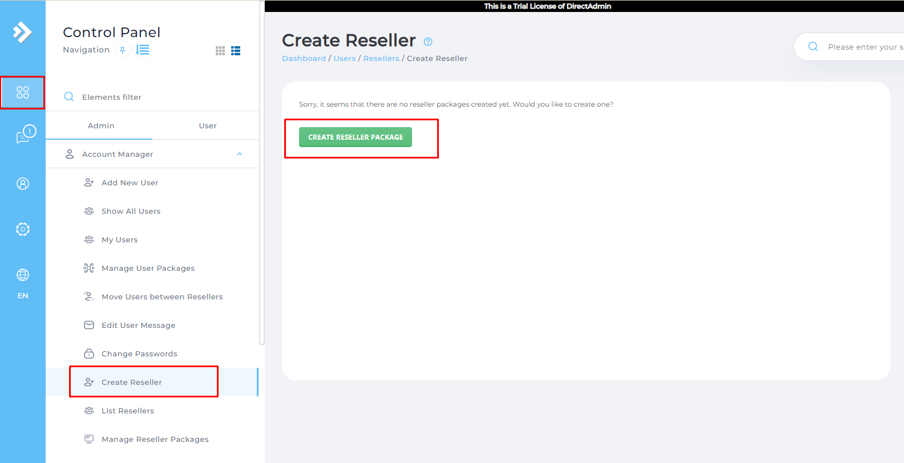
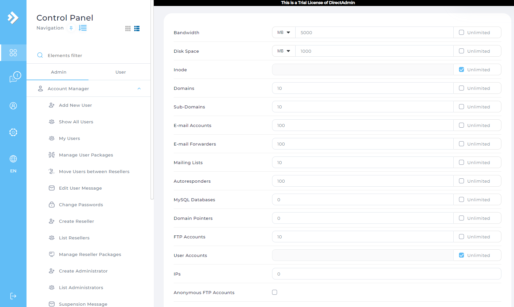
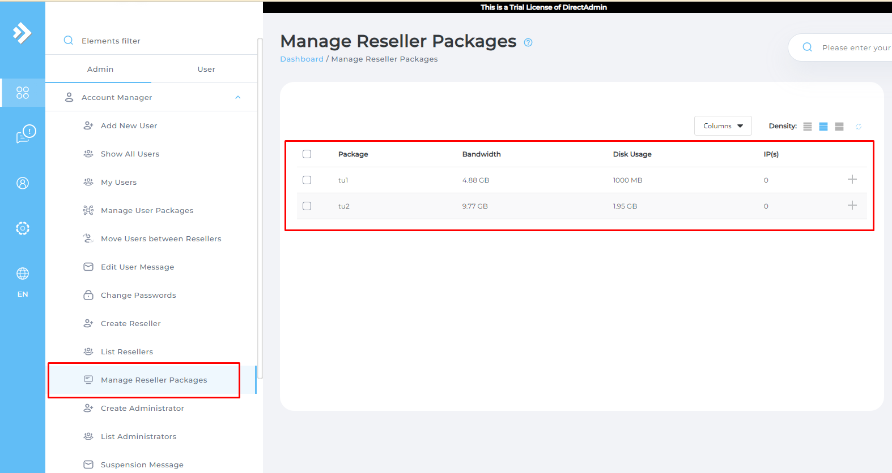
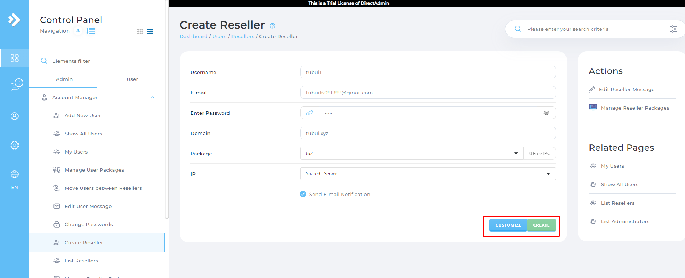
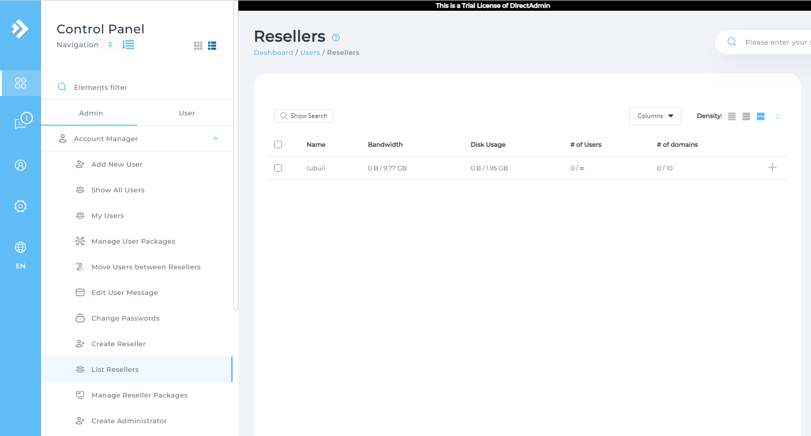
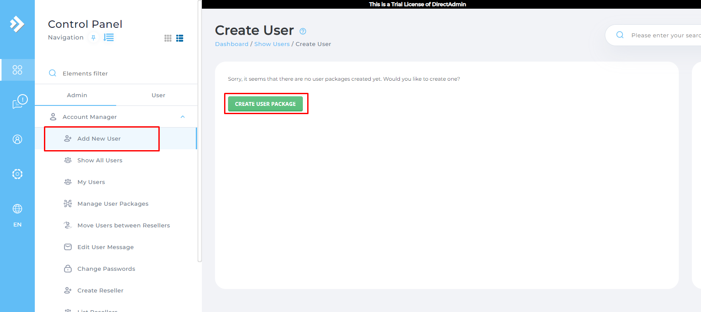
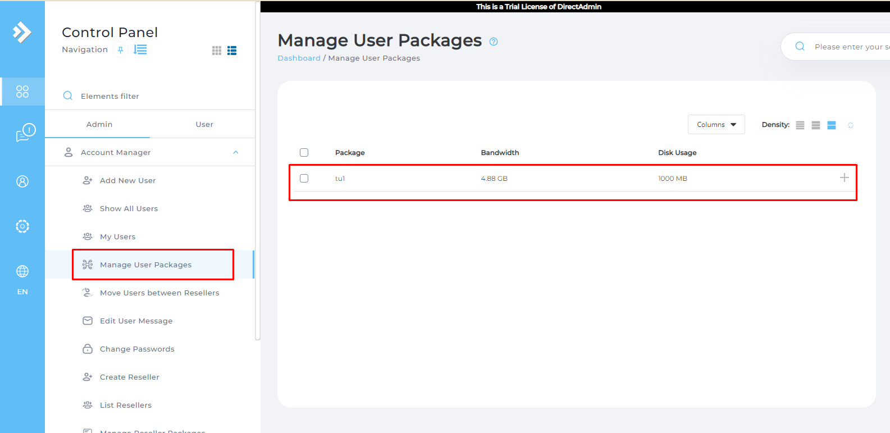
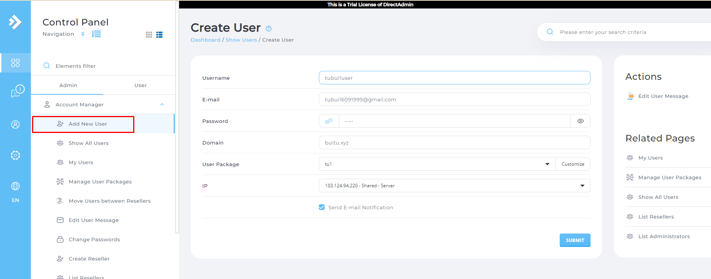
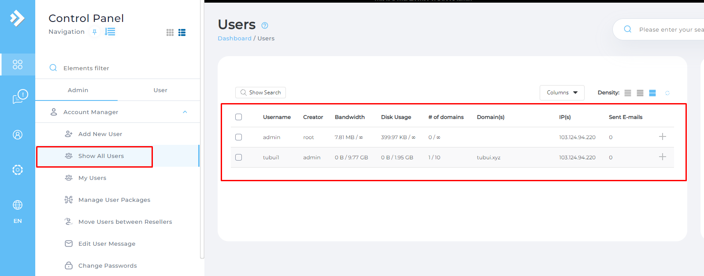
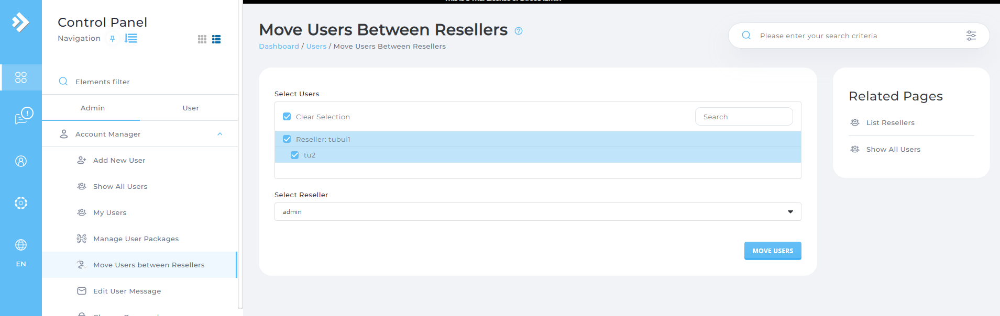

# Add Reseller 
Bước 1: Tạo Package Reseller
- Tại `Menu` -> `Admin` chọn `Create Reseller`. 
- Tại đây ta phải tạo `Package` cho `Reseller` trước khi tạo `Reseller`

- Nhấn vào `Create Reseller Package`

- Chọn các tham số ta muốn thiết lập cho `Package Reseller`:
	+ Bandwidth: Lưu lượng băng thông cấp phát cho user
	+ Disk space: Dung lượng ổ cứng cấp phát cho user
	+ Inodes: Số file tối đa được phép tạo
	+ Domains: Số lượng tên miền website được tạo ra trên user
	+ Email Accounts: Số lượng email mà user có thể tạo
- Cùng hàng loạt các tùy chọn khác, nếu như không có nhu cầu giới hạn, ta có thể để unlimited
- Tại `Package Name` nhập tên `Package` vào chọn `Create`
- Kiểm tra danh sách `Reseller Package` ta chọn `Manage Reseller Packages`

Bước 2: Sau khi tạo `Reseller Package` ta đã có thể tạo `Reseller`

- Ta có thể chọn `Customize` để thiết lập `Reseller` với `Package Reseller` mới hoặc có thể chọn `Package Reseller` đã tạo và nhấp vào `Create`
- Sau khi tạo xong vào `List Resellers` để xem danh sách `Reseller` đã tạo

# Add User
Bước 1: Tạo Package User
- Tại `Menu` -> `Admin` chọn `Add New User`. 
- Tại đây ta phải tạo `Package` cho `User` trước khi tạo `User`

- Chọn các tham số ta muốn thiết lập cho `Package User`:
- Tại `Package Name` nhập tên `Package` vào chọn `Save`
- Kiểm tra danh sách `User Package` ta chọn `Manage User Packages`

- Kiểm tra danh sách `User Package` ta chọn `Manage User Packages`

- Bước 2: Sau khi tạo `User Package` ta có thể tạo `User`

- Sau khi tạo xong vào `Show All Uers` để xem danh sách `User` đã tạo

# Move Users Between Reseller
- `Move Users Between Reseller` để chuyển đổi các User giữa các Reseller

