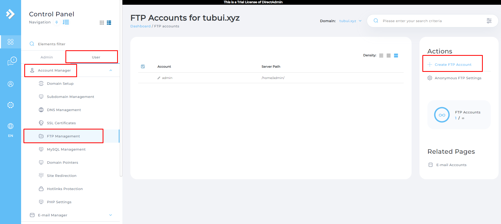
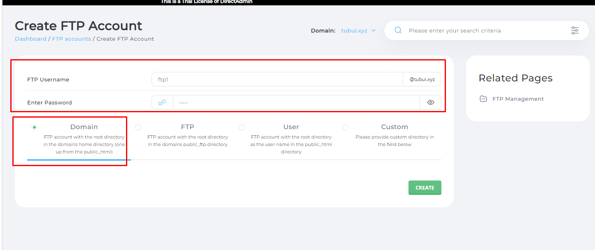
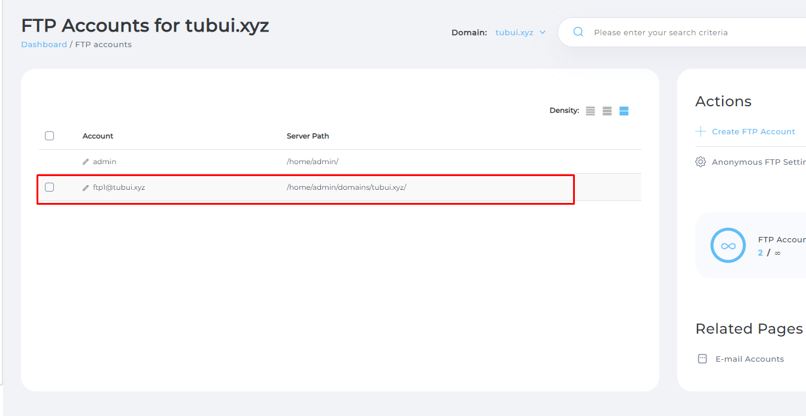
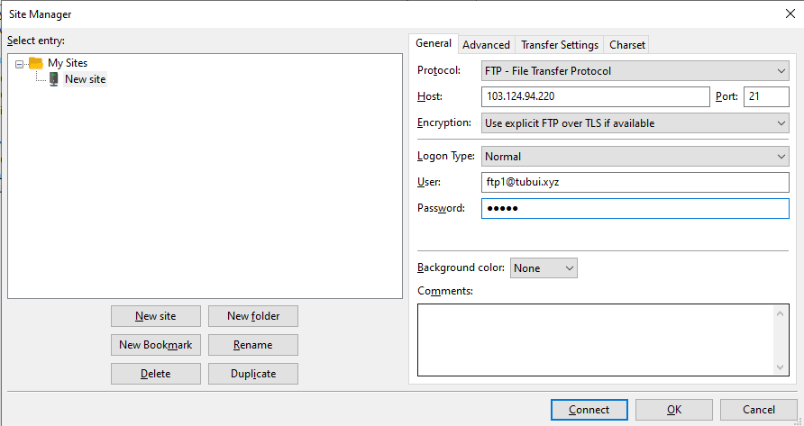
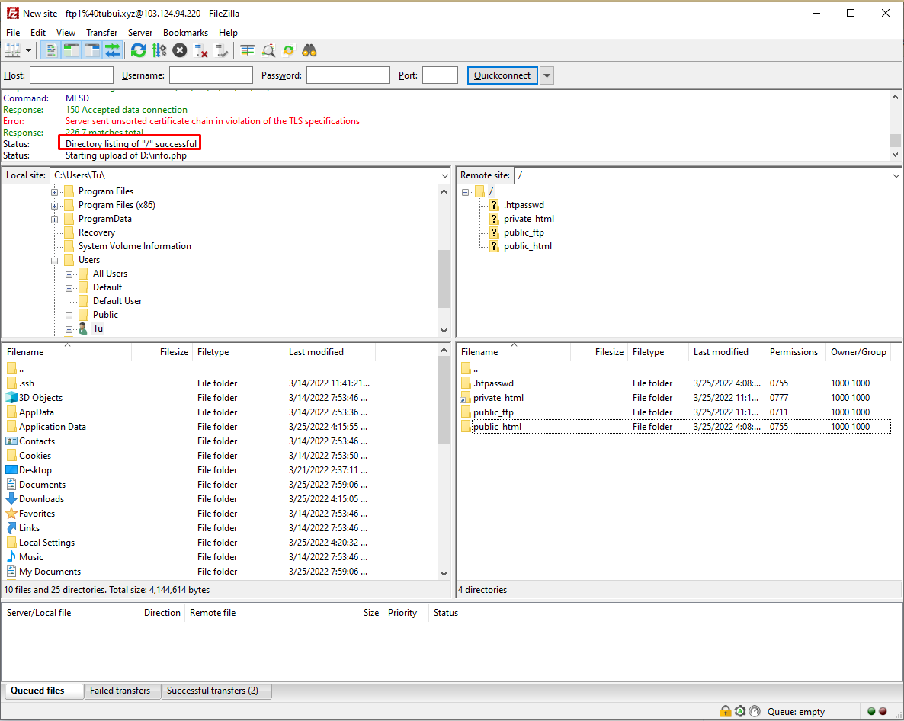

# Tạo và sử dụng FTP trên DirectAdmin
Bước 1: Tạo tài khoản FTP 
- Vào `Menu` -> tab `User` -> `Account Manager` -> `FTP Management` -> `Create FTP Account`

- Tại đây sẽ có 4 tùy chọn để set đường dẫn dữ liệu cho tài khoản FTP
	+ `Domain`: Tùy chọn này cho phép truy cập vào thư mục chứa mã nguồn của tài khoản FTP (public_html)
	+ `FTP`: Tùy chọn này cho phép truy cập vào public_ftp của domain
	+ `User`: Tùy chọn này cho phép truy cập vào thư mục FTP của user
	+ `Custom`: Tùy chọn này cho phép tùy chỉnh đường dẫn truy cập bất kỳ
- Thông thường ta chọn `Domain` để chỉnh sửa, upload hay download dữ liệu trên website
- Sau khi điền đầy đủ thông tin, nhấn `CREATE` để tạo tài khoản FTP

Bước 2: Kết nối FTP với FileZilla
- Tiến hành kết nối FileZilla với tài khoản FTP 
- Chọn `File` -> `Site Manager`
- Tiếp theo ta chọn `New site`, điền đủ thông tin
	+ Protocol: FTP - File Transfer Protocol
	+ Host: Điền thông tin IP của vps/host
	+ Port: 21
	+ Encryption: Only use plain FTP
	+ Logon Type: Normal
	+ User: Nhập user đã tạo ở bước 1:
	+ Pass: Nhập pass

- Nhấp `Connect` để kết nối đến server

>> Như vậy ta đã kết nối thành công đến đường dãn chứa file và có thể upload or download file