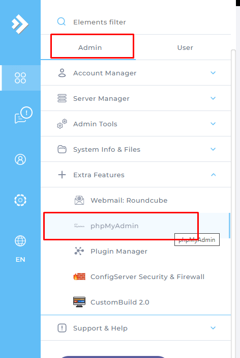

# Tạo domain
- Tại `Menu` -> tab `User` -> `Account Manager` -> chọn `Domain Setup` -> `Add New` 

# Tạo Database cho domain
- Tại `Menu` -> tab `User` -> `Account Manager` -> chọn `MySQL Management` -> `Create New Database`

- Đăng nhập vào phpMyAdmin để kiểm tra

Sau khi truy cập vào phpmyadmin ta thấy được database vừa tạo
