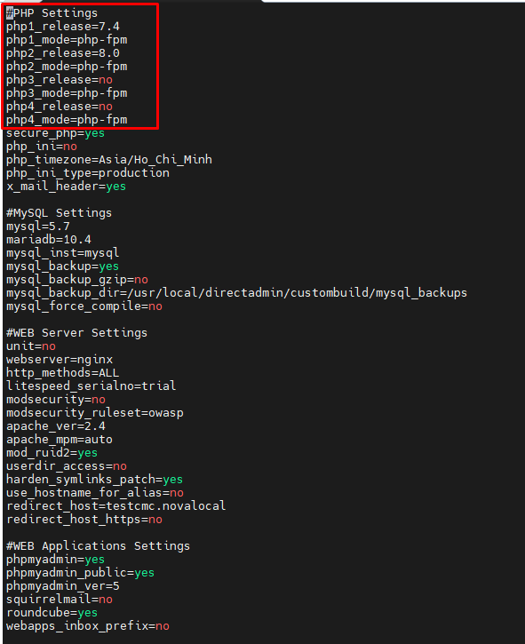
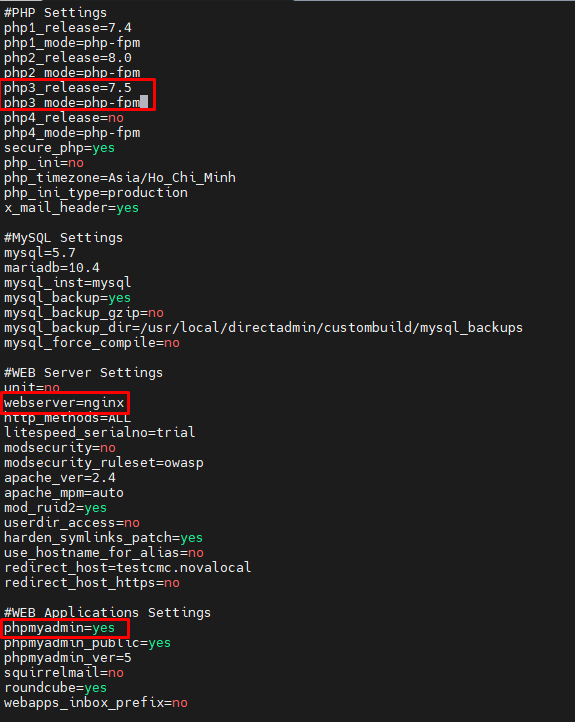
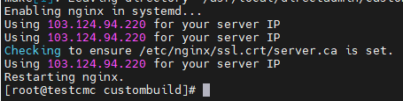
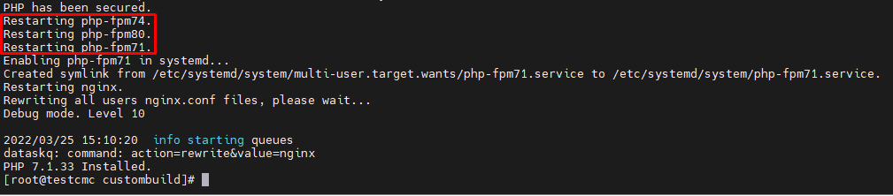
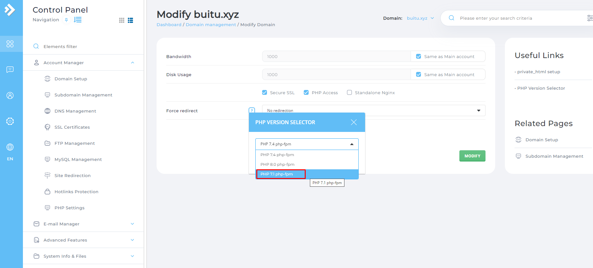
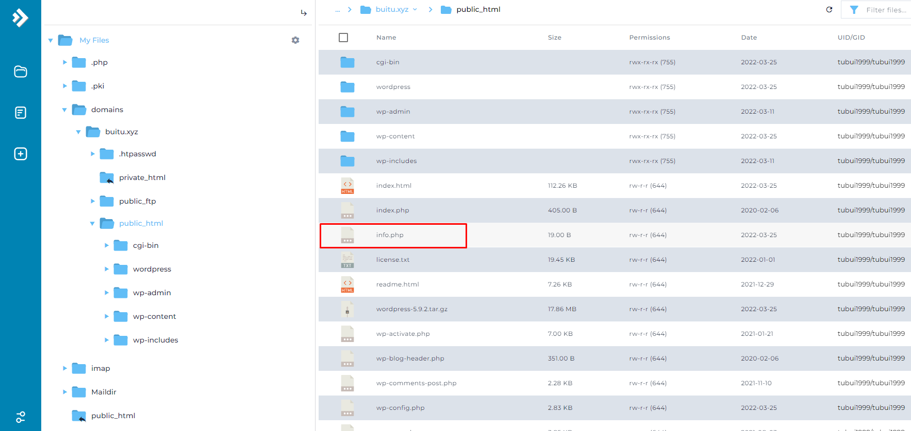
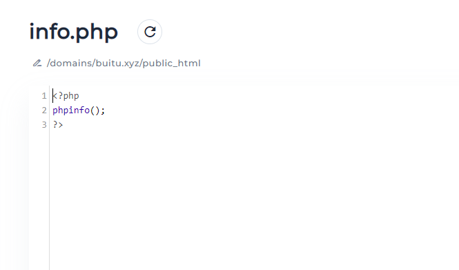
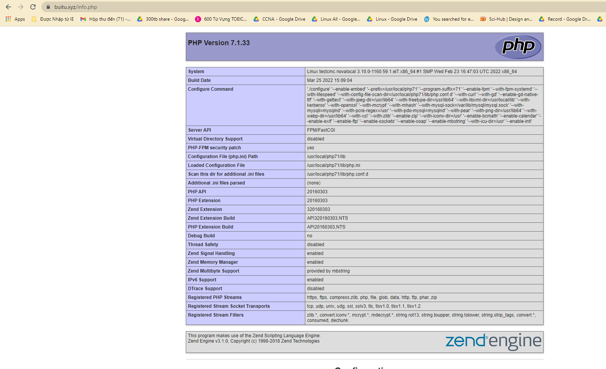

# Build PHP + Nginx trên DirectAdmin
- Vào thư mục CustomBuild
```sh
cd /usr/local/directadmin/custombuild
```

- Kiểm tra các phiên bản PHP đang được build
```sh
vi /usr/local/directadmin/custombuild/options.conf
```



- Ta thấy có thể build đồng thời 4 phiên bản PHP trên DirectAdmin. Và đã có sẵn 2 phiên bản php 7.4 và 8.0.
- Để build thêm 1 phiên bản PHP, web server nginx và phpMyAdmin ta cần chỉnh sửa thông tin trong file `/usr/local/directadmin/custombuild/option.conf` như sau



- Thoát và lưu

- Sau đó ta chạy các lệnh để build đúng như thiết lập
```sh
./build update
./build nginx
./build php n
./build rewrite_confs
```





- Đổi phiên bản php và kiểm tra 



- Vào `File Manager` tạo một file `info.php` trong thư mục `public_html` để kiểm tra phiên bản





- Vào trình duyệt kiểm tra 



>> Với Apache ta build tương tự như Nginx