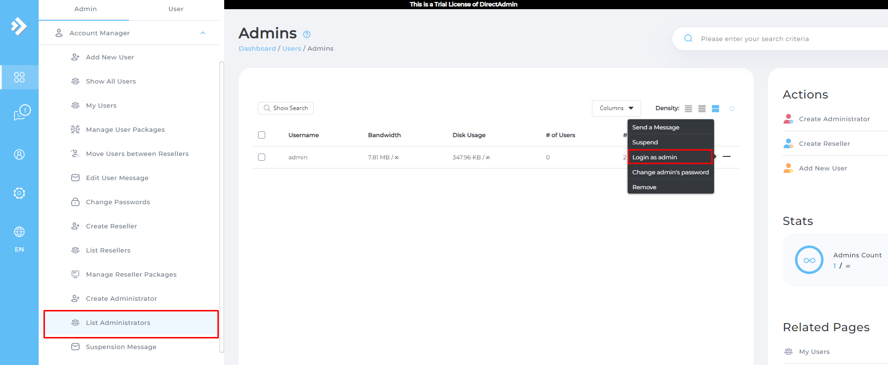
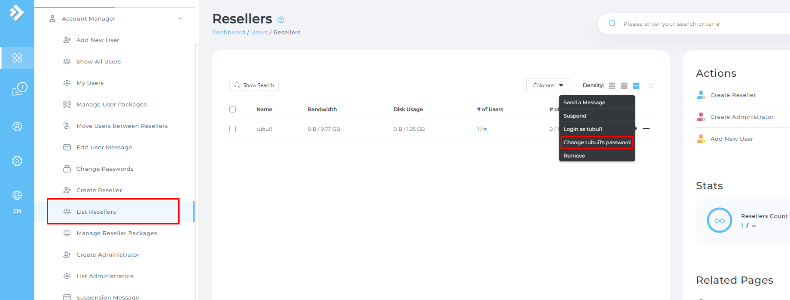
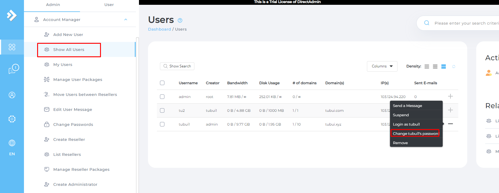

# Change Password Admin
- Để đổi mật khẩu của Admin ta làm như sau: Vào `Menu` -> `List Administrators` -> `+` -> `Change [admin's] password`

# Change Password Reseller
- Để đổi mật khẩu của Reseller ta làm tương tự như như với Admin 
`List Resellers` -> `+` -> `Change [tubui's] password`

# Change Password User
- Để đổi mật khẩu của User ta cũng làm tương tự như với Admin và Reseller

`Show All Users` -> `+` -> `Change [tubui1's] password`

