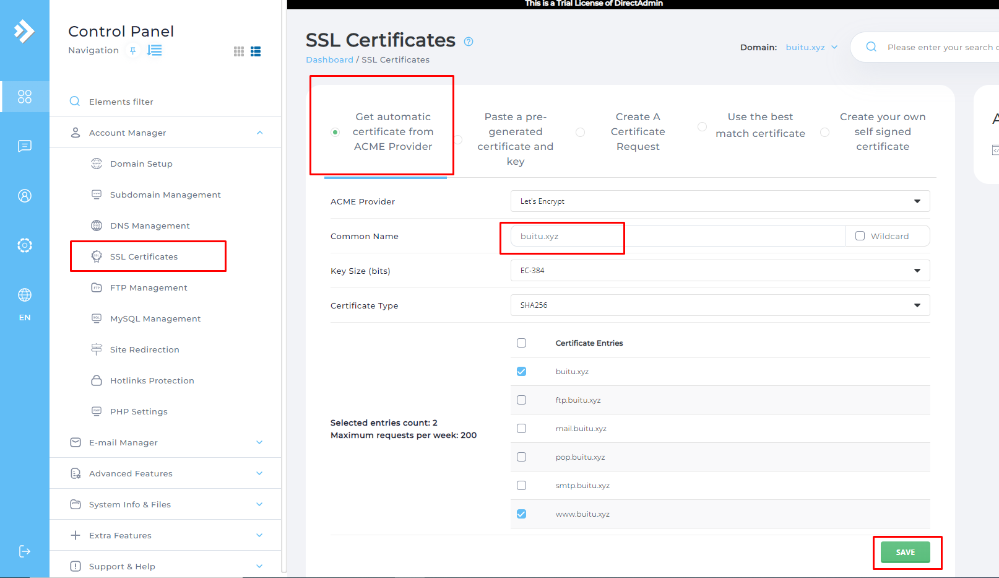
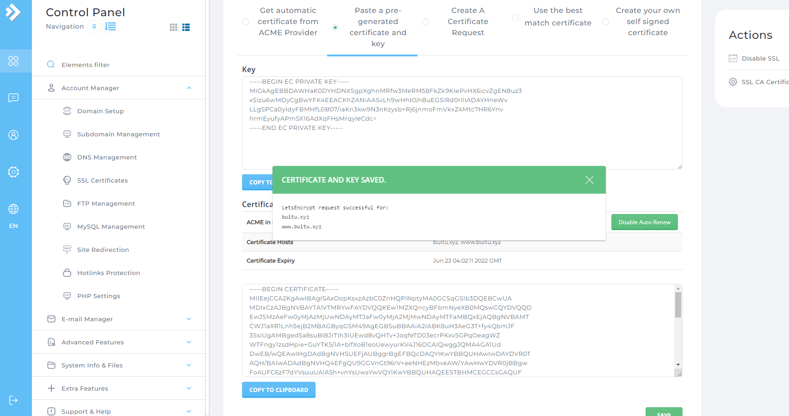
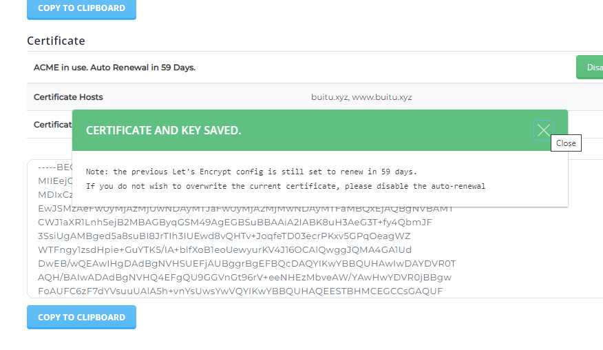
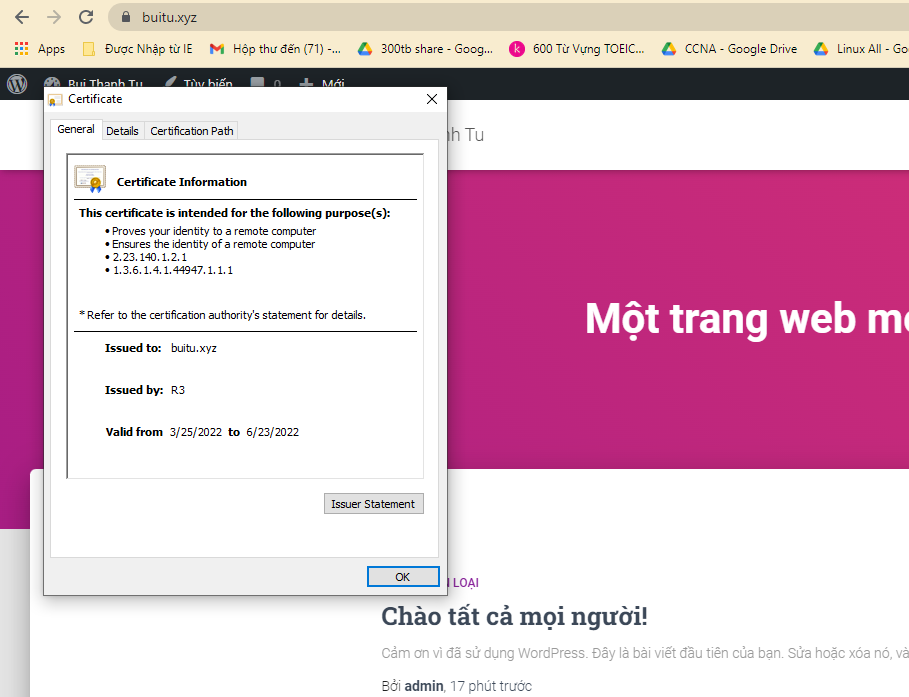

# Cài đặt SSL Let's Encrypt trên DirectAdmin
- Vào `Menu` -> `Account Manager` -> `SSL certificates` -> chọn tab đầu tiên `Get automatic certificate from ACME Provider` và thiết lập như sau

- Nhấp vào save để tạo key

- Như vậy ta đã tạo thành công Key và Certificate

>> Tiến hành đăng nhập để kiểm tra 

