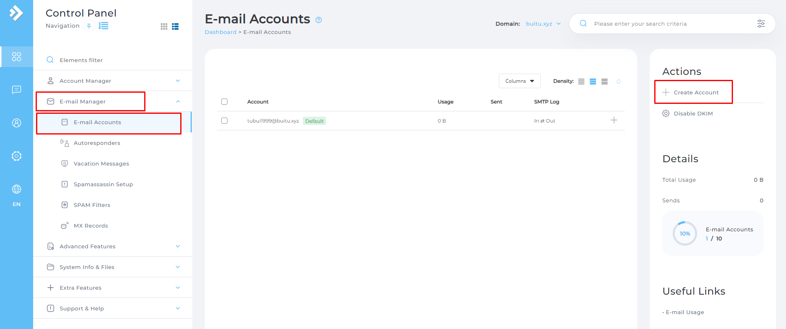
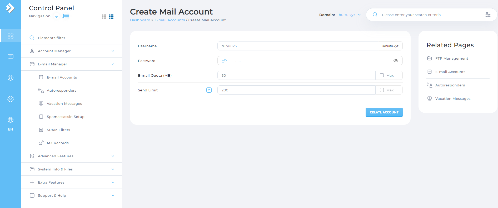
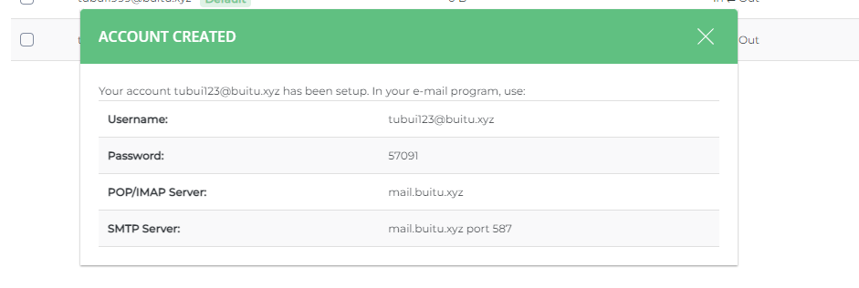
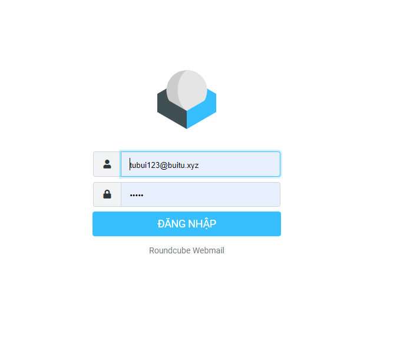
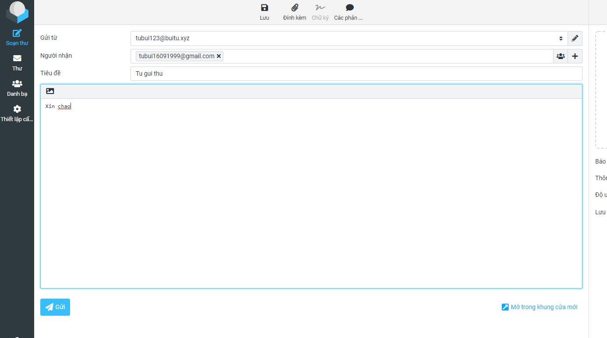
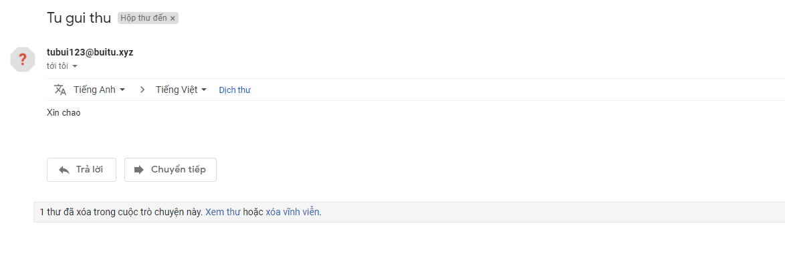

# Tạo email trên DA
- Login vào user muốn tạo email 
- Vào `Menu` -> `E-mail Manager` -> `E-mail Accounts` -> `Create Account`

- Nhập thông tin và chọn `Create Account`

# Kiểm tra gửi thư 
- Để kiểm tra ta vào `Menu` -> `Extra Features` -> `Webmail: Roundcube` hoặc ta nhập `tên miền/roundcube` vào trình duyệt

- Đăng nhập với email đã tạo trước đó và tiến hành gửi thư để kiểm tra

