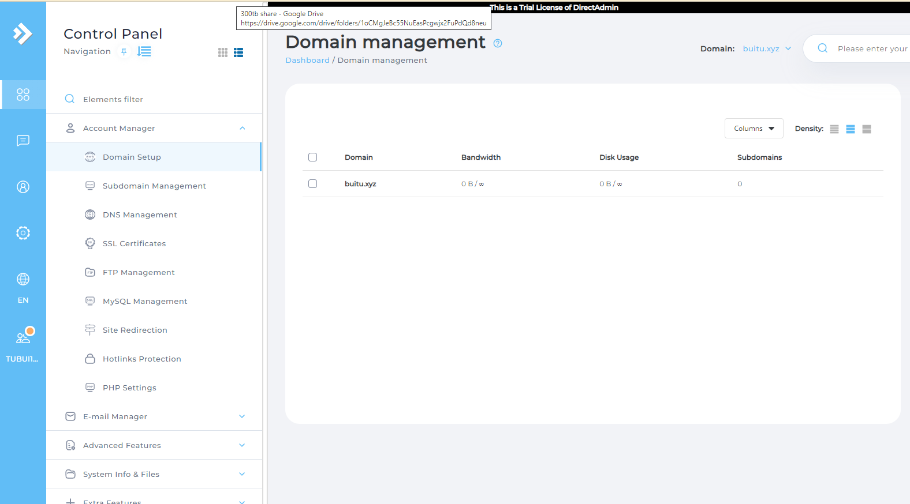
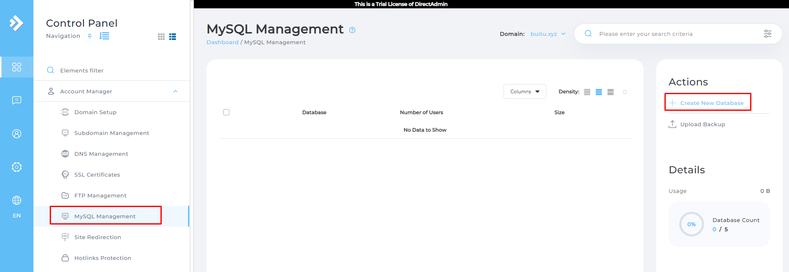
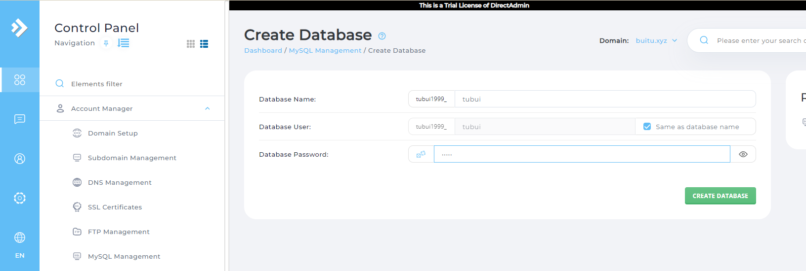
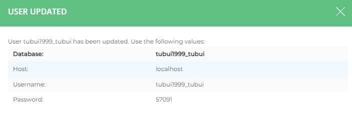
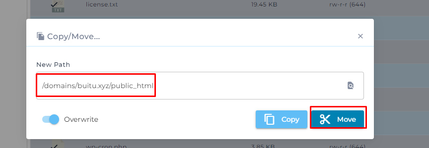
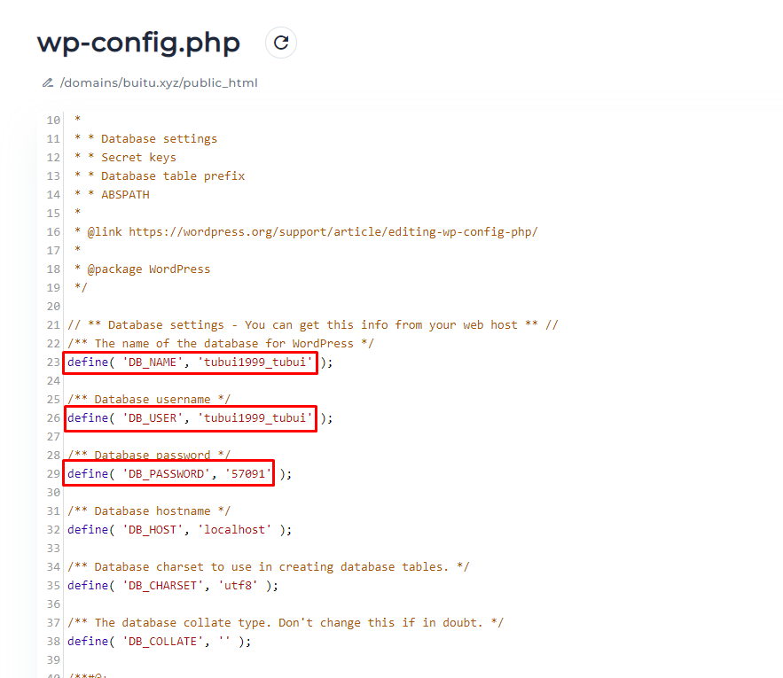
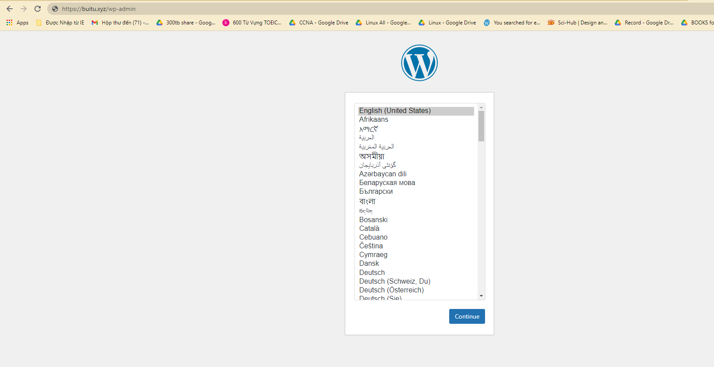

# Upload Source WordPress cho 1 user trên DA
Bước 1: Tạo User và gán domain cho User

Bước 2: Tạo database cho domain. Vào tùy chọn `MySQL Management` click vào `Create New Database`

Bước 3: Download WordPress 
- Vào trang chủ wordpress và tải file `.tar.gz` về máy tính

Bước 4: Upload Source WordPress
- Tại `Menu` chọn `System Info & Files` -> `File Manager`
- Vào thư mục `public_html` upload file `wordpress-5.9.2.tar.gz`  và tiến hành giải nén
- Đưa toàn bộ file con của WordPress ra ngoài `public_html`

- Đổi tên file `wp-config-sample.php` thành `wp-config.php` và chỉnh sửa cấu hình trong file đó tương ứng với database đã tạo trước đo

- Tiến hành vào trang quản trị để thiết lập https://buitu.xyz/wp-admin

