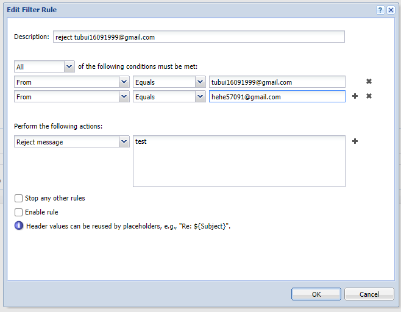
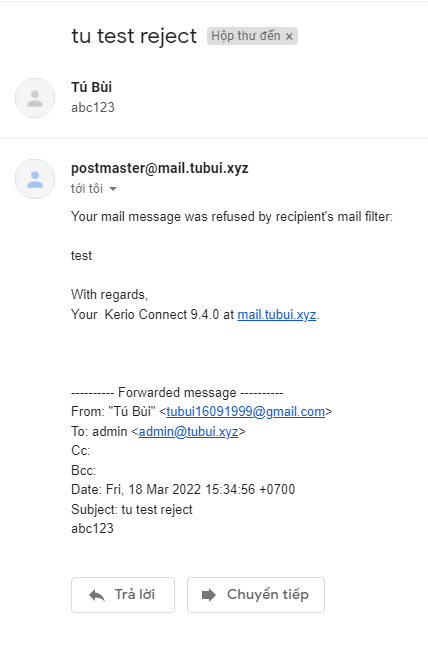
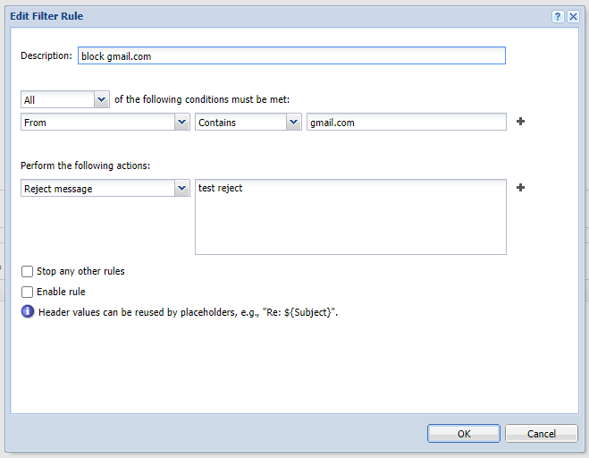
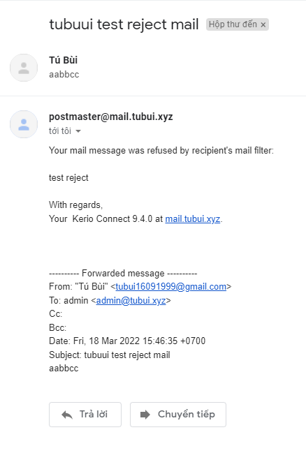

# Chặn thư từ một hoặc nhiều địa chỉ email
- Tại giao diện quản trị chọn `Message Filter` -> `Incomming rules` -> `Add` và thiết lập
- Điền mô tả cho Filter
- Chọn `From`, `Equals`, và điền địa chỉ email muốn chặn
- Tại `Perform the following actions` chọn `Reject message`

- Nhấp `ok` để lưu thiết lập

- Kiểm tra

>> Vậy ta đã có thể chặn mail đến từ tubui16091999@gmail.com và hehe57091@gmail.com

# Chặn thư từ một domain 
- Tại giao diện quản trị chọn `Message Filter` -> `Incomming rules` -> `Add` và thiết lập
- Điền mô tả cho Filter
- Chọn `From`, `Contains`, và điền domain muốn chặn
- Tại `Perform the following actions` chọn `Reject message`

- Nhấp `ok` để lưu thiết lập

- Kiểm tra

>> Vậy ta có thể chặn mail đến từ các email có đuôi @gmail.com 