# Cài đặt SSL Let's Encrypt cho mail server Kerio-connect
Bước 1: Tại `Configuration` -> `SSL Certificates` chọn `New` -> `New Let's Encrypt Certificate` như hình bên dưới

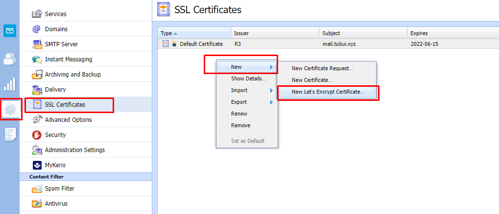

- Điền thông tin -> `ok`

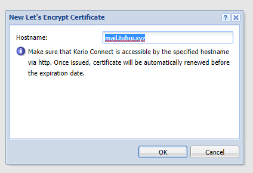

Bước 3: `New` -> `New Certificate Request`

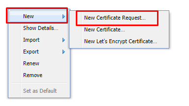

- Điền thông tin -> `ok`

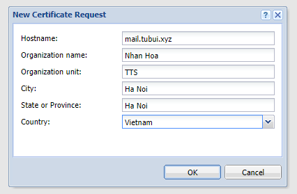

Bước 4: `Export Certificate` và `Export Private Key` SSL Let's Encrypt Certificate đã tạo trước đó về máy

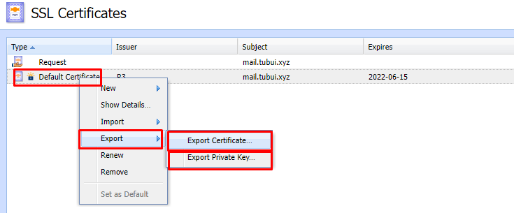

Bước 5: Tại `Certificate Request` đã tạo trước đó click chuột phải chọn `Import` -> `Import a New Certificate`

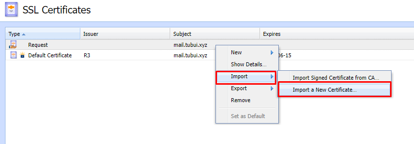

- `Select` các file vừa `Export` và `Import`

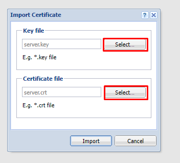

Bước 6: Sau khi Import thành công `Certificate` mới được tạo ra

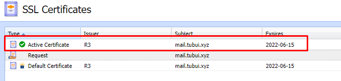

- Để cho phép máy chủ sử dụng chứng chỉ này, hãy chọn chứng chỉ và nhấp vào nút `Set as Default`

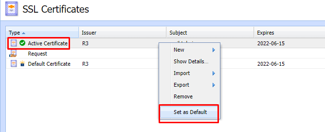

Bước 7: Kiểm tra

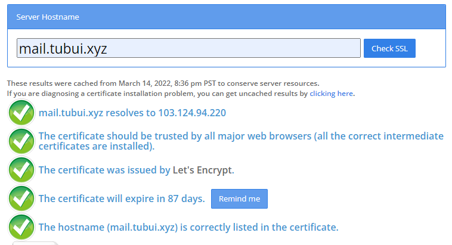

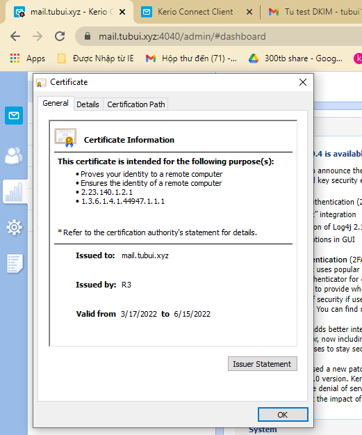