# Cài đặt mail server Kerio-connect trên Linux
## 1. Giới thiệu 
Mail kerio-connect là một mail server được triển khai bởi hơn 30 nghìn công ty trên khắp thế giới. Nó có thể được cài đặt trên nhiều hệ điều hành, bao gồm Windows, Mac OS và Linux
Kerio connect hỗ trợ đầy đủ các tính năng và tương thích với các công cụ check mail như là out look, thunderbird...
## Cài đặt
Bước 1: Chuẩn bị 
Cấu hình time-zone cho hệ thống 

> ln -sf /usr/share/zoneinfo/Asia/Ho_Chi_Minh /etc/localtime

Bước 2: Download mail Kerio-connect tại http://www.kerio.com/support/kerio-connect

Bước 3: Sử dụng WinSCP upload file rpm lên VPS

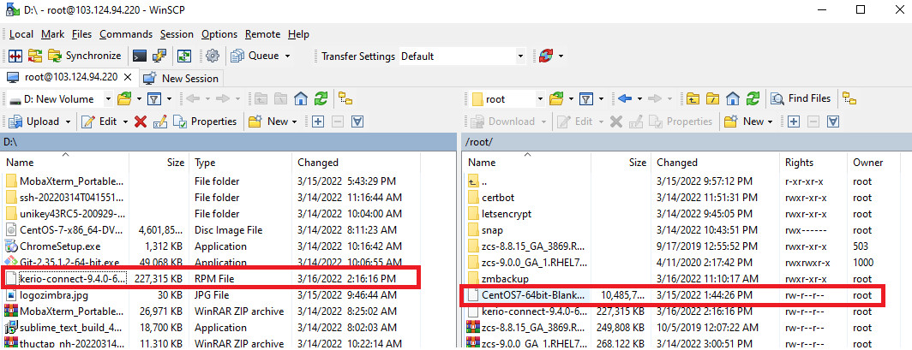

Bước 4: Kiểm tra và tắt các dịch vụ mail như là sendmail và postfix
```sh
/etc/init.d/sendmail stop && /sbin/chkconfig sendmail off
/etc/init.d/postfix stop && /sbin/chkconfig postfix off
```

Bước 5: Cài đặt kerio-connect
```sh
rpm -i kerio-connect-9.4.0-6153-linux-x86_64.rpm
```

Bước 6: Đăng nhập vào mail server trên trình duyệt
`https://103.124.94.220:4040`

Bước 7: Tiến hành cài đặt

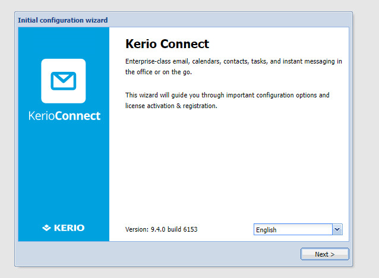

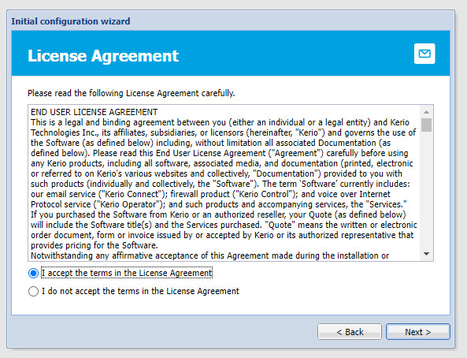

- Điền hostname và domain 

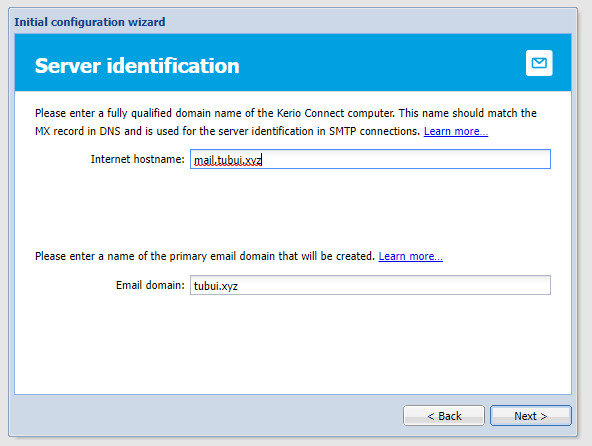

- Đặt password cho Administrator

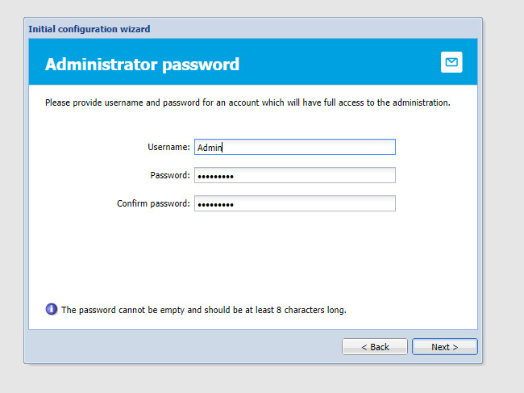

- Chọn thư mục lưu trữ mail

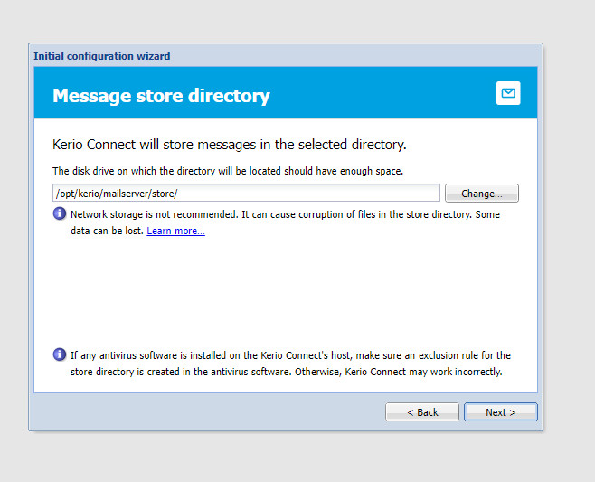

- Nhập key hoặc sử dụng bản trial

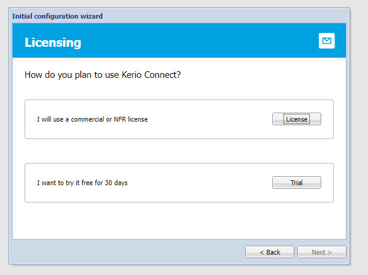

- Nhập key

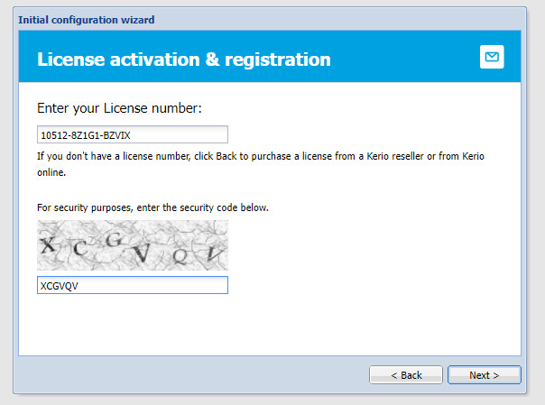

- Để mặc định và chọn next

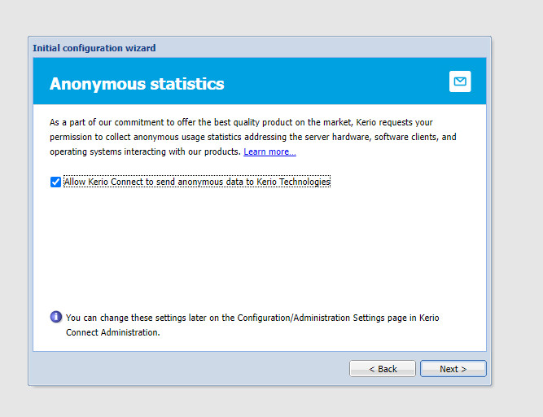

- Kết thúc việc cài đặt

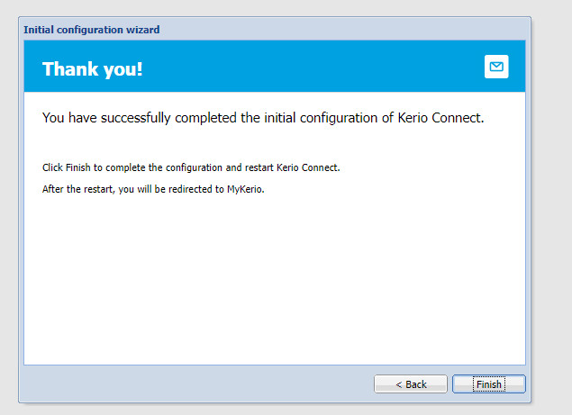

- Truy cập trang quản trị

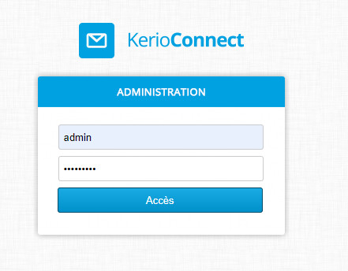

- Thay đổi ngôn ngữ 

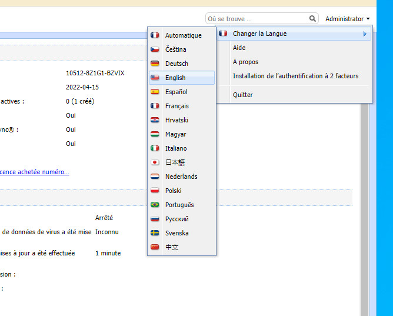

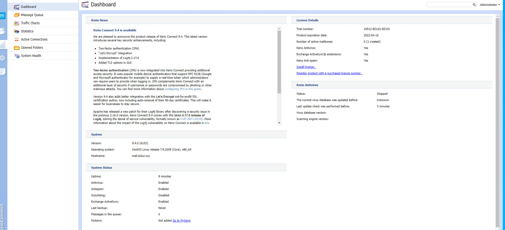

>> Quá trình cài đặt hoàn tất