# Giao diện quản trị Kerio-connect
## 1. Accounts
### 1.1 Users
- Tạo User theo tên miền và thiết lập cho user 

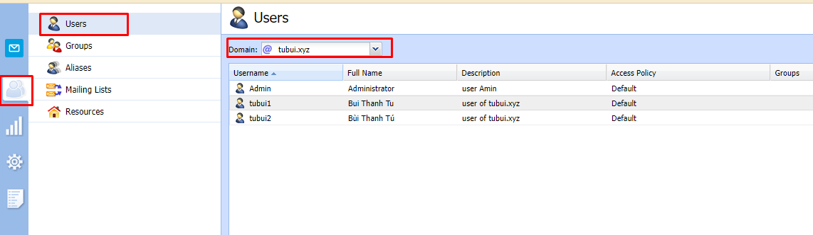

### 1.2 Groups
- Tạo group, xóa group và thiết lập cấu hình cho các group theo tên miền và gán group cho user

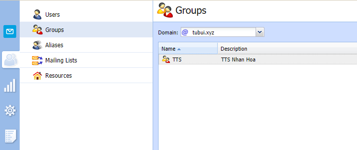

### 1.3 Aliases
- Tạo Aliases(tên bí danh) theo tên miền cho user

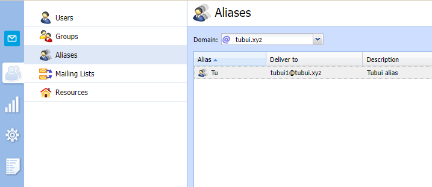

### 1.4 Mailing Lists
- Quản lý danh sách thư

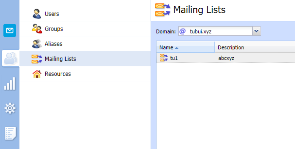

### 1.5 Resources
- Nơi quản lý các tài nguyên lập lịch

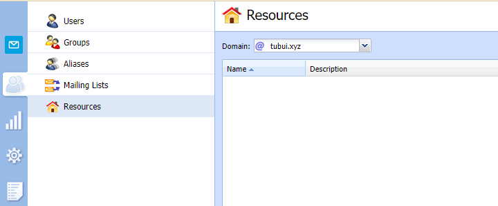

## 2. Status
### 2.1 Dashboard
Tại Dashboard hiển thị các thông tin 
- Kerio News: Giới thiệu về các chức năng mới trong phiên bản hiện tại
- System: Hiện thị thông tin phiên bản Kerio-connect, hệ điều hành và hostname
- System status: Hiển thị trạng thái của hệ thống 
- License Details: Giấy phép
- Kerio Antivirus: Hiển thị trạng thái của Kerio Antivirus
- System Health: Hiển thị RAM, CPU, Disk của hệ thống dưới dạng biểu đồ (%, time)
- Disk Storage Info: Hiển thị dung lượng Disk tổng và dung lượng Disk đang được sử dụng

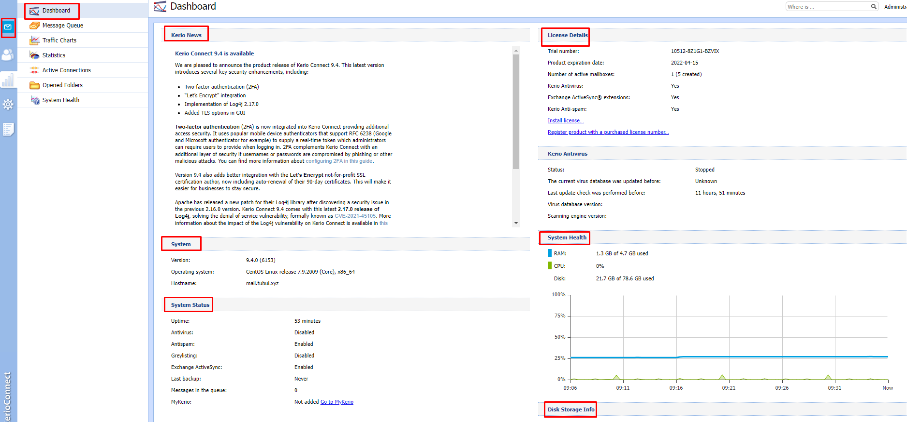

### 2.2 Message Queue
- Messages in Queue: Hiển thị các thư đang được chờ trên hàng đợi để được gửi ra bên ngoài
- Message Queue Processing: Tiến trình xếp hàng thư

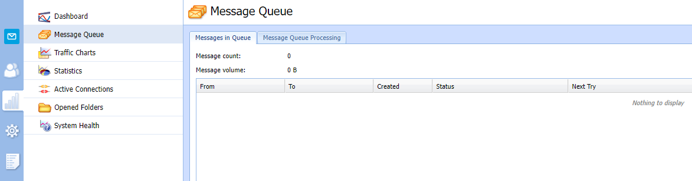

## 2.3 Traffic Chart
- Tracffic Chart cho phép hiển thị các thông tin `Connection` hoặc các `Message` trong một khoảng thời gian (có thể tùy chỉnh tối đa 30 ngày). 

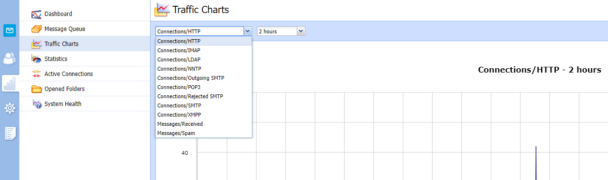

## 2.4 Statistics
- Hiển thị các số liệu thống kê của hệ thống

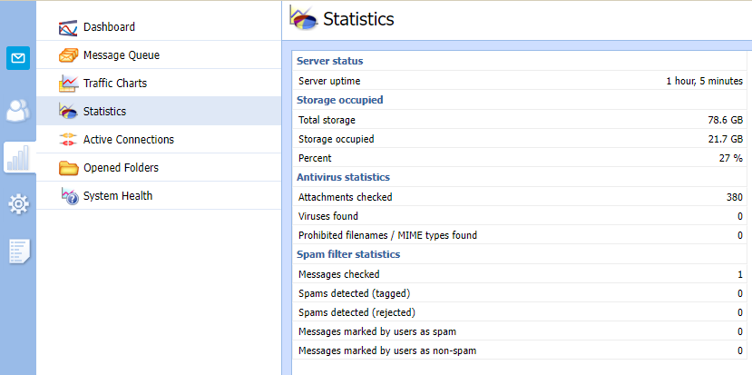

## 2.5 Active Connections
- Hiển thị các `Connection` và các `Session` đang hoạt động

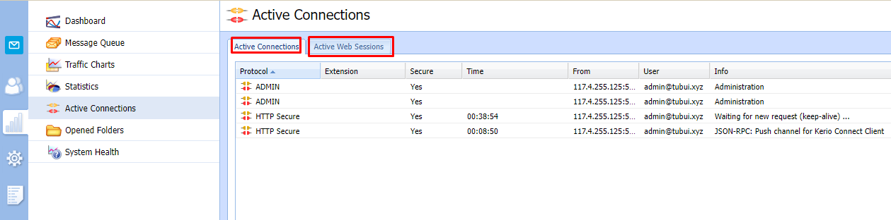

## 2.6 Opened Folders
- Hiển thị các thư mục đã mở

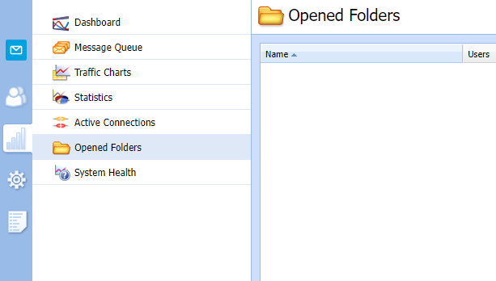

## 2.7 System Health
- Hiển thị mức độ sử dụng Ram, CPU của hệ thống
- Hiển thị tổng dung lượng disk và dung lượng disk đã sử dụng

## 3. Configuration
### 3.1 Services
- Hiển thị các dịch vụ, port và trạng thái các dịch vụ của mail server

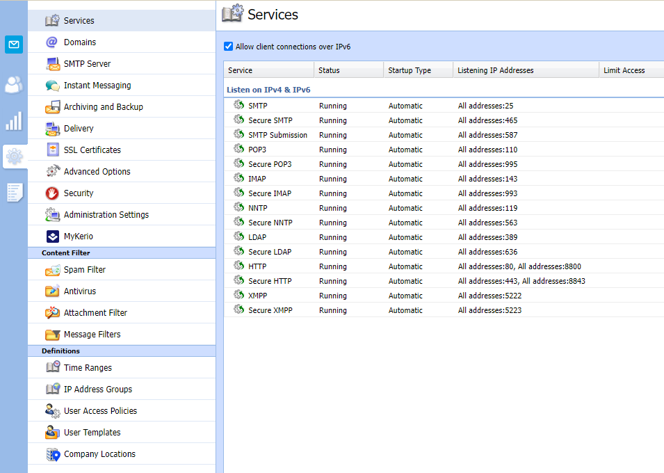

### 3.2 Domains
- Hiển thị các domain đã được tạo. Tại đây có thể tạo, sửa, xóa domain và thiết lập các tùy chọn cho domain đó

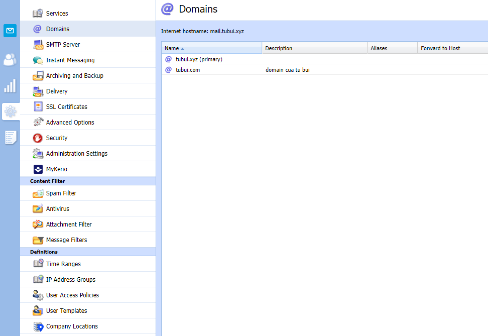

### 3.3 SMTP server
- Máy chủ SMTP xác định ai có thể gửi thư đi qua Kerio Connect và họ có thể thực hiện những hành động nào. 
- Để thiết lập gửi tin nhắn từ bên ngoài server Kerio Connect ta làm như sau
	+ Trong giao diện `Configuration` chọn `SMTP server` -> `Relay Control`
	+ Nhấp vào option `Allow relay only for`:
		+ Để chỉ định một nhóm địa chỉ IP mà từ đó người dùng có thể gửi đi, chọn `Users from IP address group` và thiết lập như mong muốn
		+ Để cho phép người dùng đã xác thực gửi thư đi, chọn `User authenticated through SMTP for outgoing mail`
		+ Để cho phép người dùng đã xác thực trước đó qua POP3 gửi thư đi từ cùng một địa chỉ IP, chọn `Users previously authenticated through POP3 from the same IP address`
		+ Nhấp vào `Apply` để lưu thiết lập

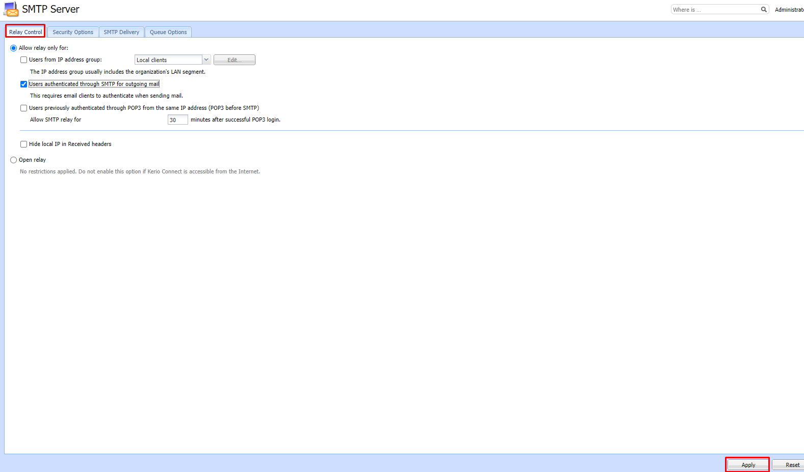

### 3.4 Instant Messaging 
- Dịch vụ trò chuyện tức thời trên Kerio-connect

### 3.5 Archiving and Backup
- Kerio-connect hỗ trợ `Full Backup` và nó cũng hỗ trợ `Differential Backup`, lưu các tệp đã được thêm vào hoặc thay đổi kể từ lần sao lưu đầy đủ nhất
- Ta có thể lên lịch sao lưu như sau:
	+ Trong giao diện quản trị, vào `Configuration` -> `Archiving and Backup` -> `Backup` 
	+ Chọn `Enable message store and configuration recovery backup`
	+ Chọn `Add`
	+ Nhập mô ta cho bản sao lưu trong `Description`
	+ Chọn thời gian và loại sao lưu và nhấp vào `ok`

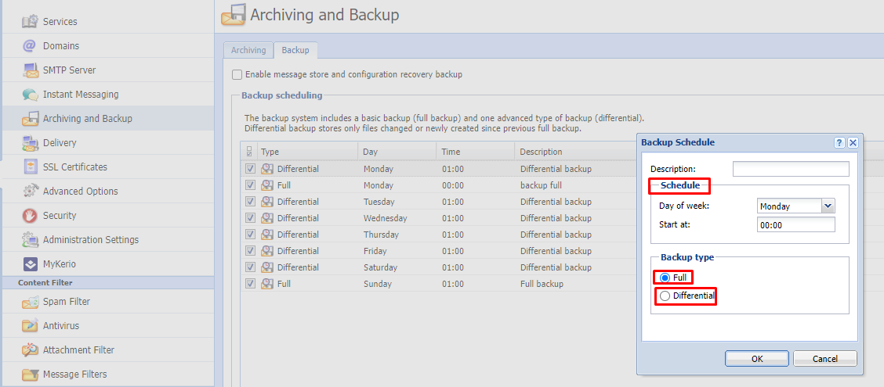

- Nhấp vào `Advanced` để chỉ định kích thước và số lượng bản sao lưu tối đa. Sau đó Bấm `ok`

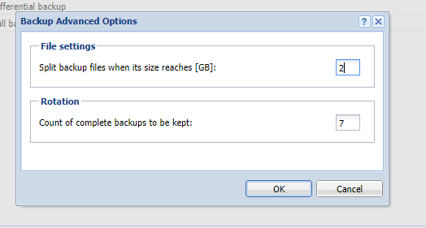

- Trong phần `Target backup directory`, chỉ định thư mục nơi lưu trữ tất cả các bản sao lưu 
- Trong phần `Notification`, nhập địa chỉ email để nhận thông báo về các bản sao lưu 
- Cuối cùng nhấn vào `Apply`

>> Nếu muốn tạo một bản sao lưu đầy đủ ngay lập tức, độc lập với các bản sao lưu khác, hãy nhấn vào `Start Now`

- Kerio-connect tự động lưu trữ tất cả các tin nhắn trò chuyện của người dùng được gửi qua Kerio-connect Client
- Để tải xuống tệp lưu trữ trò chuyện từ giao diện quản trị ta làm như sau:
	+ Vào `Configuration` -> `Archiving and Backup` -> `Archiving`
	+ Trong phần `Chat archiving`, chọn thời gian cho các tin nhắn muốn xem
	+ Nhấp vào `Download archive`
	+ Lưu tệp vào máy tính

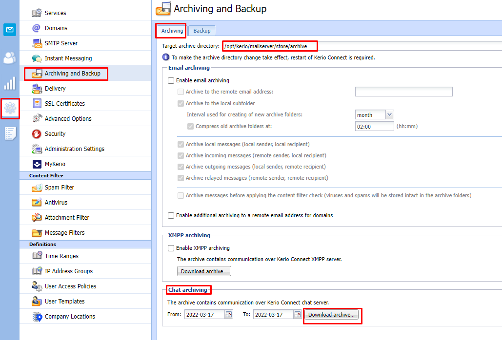

- Thực hiện Download archive từ ngày `13/03/2022` đến ngày `18/03/2022` . Giải nén ta được file `.txt` chứa toàn bộ tin nhắn được gửi trên Kerio Connect Client từ ngày `13/03/2022` đến ngày `18/03/2022` 

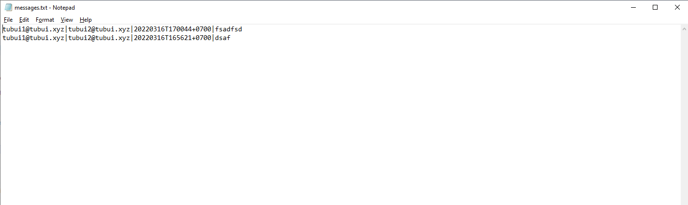

Khôi phục dữ liệu
- Tại `Archiving and Backup` -> `Current status` nhấp vào `Start Now` để tạo một bản sao lưu đầy đủ (chọn đường dẫn lưu bản sao lưu `/mnt/backup`)


- Stop Kerio Connect
- Vào thư mục cài đặt Kerio Connect `/opt/kerio/mailserver`
- Chạy lệnh
```sh
./kmsrecover /mnt/backup
```

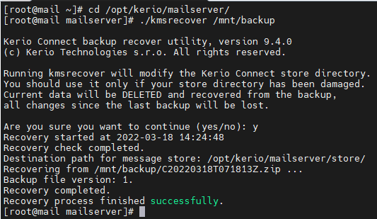

>> Restore thành công

### 3.6 Delivery 
- Trong Kerio-connect, ta có thể lên lịch để
	+ Tải xuống thư từ máy chủ POP3 từ xa 
	+ Nhận thông báo bằng lệnh ETRN đến các máy chủ đã xác định
	+ Gửi tin nhắn từ hàng đợi tin nhắn
- Cấu hình `Scheduling`, để add `scheduling` ta làm như sau:
	+ Trong giao diện quản trị chọn `Configuration` -> `Delivery` -> Scheduling
	+ Chọn `Add` 
	+ Chỉ định `Time condition`
	+ Để giới hạn việc lập lịch trong một phạm vi thời gian cụ thể, hãy chọn `Valid only at time` và chọn một phạm vi thời gian
	+ Chỉ định `Action`. Có thể lên lịch cho bất kỳ hoạt động nào sau đây
		+ Gửi tin nhắn từ hàng đợi tin nhắn
		+ Tải xuống tin nhắn qua POP3
		+ Gửi lệnh ETRN
	+ Bấm `ok`

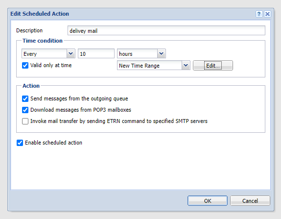

### 3.7 SSL Certificates
- SSL hỗ trợ việc cài đặt chứng chỉ SSL miễn phí Let's Encrypt cho mail.domain. Tại đây ta có thể tạo mới và xóa chứng chỉ

### 3.8 Advanced Options 
- Kerio-connect bao gồm hai giao diện:
	+ Quản trị Kerio-connect dành cho quản trị viên
	+ Kerio-connect Client dành cho người dùng
- Để thiết lập một số tùy chọn cho Kerio-connect Client ta làm như sau
	+ Trong giao diện quản trị, vào `Configuration` -> `Advanced options` -> `Kerio Connect Client`
	+ Trong phần `Maximum size limit`, thiết lập kích cỡ tin nhắn có thể được gửi từ `Kerio Connect Client`
	+ Trong phần `Session security`, hãy đặt thời gian chờ cho:
		+ Session expiration timeout: Là thời gian không có bất kỳ hoạt động nào trong giao diện mà sau đó Kerio Connect kết thúc phiên. Thời gian chờ được đặt lại mỗi khi người dùng thực hiện một hành động 
		+ Maximum session duration: Là thời gian mà sau đó người dùng được đăng xuất ngay cả khi họ chử động sử dụng giao diện 
		+ Để bảo vệ, chống lại việc chiếm quyền điều khiển phiên, ta có thể thiết lập buộc đăng xuất sau khi người dùng Kerio Connect thay đổi địa chỉ IP của họ, chọn `Force logout from Kerio Connect Client`
	+ Trong phần Custum logo
		+ Ta có thể thiết lập logo cho Kerio-connect Clients
	+ Nhấp vào `Apply` để áp dụng cấu hình


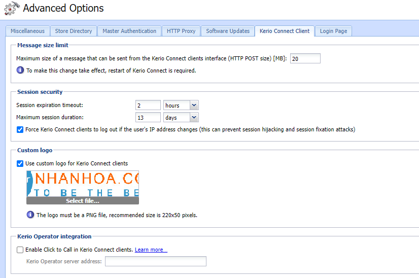

### 3.9 Security
- Kerio-connect cung cấp chức năng yêu cầu xác thực `Require secure authentication`. Người dùng phải xác thực an toàn khi họ truy cập Kerio-connect
- Có thể chọn bất cứ phương thức xác thực nào sau đây
	+ CRAM-MD5: Xác thực mật khẩu bằng cách sử dụng thông báo MD5
	+ DIGEST-MD5: Xác thực mật khẩu sử dụng thông báo MD5
	+ LOGIN
	+ PLAIN

>> Nếu mật khẩu của người dùng được lưu ở định dạng SHA, chọn `LOGIN` hoặc `PLAIN`. Nếu chọn nhiều phương pháp, Kerio sẽ thực hiện phương pháp khả dụng đầu tiên

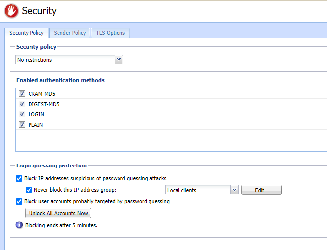

### 3.10 Administration Settings
- Trong Kerio-connect, có thể kích hoạt một tài khoản quản trị viên đặc biệt. Tài khoản này được tích hợp sẵn để truy cập giao diện quản trị
- Để kích hoạt giao diện quản trị ta làm như sau:
	+ Đi tới phần `Configuration` -> `Administration Settings`
	+ Chọn `Enable built-in administrator account`
	+ Nhập password cho tài khoản. Tên tài khoản mặc định là `Admin` và không thể thay đổi

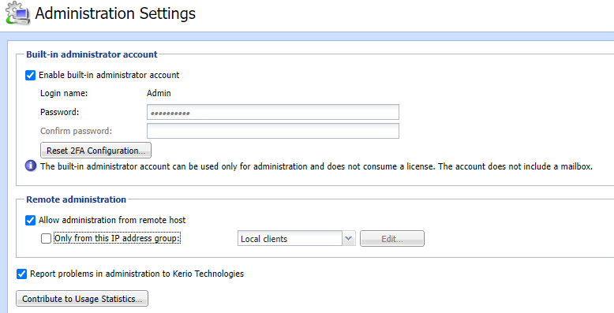

### 3.11 MyKerio
MyKerio là dịch vụ đám mây cho phép quản lý nhiều phiên bản của các thiết bị Kerio Connect thông qua giao diện web tập trung 
Thêm Kerio-connect và MyKerio

### 3.12 Spam Filter
Để phát hiện và loại bỏ thư rác, Kerio Connect sử dụng các phương pháp sau:
- `Kerio Anti-Spam`: Bộ lọc nâng cao các tin nhắn spam bằng các dịch vụ quét trực tuyến của Bitdefender
- `Blacklists`: Ta có thể tạo danh sách địa chỉ IP và đưa vào Blacklists để chặn tất cả các thư từ các địa chỉ đó
- `Caller ID` và `SPF`: Có thể lọc ra các thư có địa chỉ gửi giả
- `Greylisting`: Phương pháp Greylisting chỉ gửi tin nhắn từ những người đã biết
- `Spam Repellent`: Đặt SMTP greeting trì hoãn để ngăn việc gửi thư được gửi từ máy chủ thư rác

Để đặt giới hạn cho việc đánh dấu thư là thư rác hay không phải thư rác ta làm như sau:
- `Tag Score` - Nếu tin nhắn đạt đến điểm thẻ, Kerio Connect sẽ đánh dấu nó là thư rác 
- `Block Score` - Nếu tin nhắn đạt đến điểm khối, Kerio Connect sẽ hủy tin nhắn đó


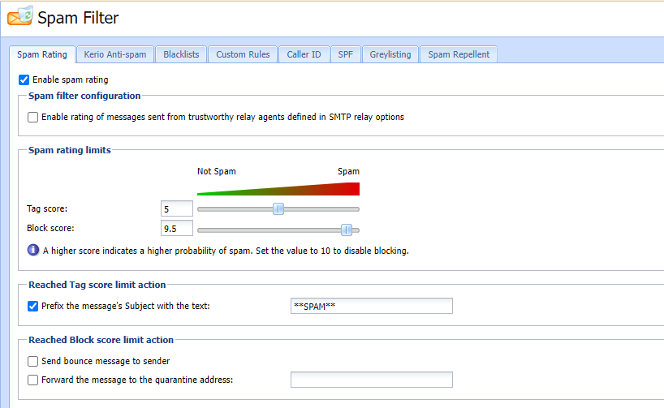

### 3.13 Antivirus
Kerio Connect bao gồm Kerio Antivirus, một biện pháp bảo vệ tích hợp chống lại các email độc hại có chứa virus. Virus có thể lây nhiễm vào máy tính gây hại cho các tệp hoặc cho hệ thống máy tính
- Cấu hình Antivirus
	+ Trong giao diện quản trị, chuyển đến `Configuration` -> `Antivirus`
	+ Để tự động cập nhật cơ sở dữ liệu virus, hãy chọn `Check for update every [hours]`. Nếu có bất kỳ bản cập nhật nào, nó sẽ tự động được tải xuống
	+ Chọn hành động cho các thư có chứa virus. Kerio Connect có thể `Discard the message`(Hủy tin nhắn) hoặc `Deliver the message with the malicious code removed`(Gửi tin nhắn đã khi đã loại bỏ mã độc hại)
	+ Ngoài ra, ta có thể chọn 2 tùy chọn để chuyển tiếp tin nhắn. Chọn `Forward the original message to an administrator address`(Chuyển tiếp thư gốc đến địa chỉ quản trị viên) hoặc `Forward the filtered message to an administrator address`(Chuyển tiếp thư đã lọc tới địa chỉ quản trị viên)
	+ Đối với bất kỳ thông báo nào mà Kerio Antivirus không thể quét, Kerio Connect có thể `Deliver the original message with a warning prefixed`(Gửi tin nhắn gốc có cảnh báo) hoặc `Reject the message as if it was a virus`(Chuyển tiếp thư đã lọc tới địa chỉ quản trị viên)

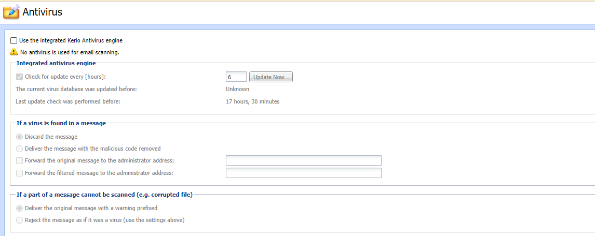

### 3.14 Attachment Filter
- Nhiều loại virus được ẩn dưới dạng tập tin đính kèm. Kerio Connect có thể lọc ra các tập tin đính kèm email theo cài đặt . Nếu Kerio Connect phát hiện một tập tin đính kèm có vấn đề, nó sẽ xóa tập tin đính kèm và gửi thông báo mà không có tệp đó

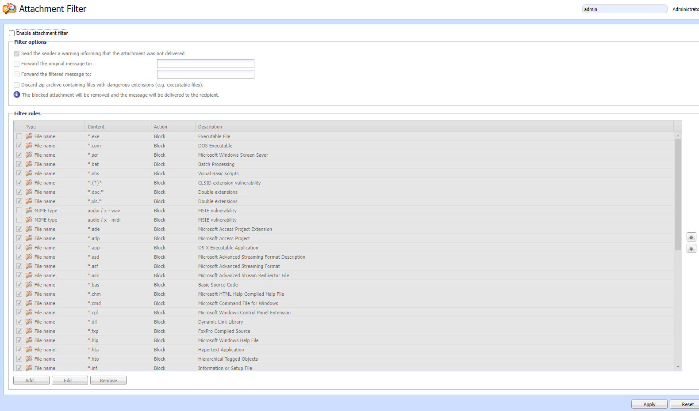

- Thiết lập bộ lọc các tập tin:
	+ Tại giao diện quản trị, chọn `Configuration` -> `Attachment filter`, hãy nhấp vào `Add`
	+ Nhập mô tả
	+ Xác định điều kiện cho các tệp đính kèm. Ví dụ file `.pif`
	+ Chọn thiết lập: `Block the attachment`(Chặn tập tin đính kèm) hoặc `Accept the attachment`(Cho phép tập tin đính kèm)

	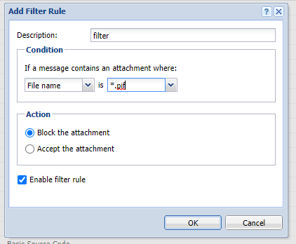

### 3.15 Message Filter
- Kerio Connect áp dụng `Incomming rules`(Quy tắc nhận) cho tất cả người nhận trong tin nhắn và `Outgoing rules`(Quy tắc gửi), các thư được xem xét riêng biệt cho từng người nhận
- Tạo quy tắc nhận `Incomming rules`
	+ `Configuration` -> `Message Filters`
	+ Trong phần `Incomming rules` nhấp vào `Add`
	+ Nhập mô tả
	+ Chỉ định các điều kiện cho bộ lọc như hình dưới

	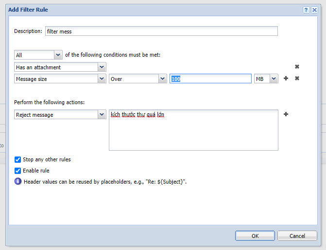
	
>> Như vậy thư có kích thước trên 100 MB đã bị chặn

- Tạo quy tắc gửi `Outgoing rules`: Làm tương tự như `Incomming rules`

### 3.16 Time Ranges
- Tạo `Time Ranges`:
	+ `Configuration` -> `Time Ranges`
	+ Nhấp vào `Add`
	+ Cấu hình cài đặt `Time ranges` như hình dưới 

	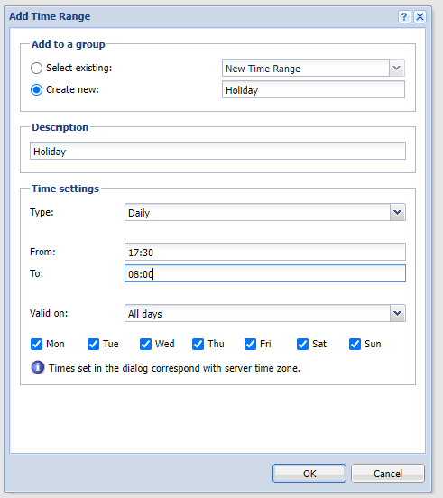

	+ Bấm `ok`

### 3.17 IP Address Groups
Nhóm địa chỉ IP giúp dễ dàng xác định ai có quyền truy cập, ví dụ quản trị từ xa...

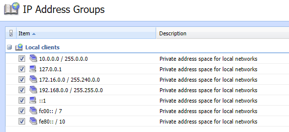

Để thêm add IP vào một IP Address Group mới ta làm như hình dưới

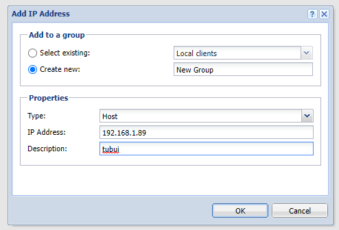

### 3.18 User Access Policies
- `User Access Policies` cho phép thiết lập quyền truy cập đối với một số dịch vụ dành cho người dùng cụ thể. Có thể hạn chế quyền truy cập vào bất kỳ người dùng nào từ một nhóm địa chỉ IP nhất định
- Ví dụ `Add policy` chỉ cho phép WebDAV, CalDAV(Đồng bộ hóa lịch), CardDAV(Đồng bộ hóa danh bạ), POP3(Giao thức lấy thư)

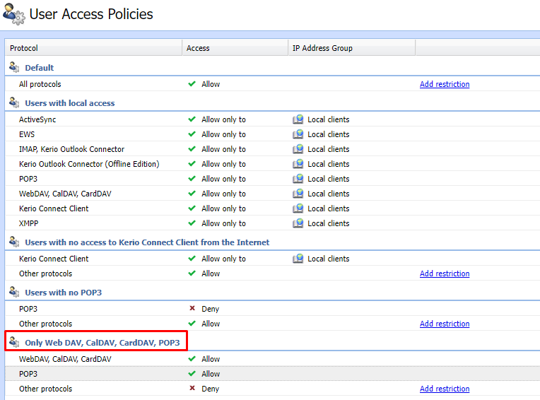

### 3.19 User Templates
- Tạo các mẫu user. Nếu ta cần tạo nhiều tài khoản cục bộ với các thiết lập tương tự, ta nên tạo một mẫu

### 3.20 Company Locations
- Trong Kerio connect, ta có thể thêm thông tin liên hệ cho công ty của mình

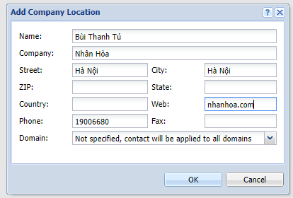

## 4. Log
- Các loại log
	+ Config log: Lưu giữ lịch sử đầy đủ của các thay đổi điều chỉnh config. Nó cho ta biết người dùng nào đã thực hiện các tác vụ quản trị cá nhân và thời gian người đó thực hiện
	+ Debug log: Giám sát nhiều loại thông tin khác nhau và được sử dụng để giải quyết vấn đề 
	+ Error log: Hiển thị các lỗi có ý nghĩa quan trọng, thường ảnh hưởng đến hoạt động của mail server. Thông báo lỗi điển hình được hiển thị trong lần khởi tạo dịch vụ liên quan đến Error log, phân bổ dung lượng đĩa, khởi tạo kiểm tra chống virus, xác thực người dùng không đúng cách ...
	+ Mail log: Chứa thông tin về các thư riêng lẻ được Kerio Connect xử lý
	+ Operations log: Thu thập thông tin về các mục đã loại bỏ và di chuyển (thư mục, tin nhắn, danh bạ, sự kiện, tác vụ và ghi chú) trong hộp thư người dùng. Nó rất hữu ích, đặc biệt nếu người dùng không thể tìm thấy một thư cụ thể trong hộp của họ
	+ Security log: Chứa thông tin liên quan đến bảo mật của Kerio Connect. Nó cũng chứa các bản ghi về tất cả các thư không gửi được 
	+ Spam log: Hiển thị thông tin về tất cả các email spam được lưu trữ (hoặc được đánh dấu) trong Kerio Connect 
	+ Warning log: Hiển thị các thông báo cảnh báo về các lỗi có ý nghĩa nhỏ. Các sự kiện hiển thị trong Security log không ảnh hưởng nhiều đến hoạt động của Kerio Connect
	+ Audit log: Hiển thị thông tin về tất cả các lần xác thực thành công tài khoản Kerio Connect, bao gồm quản trị Kerio Connect, Kerio Connecy Client, Microsoft Outlook...
