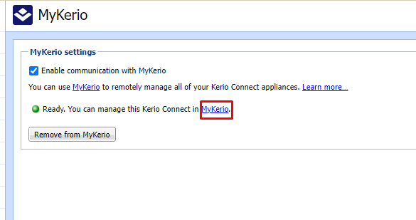
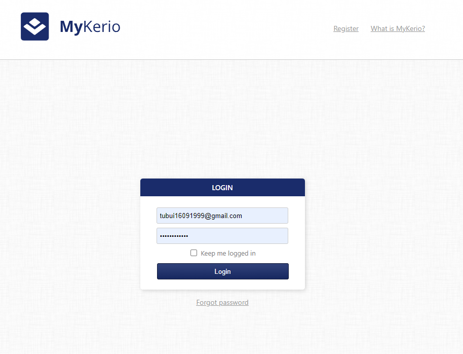
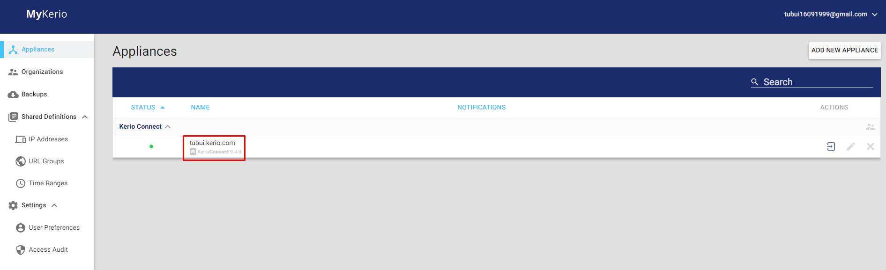
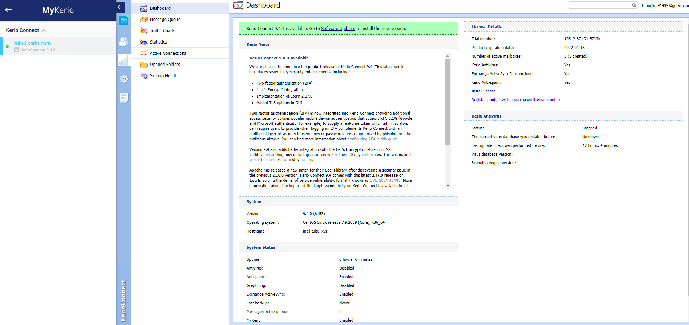

# MyKerio
MyKerio là dịch vụ đám mây cho phép quản lý nhiều phiên bản của các thiết bị Kerio Connect thông qua giao diện web tập trung 
Thêm Kerio-connect và MyKerio
- Để liên kết Kerio Connect với MyKerio, ta cần phải kích hoạt quyền truy cập vào MyKerio trong Kerio Connect và đăng ký MyKerio
	+ Trong giao diện quản trị, vào `Configuration` -> `MyKerio`
	+ Chọn `Enable communication with MyKerio`
	+ Chọn `Apply`
	+ Nhấp vào liên kết `MyKerio`

	
	
	+ Nhập user và password để đăng nhập

	
	
	+ Liên kết Kerio Connect với MyKerio thành công. Tại đây ta có thể thấy mail server Kerio Connect trong trang tổng quan MyKerio

	
	
>> Tại MyKerio ta có thể vào giao diện quản trị của Kerio Connect 

