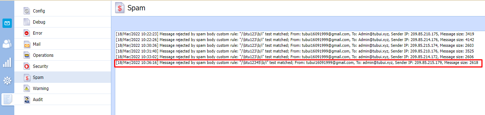

# Spam Filter
Để phát hiện và loại bỏ thư rác, Kerio Connect sử dụng các phương pháp sau:

- `Spam Rating`: Kerio connect kiểm tra từng tin nhắn với tất cả các kiểm tra và bộ lọc đã bật. Dựa trên điểm số spam thu được, nó đánh dấu tin nhắn là spam
- `Kerio Anti-Spam`: Bộ lọc nâng cao các tin nhắn spam bằng các dịch vụ quét trực tuyến của Bitdefender
- `Blacklists`: Ta có thể tạo danh sách địa chỉ IP và đưa vào Blacklists để chặn tất cả các thư từ các địa chỉ đó
- `Custom Rules`: Trong Kerio Connect, ta có thể tạo các quy tắc chống thư rác của riêng mình. Các quy tắc lọc tiêu đề email hoặc nội dung email
- `Caller ID` và `SPF`: Có thể lọc ra các thư có địa chỉ gửi giả
- `Greylisting`: Phương pháp Greylisting chỉ gửi tin nhắn từ những người đã biết
- `Spam Repellent`: Đặt SMTP greeting trì hoãn để ngăn việc gửi thư được gửi từ máy chủ thư rác

## 1. Spam Rating 
Kerio Connect đặt giới hạn cho việc đánh dấu thư là thư rác hay không là thư rác dựa trên `Spam Rating`. Để thiết lập cho `Spam filter` ta làm như sau:
- `Tag Score` - Nếu tin nhắn đạt đến `điểm thẻ`, Kerio Connect sẽ đánh dấu nó là thư rác 
- `Block Score` - Nếu tin nhắn đạt đến `điểm khối`, Kerio Connect sẽ hủy tin nhắn đó

## 2. Kerio Antispam
Tiện ích mở rộng Kerio Anti-spam sử dụng dịch vụ quét trực tuyến Bitdefender và cung cấp mức lọc thư rác nâng cao đối với các thư đến
Hoạt động của Kerio Anti-spam:
- Khi Kerio Anti-spam được bật:
	+ Kerio Connect gửi dữ liệu được mã hóa tới dịch vụ quét trực tuyến Bitdefender
	+ Bitdefender quét dữ liệu và gửi kết quả đến cho Kerio Connect. Điểm số có thể là:
		+ 0: Không phải là thư rác
		+ 1-9: Cho các mức độ spam khác nhau
		+ Kerio Connect tính toán điểm thư rác bằng cách sử dụng một thuật toán đặc biệt và thêm điểm vào `Spam Rating`
		+ Nếu Bitdefender nhận ra phần mềm độc hại hoặc tin nhắn lừa đảo, Kerio Connect sẽ tự động chặn tin nhắn bất kể các cài đặt trên Kerio Connect có sẵn ví dụ "Whitelists"

## 3. Blacklists
Trong Kerio Connect, ta có thể tự động chặn các máy chủ (địa chỉ IP) được cho là đang gửi tin nhắn rác 
Tạo `Blacklists`, trước tiên ta cần phải có địa chỉ IP của máy chủ mà mình muốn chặn:
- Đi tới phần `Configuration` -> `IP address Groups` và tạo một group mới với địa chỉ IP của máy chủ thư rác

- Đi tới phần `Spam Filter` -> `Blacklists`
- Trong phần `Custom blacklist of spammer IP addresses`, chọn `Use IP address group`
- Chọn hoặc tạo một nhóm địa chỉ IP 
- Chọn thiết lập theo mong muốn
	+ `Block the message`(Điều này có nghĩa là đánh dấu thư đó là spam)
	+ `Add spam score to the message`(Thêm điểm thư rác vào tin nhắn)
- Nhấp vào `Apply`

## 4. Custom Rules
Trong Kerio, ta có thể tạo các quy tắc chống thư rác của riêng mình, các quy tắc lọc tiêu đề email hoặc nội dung email
Kerio Connect sẽ xử lý các quy tắc theo thứ tự được liệt kê. Nếu bộ lọc thư rác đánh dấu thư không phải là thư rác hoặc từ chối thư đó, Kerio Connect sẽ ngừng xử lí các quy tắc còn lại

Để tạo quy tắc tùy chỉnh:
- Trong giao diện quản trị, chuyển đến `Confiaguration` -> `Spam filter` -> `Custom rules`
- Nhấp vào `Add`
- Trong tab `Add rule`, nhập tên cho quy tắc
- Chọn `Mail header` or `Mail body`
- Nhập chuỗi muốn lọc:
	+ Đối với `Mail header`:
		+ `is empty`: Lọc các thư có tiêu đề quá ngắn
		+ `is missing`: Lọc các thư có tiêu đề còn thiết
		+ `contains address`: Lọc các thư có tiêu đề chứa đựng địa chỉ, và nhập vào nội dung địa chỉ
		+ `contains domain:` Lọc các thư có tiêu đề chứa đựng tên miền, và nhập vào nội dung tên miền
		+ `contains substring`: Lọc các thư có tiêu đề chứa đựng các chuỗi con và nhập vào nội dung chuỗi con
		+ `contains binary hex string`: Lọc các thư có tiêu đề chứa các chuỗi nhị phân, thập phân và nhập vào nội dung của chuỗi
	+ Đối với `Mail body`: Nhập nội dung mail muốn lọc
- Tại `Action` ta có thể chọn:
	+ Treat the message as non-spam: Coi thư không phải là thư rác
	+ Treat the message as spam and reject it: Coi thư là spam và từ chối nó
	+ Add spam score to the message: Thêm điểm thư rác vào tin nhắn
- Chọn `ok`

Ví dụ cho `Custom Rules`:
- Chặn tất cả các tin nhắn có chứa từ `tu12345`

- Kiểm tra `Spam log`

## 5. Caller ID và SPF
Caller IP và SPF cho phép lọc ra các thư có địa chỉ người gửi giả
Việc kiểm tra xác minh xem địa chỉ IP của máy chủ SMTP từ xa có được phép gửi email đến tên miền được chỉ định hay không
Thiết lập Caller ID:
- Trong giao diện quản trị, vào `Configuration` -> `Bộ lọc thư rác` -> `Caller ID`
- Nếu một tin nhắn bị chặn, Kerio Connect có thể:
	+ Ghi nó vào `Security Log`
	+ Từ chối nó
	+ Tăng/giảm điểm thư rác
- Caller ID thường chỉ được sử dụng bởi các miền ở chế độ thử nghiệm
- Nếu thư được gửi qua máy chủ dự phòng, nhóm địa chỉ IP của những máy chủ đó sẽ không được Caller ID kiểm tra 
- Xác nhận cài đặt

Thiết lập tương tự với SPF

## 6. Greylisting
`Greylisting` là một phương pháp chống thư rác bổ sung cho các phương pháp và cơ chế chống thư rác khác trong Kerio Connect
Cách hoạt động của `Greylisting`
- Kerio liên hệ với server `Greylisting` và cung cấp thông tin về thư. `Greylisting` server bao gồm danh sách các địa chỉ IP đáng tin cậy
- Nếu danh sách chứa địa chỉ IP của người gửi thư, thư sẽ vượt qua kiểm tra `Greylisting` ngay lập tức 
- Nếu danh sách không chứa địa chỉ IP của người gửi, server `Greylisting` sẽ trì hoãn việc gửi. Những người gửi thư đáng tin cậy sẽ cố gắng gửi lại các thư sau đó. Người gửi thư rác thì không
- Tin nhắn được nhận lại. Kerio Greylisting Service sẽ thêm địa chỉ IP của người gửi vào danh sách trắng. Tất cả các thư sau này từ người gửi này sẽ vượt qua kiểm tra `Greylisting` ngay lập tức

Thiết lập `Greylisting`:
- `Configuration` -> `Spam Filter` -> `Greylisting`
- Chọn `Check incoming messages by Kerio Greylisting Service`
- Tạo danh sách địa chỉ IP để bỏ qua quá trình kiểm tra `Greylisting`
- Nhấp vào `Test Connection` để kiểm tra kết nối với `Kerio Greylisting Service`
- Nhấp vào `Apply`

## 7. Spam Repellent
- Phần lớn `Spam` được tạo ra bởi các ứng dụng gửi thư hàng loạt chuyên biệt. Mục tiêu của phần mềm này là phân phối càng nhiều thư rác càng tốt trong một khoảng thời gian nhỏ. Tính năng chống thư rac `Spam Repellent` hoạt động bằng cách tạo độ trễ cho lời chào SMTP. Các mail server hợp pháp thường sẽ đợi ít nhất 2 phút trước khi đóng kết nối, trong khi các công cụ thư rác có thể chỉ đợi vài giây. Giá trị tốt là 25 giây. Điều chỉnh này sẽ loại bỏ một lượng đang kể thư rác mà không gây mất email hợp lệ. Hạn chế nhỏ duy nhất với cài đặt này là email Internet sẽ mất thêm 25 giây để nhận
- Thiết lập Spam Repellent như sau

