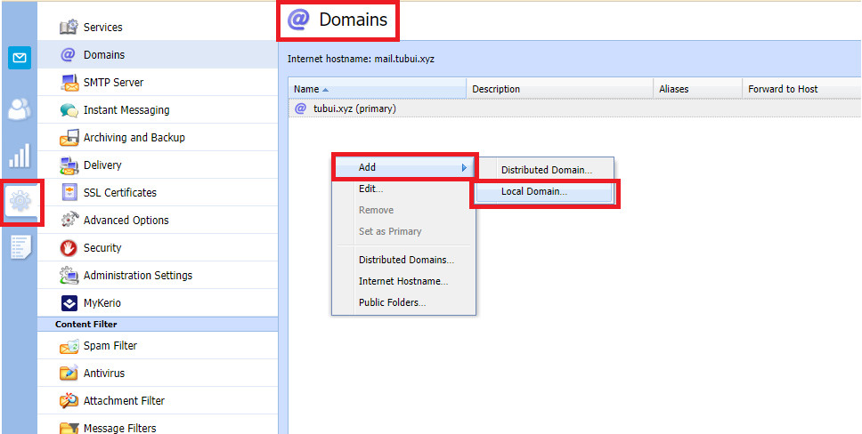
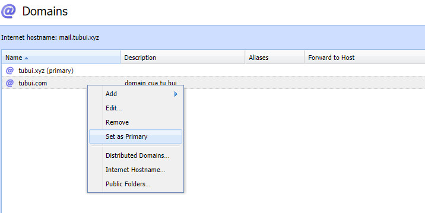
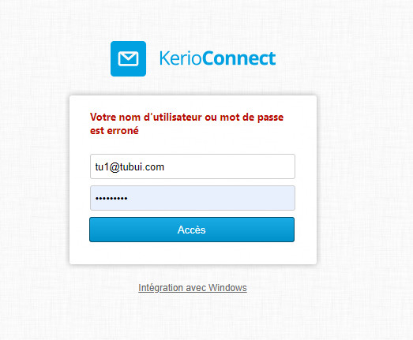

# Các thao tác cơ bản trên mail server Kerio-connect
## 1. Add domain mới 

Bước 1: Vào `configuration` -> `domain` -> `add` -> `local domain`

- Domain: Tên domain cần add
- Description: Mô tả thông tin liên quan đến domain
- User count: Giới hạn số user cho domain

Bước 2: Tab Security
- Chọn theo hình dưới. 2 thông số dưới nhằm đảm bảo vấn đề liên quan đến password

Bước 3: Tab Message
- Giới hạn dung lượng gửi ra 50MB
- Ngoài ra có thể cấu hình thêm phần `Item clean-out` mục đích nhằm tối ưu hóa hệ thống dung lượng của user

Bước 4: Tab Custom Logo
- Chọn Logo và upload. Kích thước đề nghị 220x50

- Cài đặt thành công cho 1 domain

Bước 5: Set domain `tubui.com` thành domain chính để dễ quản lí
- Chuột phải vào domain `tubui.com` chọn `Set as Primary`

## 2. Add user cho domain tubui.com vừa tạo 
Bước 1: Vào `Account` -> `User` -> chọn `Domain`

Bước 2: Add user vào domain trên 
- Chọn `add` -> điền thông tin user

Bước 3: Tab `General`
- Điền thông tin user

Bước 4: Tab `Contact` 
- Ở phần này có thể điền thông tin tùy ý hoặc bỏ qua 

Bước 5: Tab Groups
- Nếu có group riêng thì ta nên vào phần group để cấu hình. Ví dụ: Group Nhân sự, group IT, group Kế toán...

Bước 5: Tab Quota
- Giới hạn dung lượng và cho mỗi user thì ta nên vào đây để cấu hình
- Ví dụ: Giới hạn user 500MB

Bước 6: Kiểm tra lại user vừa tạo có hoạt động hay không

