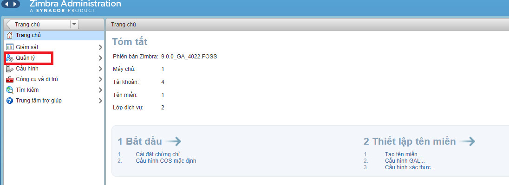
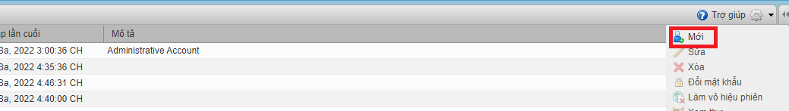
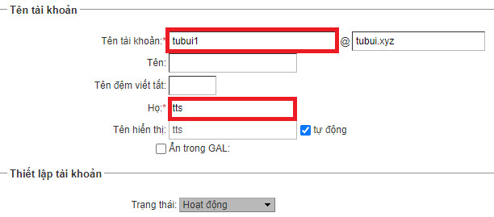
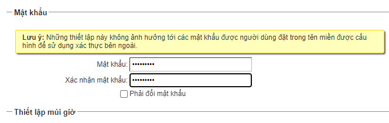

# Tạo user Zimbra
## 1. Đăng nhập 
Vào trang quản trị admin theo link https://tubui.xyz:7071 . Nhập user và pass được cấp sau đó Sign in 
## 2. Sau khi đăng nhập chọn manage

## 3. Chọn cấu hình bên tay phải sau đó vào phần 'Mới' để tạo user

## 4. Điền tên người dùng ở ô account name và điền lastname (phần có dấu `*` là bắt buộc)

Kéo thanh cuốn bên tay phải xuống dưới và nhập pass và xác nhận pass. Sau khi điền chính xác thì click finish. Chú ý:
	- Pass tạo cần có độ khó (trên 10 ký tự, có chữ thường, chữ hoa, số). Nếu dùng luôn pass admin tạo thì không cần click trong phần àny
	- Ở mục 'Phải đổi pass' nếu chọn phần này sẽ yêu cầu người dùng phải đổi pass khi đăng nhập lần đầu. Nếu dùng luôn pass admin tạo thì không cần chọn phần này

