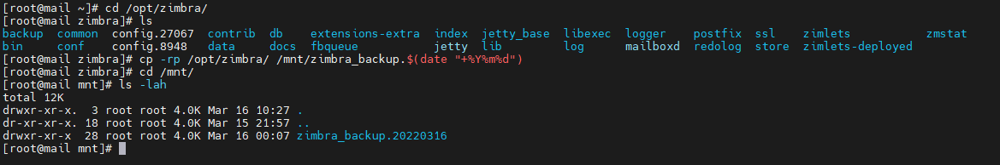

# Zimbra Backup and Restore
# 1. Backup
Bước 1: Đăng nhập với user Zimbra, và dừng các chương trình đang chạy
```sh
su zimbra
zmcontrol stop
```

- Đảm bảo rằng Zimbra đã dừng hoàn toàn
```sh
ps auxww | grep zimbra
```

`kill-9` bất kì tiến trình nào còn sót lại

Bước 2: Tạo bản sao lưu
- Đảm bảo rằng vị trí sao lưu có đủ dung lượng để chứa được bản sao lưu
- Tất cả thành phần mà Zimbra cần đều được lưu trữ trong chính thư mục Zimbra, nên chỉ cần sao chép thư mục đó vào một vị trí an toàn `cp -rp /opt/zimbra/ [vi_tri_sao_luu]/zimbra_backup`. Quá trình có thể mất 1 lúc 
Lưu ý: Nên gắn ngày sao lưu vào file
```sh
cp -rp /opt/zimbra /mnt/zimbra_backup.$(date "+%Y%m%d")
```



# 2. Restore
Bước 1: Đảm bảo các chương trình liên quan đến Zimbra đã dừng
```sh
su zimbra
zmcontrol stop
```

Bước 2: Sao chép bản sao lưu đã tạo trước đó vào thư mục `/opt` và đặt tên là `zimbra`
```sh
cp -rp /mnt/zimbra_backup/ /opt
mv /opt/zimbra_backup/ /opt/zimbra
```

Bước 4: Cài đặt lại Zimbra 
- Tải zimbra 9.0, giải nén và cài đặt (Có thể dùng file cũ để cài đặt)
```sh
tar zcs-9.0.0_GA_1.RHEL7_64.20200411070311.tgz
cd zcs-9.0.0_GA_1.RHEL7_64.20200411070311.tgz
./install.sh
```

- Lưu ý: Không chạy tập lệnh với option -u. Nó sẽ xóa dữ liệu sao lưu và chạy với quyền root
Nếu không gặp lỗi nào, sẽ có thông báo hiện thị như sau: 
```sh
The Zimbra Collaboration Suite appears already to be installed.

It can be upgraded with no effect on existing accounts,

or the current installation can be completely removed prior

to installation for a clean install.

Do you wish to upgrade? [Y]
```

>> Chọn Y để đồng ý

- Tập lệnh sẽ xóa bỏ các gói hiện tại và cài đặt lại chúng. Nó sẽ dừng dịch vụ Zimbra cũ và chạy với file đã sao lưu trước đó

Bước 3: Đặt lại quyền 
```sh
chown -R zimbra:zimbra /opt/zimbra/store
chown -R zimbra:zimbra /opt/zimbra/index
```

```sh
/opt/zimbra/libexec/zmfixperms
```

