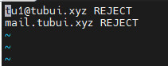
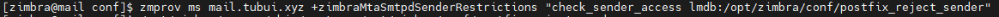
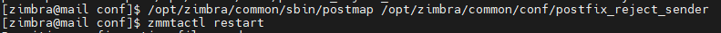
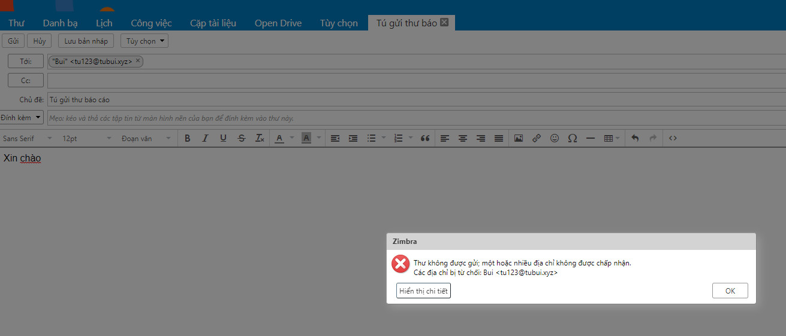

# Chặn gửi email đến email server Zimbra
- Tạo tệp /opt/zimbra/common/conf/postfix_reject_sender. Với danh sách địa chỉ IP, tên miền bị từ chối ở định dạng dưới đây
```sh
user@domain.com REJECT
domain.com REJECT
```



- Truy cập vào user Zimbra và thực hiện lệnh sau
```sh
su zimbra
zmprov ms mail.tubui.xyz +zimbraMtaSmtpdSenderRestrictions "check_sender_access lmdb:/opt/zimbra/conf/postfix_reject_sender"
```



- `Postmap` với file đã tạo và khởi động lại `zmmtactl`
```sh
/opt/zimbra/common/sbin/postmap /opt/zimbra/common/conf/postfix_reject_sender
zmmtactl restart
```



- Đăng nhập vào user tu1 và thực hiện gửi thư để kiểm tra gửi mail (Gửi thư từ tu1@tubui.xyz đến tu123@tubui.xyz)


