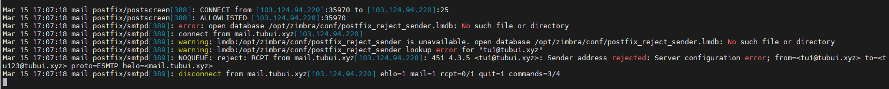
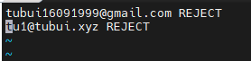
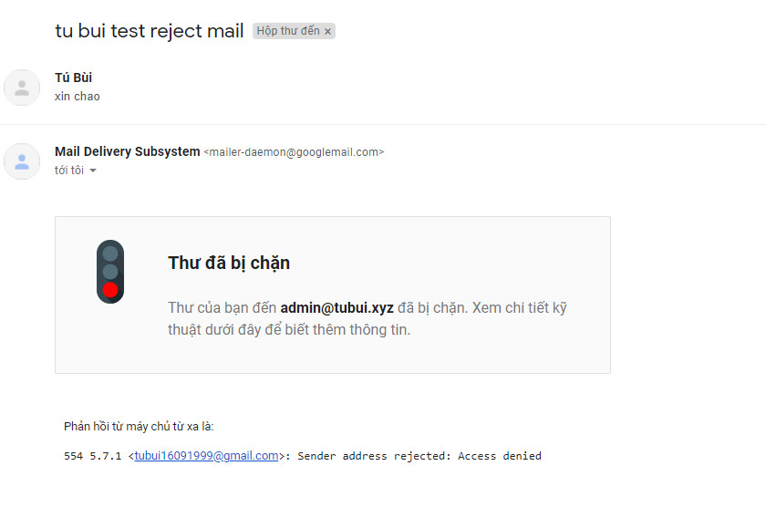
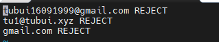
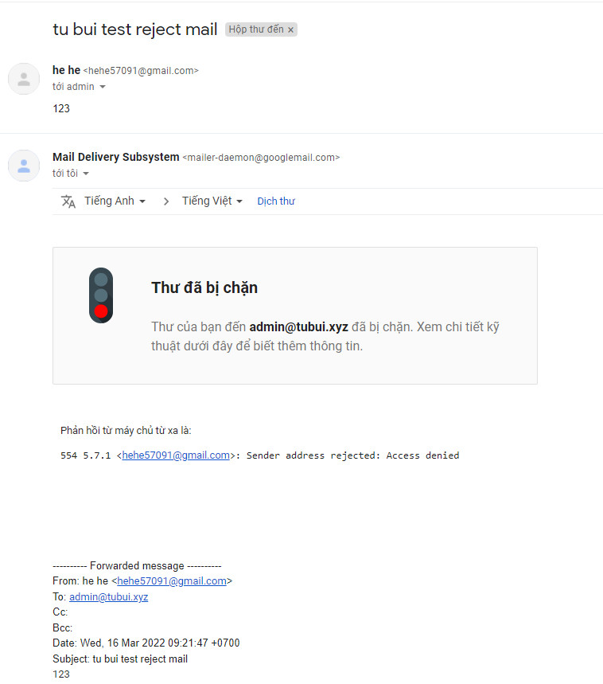

# Chặn gửi email đến email server Zimbra
## 1. Chặn thư từ tu1@tubui.xyz đến zimbra server
- Tạo tệp `/opt/zimbra/conf/postfix_reject_sender`. Với danh sách địa chỉ IP, tên miền bị từ chối ở định dạng dưới đây
```sh
user@domain.com REJECT
domain.com REJECT
```


- Truy cập vào user Zimbra và thực hiện lệnh sau
```sh
su zimbra
zmprov ms mail.tubui.xyz +zimbraMtaSmtpdSenderRestrictions "check_sender_access lmdb:/opt/zimbra/conf/postfix_reject_sender"
```


- `Postmap` với file đã tạo và khởi động lại `zmmtactl`
```sh
/opt/zimbra/common/sbin/postmap /opt/zimbra/conf/postfix_reject_sender
zmmtactl restart
```


- Đăng nhập vào user tu1 và thực hiện gửi thư để kiểm tra gửi mail (Gửi thư từ tu1@tubui.xyz đến tu123@tubui.xyz)




## 2. Chặn thư từ tubui@gmail.com đến zimbra server
- Chỉnh sửa tệp `/opt/zimbra/conf/postfix_reject_sender` đã tạo trước đó
```sh
tubui16091999@gmail.com REJECT
```



- Khởi động lại `zmmtactl` 
```sh
zmmtactl restart
```

- Đăng nhâp vào tubui16091999@gmail.com gửi thư đến admin@tubui.xyz để kiểm tra add reject




## 3. Chặn thư từ những user đuôi @gmail.com đến zimbra server
- Chỉnh sửa tệp `/opt/zimbra/conf/postfix_reject_sender` đã tạo trước đó
```sh
gmail.com REJECT
```



- Khởi động lại `zmmtactl`
```sh
zmmtactl restart
```

- Đăng nhập vào hehe57091@gmail.com gửi thư đến admin@tubui.xyz để kiểm tra add reject

