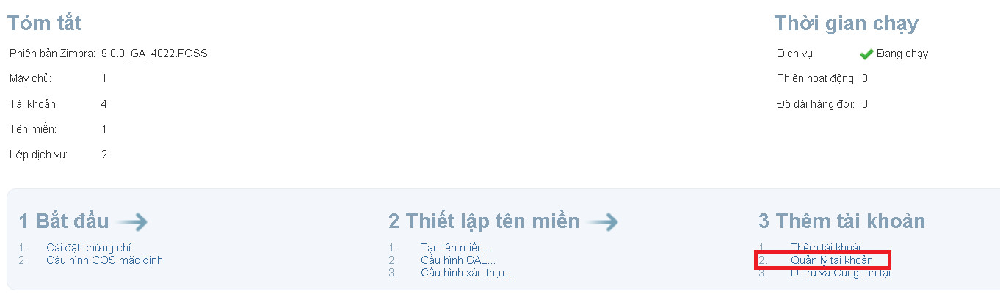
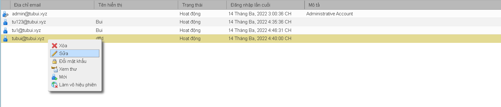
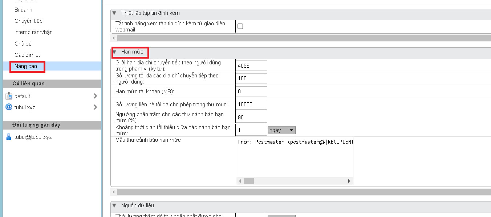
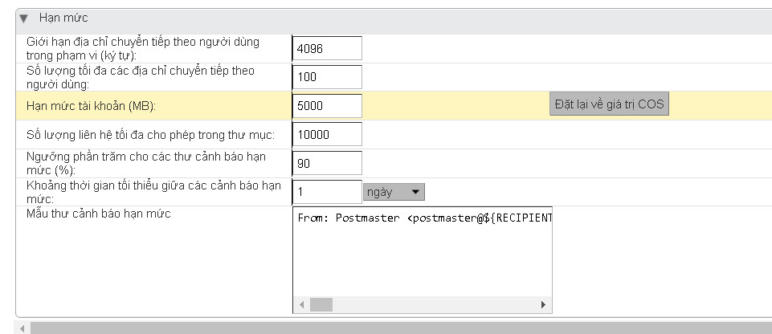

# Chỉnh sửa quota account email Zimbra
- Khi tạo 1 account email trong server zimbra hệ thống sẽ tự động phân chia `quota` cho mỗi account theo mặc định. Trong thực tế việc thiết lập quota cho account khác nhau với giá trị khác nhau là cần thiết tùy thuộc vào nhu cầu sử dụng của account đó
	+ Truy cập `Trang chủ` -> `Quản lý tài khoản`

	

	+ Lựa chọn tài khoản muốn sửa 

	

	+ Chọn `Nâng cao` -> `Hạn mức`

	

	+ Tùy chỉnh các tham số
	```sh
	Giới hạn địa chỉ chuyển tiếp theo người dùng trong phạm vi (ký tự)
	Số lượng tối đa các địa chỉ chuyển tiếp theo người dùng
	Hạn mức tài khoản (MB) (0 là không có giới hạn)
	Số lượng liên hệ tối đa cho phép trong thư mục
	Ngưỡng phần trăm cho các thư cảnh báo hạn mức (%)
	Khoảng thời gian tối thiểu giữa các cảnh báo hạn mức
	Mẫu thư cảnh báo hạn mức
	```

	

	