# Cài đặt email server zimbra trên CentOS7
## 1. Chuẩn bị 
- Phiên bản zimbra 9.0 trên CentOS 7
- Cấu hình tối thiểu: RAM: 2GB, Disk: 30GB, CPU: 3 core
- Chuẩn bị tên miền: Tên miền đã trỏ bản ghi MX
Tên miền: tubui.xyz
- Update OS
```sh 
yum install epel-release -y
yum update -y
```
- Cài đặt đồng bộ thời gian
```sh
yum install chronyd -y
systemctl start chronyd
systemctl enable chronyd
systemctl restart chronyd
chronyd sources -v
```

- Cập nhật múi giờ
```sh
ln -f -s /usr/share/zoneinfo/Asia/Ho_Chi_Minh /etc/localtime
```

- Cài đặt cmdlog
```sh
curl -Lso- https://raw.githubusercontent.com/nhanhoadocs/ghichep-cmdlog/master/cmdlog.sh | bash
```

- Thiết lập Firewall, selinux và một số package cơ bản
```sh
systemctl disable firewalld
systemctl stop firewalld
sed -i 's/SELINUX=enforcing/SELINUX=disabled/g' /etc/sysconfig/selinux
sed -i 's/SELINUX=enforcing/SELINUX=disabled/g' /etc/selinux/config
yum install -y git wget byobu

service sendmail stop
service iptables stop
service ip6tables stop
chkconfig sendmail off
chkconfig iptables off
chkconfig ip6tables off
service httpd stop
chkconfig httpd off

init 6
```

## 2. Cài đặt email server zimbra 
- Cài package cần thiết 
```sh
yum install unzip net-tools sysstat openssh-clients perl-core libaio nmap-ncat libstdc++.so.6 nano wget -y 
```
- Đổi hostname, add hostname
```sh
hostnamectl set-hostname mail.tubui.xyz 
cat << EOF >> /etc/hosts
103.124.94.220 mail.tubui.xyz mail
EOF

init 6
```

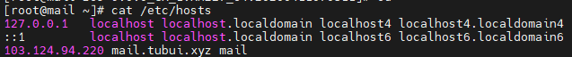

- Truy cập vào https://s3.beezim.fr/beebot/upload/09830127-c2f1-43cb-b3fa-c35fc514e539/zcs-9.0.0_GA_1.RHEL7_64.20200411070311.tgz để tải zimbra 9 về máy
- Sau khi tải về máy, thực hiện transfer sang vps bằng công cụ WinSCP

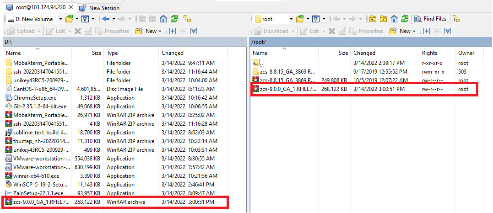

- Giải nén và cài đặt
```sh
tar zcs-9.0.0_GA_1.RHEL7_64.20200411070311.tgz
cd zcs-9.0.0_GA_1.RHEL7_64.20200411070311.tgz
./install.sh
```

- Ở bước này lưu ý một số tùy chọn cài đặt
```
Do you agree with the terms of the software license agreement? [N] Y

Use Zimbra's package repository [Y] Y

Select the packages to install

Install zimbra-ldap [Y] Y

Install zimbra-logger [Y] Y

Install zimbra-mta [Y] Y

Install zimbra-dnscache [Y] N

Install zimbra-snmp [Y] Y

Install zimbra-store [Y] Y

Install zimbra-apache [Y] Y

Install zimbra-spell [Y] Y

Install zimbra-memcached [Y] Y

Install zimbra-proxy [Y] Y

Install zimbra-drive [Y] Y

Install zimbra-imapd (BETA - for evaluation only) [N] N

The system will be modified.  Continue? [N] Y
```

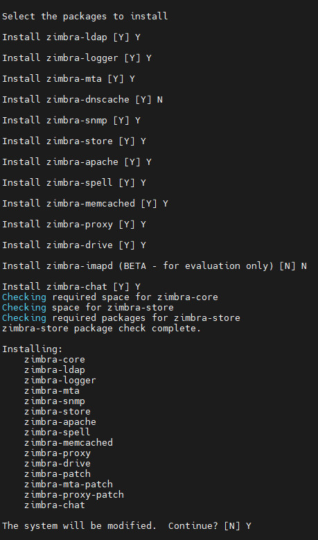

- Xác nhận thay đổi domain và nhập domain

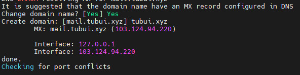

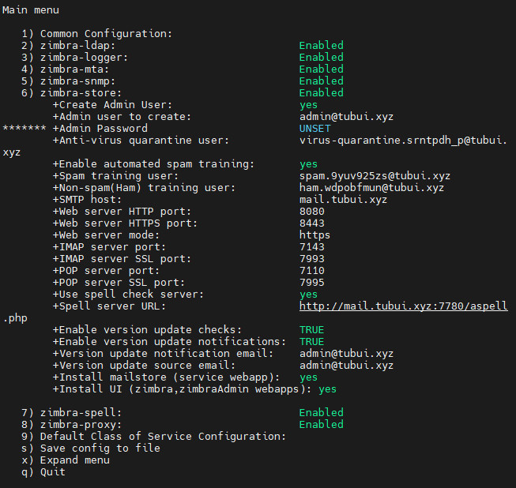

- Hệ thống sẽ báo password account admin zimbra chưa được nhập, cần đặt lại password admin zimbra
`Chọn 6 -> Chọn 4 -> Nhập pass => Enter`

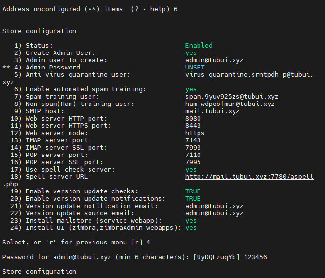

- Chọn `r` để quay lại menu chính, chọn `a` để lưu cấu hình  

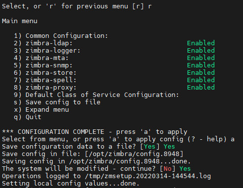

- Chờ quá trình lưu cấu hình hoàn tất
```sh
Notify Zimbra of your installation? [Yes] Yes
Configuration complete - press return to exi
```

- Blocking Memcached Exploit
```sh
su zimbra
/opt/zimbra/bin/zmprov ms `zmhostname` zimbraMemcachedBindAddress 127.0.0.1
/opt/zimbra/bin/zmprov ms `zmhostname` zimbraMemcachedClientServerList 127.0.0.1
```

- Restart memcached
```sh
zmmemcachedctl restart
```

- Truy cập 
```sh
https://tubui.xyz:7071
```

Hoặc 
```sh
https://103.124.94.220:7071
```

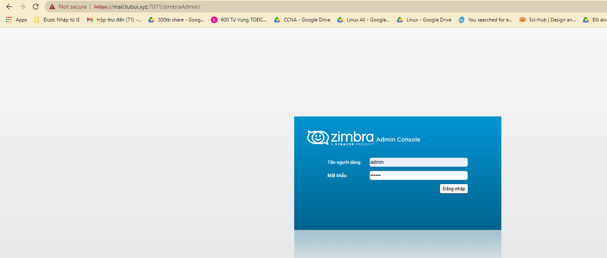

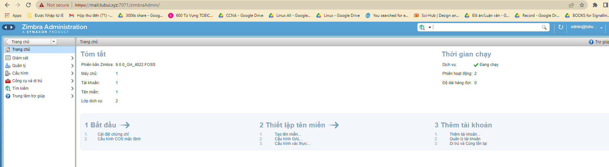

3. Kiểm tra gửi - nhận
```sh
su - zimbra
zmcontrol status
```

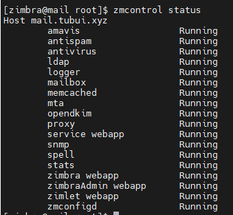

- Đảm bảo đầy đủ các bản ghi MX, PTR, SPF, DKIM, DMARC
	+ Thêm bản ghi A: Tên `mail` loại bản ghi `A` giá trị `103.124.94.220`
	+ Thêm bản ghi MX: Tên `@` loại bản ghi `MX` giá trị `mail.tubui.xyz`
	+ Thêm bản ghi TXT: Tên `_dmarc` loại bản ghi `txt` giá trị `v=DMARC1; p=none; rua=mailto:mailauth-reports@mail.tubui.xyz`
	+ Thêm bản ghi TXT: Tên bản ghi `@` loại bản ghi `txt` giá trị `v=spf1 +a +mx +ip4:103.124.94.220 ~all`

- Active dkim cho domain tubui.xyz
```sh
su - zimbra
/opt/zimbra/libexec/zmdkimkeyutil -a -d tubui.xyz
```

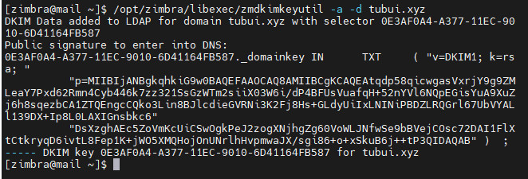

- Get dkim record
```sh
/opt/zimbra/libexec/zmdkimkeyutil -a -d tubui.xyz
```

```sh
DKIM Public signature:
0E3AF0A4-A377-11EC-9010-6D41164FB587._domainkey IN      TXT     ( "v=DKIM1; k=rsa; "
          "p=MIIBIjANBgkqhkiG9w0BAQEFAAOCAQ8AMIIBCgKCAQEAtqdp58qicwgasVxrjY9g9ZMLeaY7Pxd62Rmn4Cyb446k7zz321SsGzWTm2siiX03W6i/dP4BFUsVuafqH+52nYVl6NQpEGisYuA9XuZj6h8sqezbCA1ZTQEngcCQko3Lin8BJlcdieGVRNi3K2Fj8Hs+GLdyUiIxLNINiPBDZLRQGrl67UbVYALl139DX+Ip8L0LAXIGnsbkc6"
          "DsXzghAEc5ZoVmKcUiCSwOgkPeJ2zogXNjhgZg60VoWLJNfwSe9bBVejCOsc72DAI1FlXtCtkryqD6ivtL8Fep1K+jWO5XMQHojOnUNrlhHvpmwaJX/sgi86+o+xSkuB6j++tP3QIDAQAB" )  ; ----- DKIM key 0E3AF0A4-A377-11EC-9010-6D41164FB587 for tubui.xyz

DKIM Identity:
tubui.xyz
```

- Bản ghi DKIM tên `0E3AF0A4-A377-11EC-9010-6D41164FB587._domainkey` loại bản ghi `txt` giá trị 
```sh
"v=DKIM1; k=rsa; p=MIIBIjANBgkqhkiG9w0BAQEFAAOCAQ8AMIIBCgKCAQEAtqdp58qicwgasVxrjY9g9ZMLeaY7Pxd62Rmn4Cyb446k7zz321SsGzWTm2siiX03W6i/dP4BFUsVuafqH+52nYVl6NQpEGisYuA9XuZj6h8sqezbCA1ZTQEngcCQko3Lin8BJlcdieGVRNi3K2Fj8Hs+GLdyUiIxLNINiPBDZLRQGrl67UbVYALl139DX+Ip8L0LAXIGnsbkc6DsXzghAEc5ZoVmKcUiCSwOgkPeJ2zogXNjhgZg60VoWLJNfwSe9bBVejCOsc72DAI1FlXtCtkryqD6ivtL8Fep1K+jWO5XMQHojOnUNrlhHvpmwaJX/sgi86+o+xSkuB6j++tP3QIDAQAB"
```

- Kiểm tra thư gửi đến email

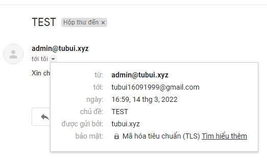

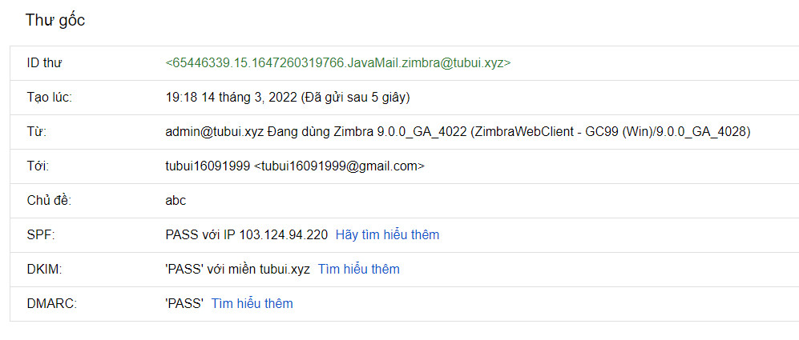