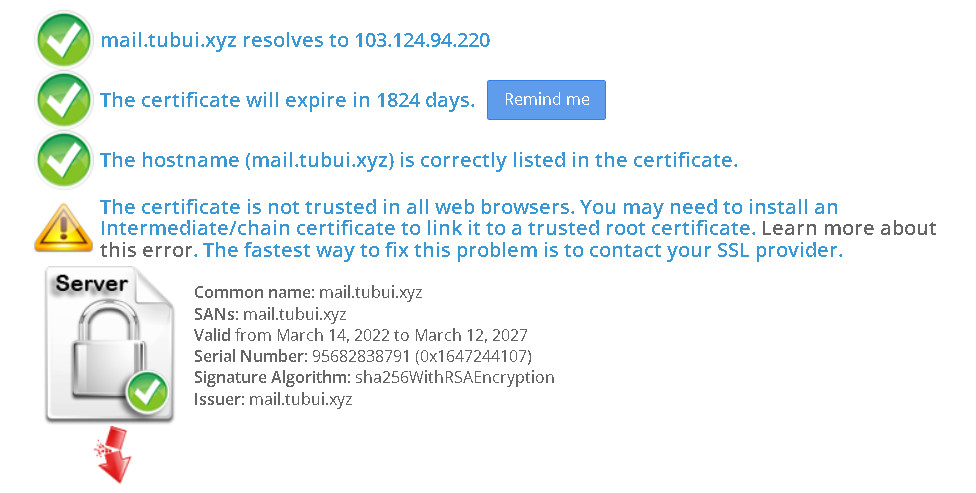
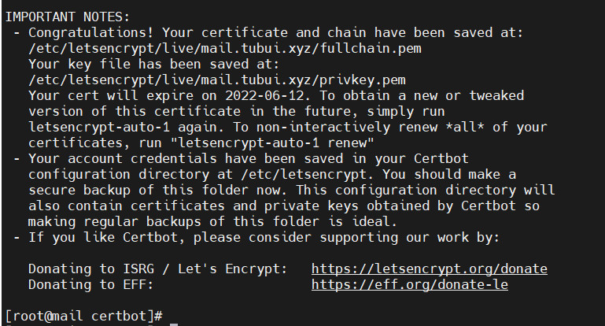
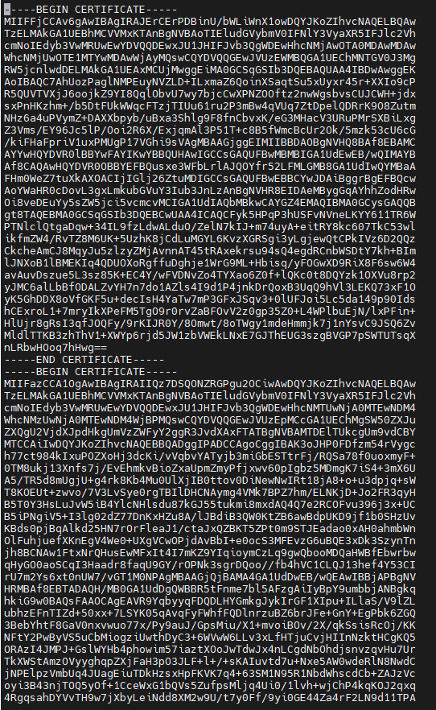
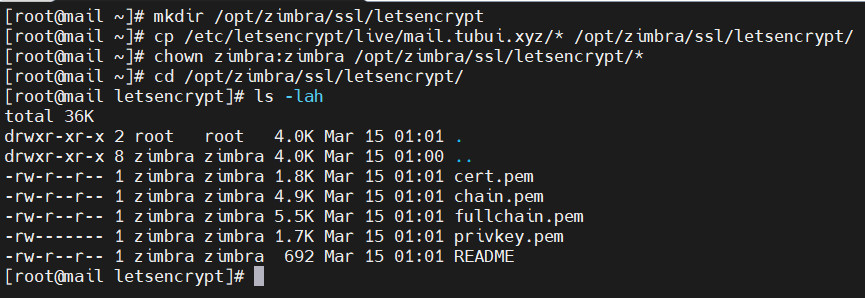

# Cài đặt SSL Let's Encrypt email server zimbra
- Email server Zimbra hỗ trợ việc cài đặt chứng chỉ SSL miễn phí Let's Encrypt cho mail domain đại diện cho email server
- Truy cập vào https://www.sslshopper.com/ssl-checker.html để check trạng thái chứng chỉ SSL cho tên miền
- Cài đặt Let's Encrypt cho `mail.tubui.xyz`



## Các bước cài đặt 
Bước 1: Truy cập ssh vào server zimbra và stop hết các service
```sh
su zimbra
zmcontrol stop
```


Bước 2: Cài đặt git cho server
```sh
yum install git -y
```

Bước 3: Tiến hành clone Let's Encrypt 
```sh
git clone https://github.com/certbot/certbot
cd certbot
```

Bước 4: Chạy auto chứng chỉ Let's Encrypt cho tên miền mail.tubui.xyz
```sh
./letsencrypt-auto certonly --standalone
```




Bước 5: Kiểm tra lại key đã được tạo ra trong đường dẫn `/etc/letsencrypt/live/$domain` với `$domain` là tên domain mail.tubui.xyz nhập ở bước trên. Kết quả hiển thị giống ảnh phía dưới


Bước 6: Mở file `/etc/letsencrypt/live/$domain/chain.pem` và chèn thêm đoạn mã sau và cuối file (Thay `$domain` bằng tên miền mail.tubui.xyz)
```sh
-----BEGIN CERTIFICATE-----
MIIDSjCCAjKgAwIBAgIQRK+wgNajJ7qJMDmGLvhAazANBgkqhkiG9w0BAQUFADA/
MSQwIgYDVQQKExtEaWdpdGFsIFNpZ25hdHVyZSBUcnVzdCBDby4xFzAVBgNVBAMT
DkRTVCBSb290IENBIFgzMB4XDTAwMDkzMDIxMTIxOVoXDTIxMDkzMDE0MDExNVow
PzEkMCIGA1UEChMbRGlnaXRhbCBTaWduYXR1cmUgVHJ1c3QgQ28uMRcwFQYDVQQD
Ew5EU1QgUm9vdCBDQSBYMzCCASIwDQYJKoZIhvcNAQEBBQADggEPADCCAQoCggEB
AN+v6ZdQCINXtMxiZfaQguzH0yxrMMpb7NnDfcdAwRgUi+DoM3ZJKuM/IUmTrE4O
rz5Iy2Xu/NMhD2XSKtkyj4zl93ewEnu1lcCJo6m67XMuegwGMoOifooUMM0RoOEq
OLl5CjH9UL2AZd+3UWODyOKIYepLYYHsUmu5ouJLGiifSKOeDNoJjj4XLh7dIN9b
xiqKqy69cK3FCxolkHRyxXtqqzTWMIn/5WgTe1QLyNau7Fqckh49ZLOMxt+/yUFw
7BZy1SbsOFU5Q9D8/RhcQPGX69Wam40dutolucbY38EVAjqr2m7xPi71XAicPNaD
aeQQmxkqtilX4+U9m5/wAl0CAwEAAaNCMEAwDwYDVR0TAQH/BAUwAwEB/zAOBgNV
HQ8BAf8EBAMCAQYwHQYDVR0OBBYEFMSnsaR7LHH62+FLkHX/xBVghYkQMA0GCSqG
SIb3DQEBBQUAA4IBAQCjGiybFwBcqR7uKGY3Or+Dxz9LwwmglSBd49lZRNI+DT69
ikugdB/OEIKcdBodfpga3csTS7MgROSR6cz8faXbauX+5v3gTt23ADq1cEmv8uXr
AvHRAosZy5Q6XkjEGB5YGV8eAlrwDPGxrancWYaLbumR9YbK+rlmM6pZW87ipxZz
R8srzJmwN0jP41ZL9c8PDHIyh8bwRLtTcm1D9SZImlJnt1ir/md2cXjbDaJWFBM5
JDGFoqgCWjBH4d1QB7wCCZAA62RjYJsWvIjJEubSfZGL+T0yjWW06XyxV3bqxbYo
Ob8VZRzI9neWagqNdwvYkQsEjgfbKbYK7p2CNTUQ
-----END CERTIFICATE-----
```



Bước 7: `Verify certificate`
- Copy Let’s Encrypt folder trong `/etc/letsencrypt/live/$domain` tới thư mục `/opt/zimbra/ssl/letsencrypt` và phân quyền cho thư mục với các lệnh bên dưới
```sh
mkdir /opt/zimbra/ssl/letsencrypt
cp * /opt/zimbra/ssl/letsencrypt/
chown zimbra:zimbra /opt/zimbra/ssl/letsencrypt/*
```



Bước 8: Verify chứng chỉ, với phiên bản zimbra 8.7 trở lên (Với phiên bản từ 8.6 trỏ xuống dùng user root nên bỏ qua lệnh `su zimbra`)
```sh
su zimbra
cd /opt/zimbra/ssl/letsencrypt
/opt/zimbra/bin/zmcertmgr verifycrt comm privkey.pem cert.pem chain.pem
```


Bước 9: Deloy Let's Encrypt SSL certificate mới, lệnh bên dưới sử dụng với quyền `root`
- Backup thư mục SSL của zimbra
```sh
cp -a /opt/zimbra/ssl/zimbra /opt/zimbra/ssl/zimbra.$(date "+%Y%m%d")
```

- Copy private key tới đường dẫn Zimbra SSL commercial.key
```sh
cp /opt/zimbra/ssl/letsencrypt/privkey.pem /opt/zimbra/ssl/zimbra/commercial/commercial.key
chown zimbra:zimbra /opt/zimbra/ssl/zimbra/commercial/commercial.key
```

- Deploy 
```sh
su zimbra
cd /opt/zimbra/ssl/letsencrypt
/opt/zimbra/bin/zmcertmgr deploycrt comm cert.pem chain.pem
```

Lưu ý: Lệnh deploy SSL áp dụng với zimbra version 8.7 trỏ lên, với zimbra version 8.6 trở xuống bỏ qua `su zimbra`


Bước 10: Restart service zimbra
```sh
su zimbra
zmcontrol restart
```

- Kiểm tra sau khi cài đặt SSL Let's Encrypt


