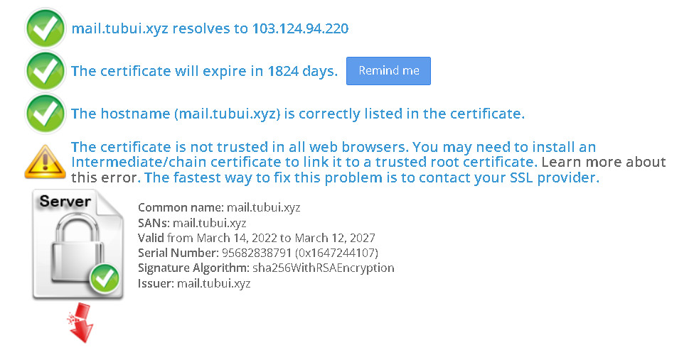
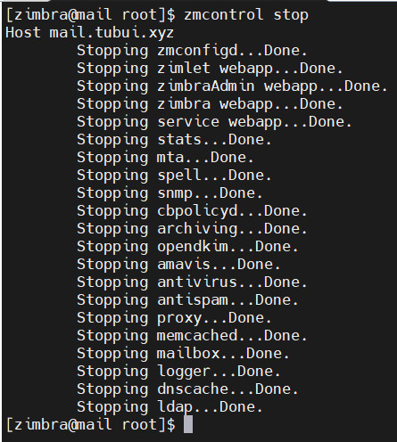
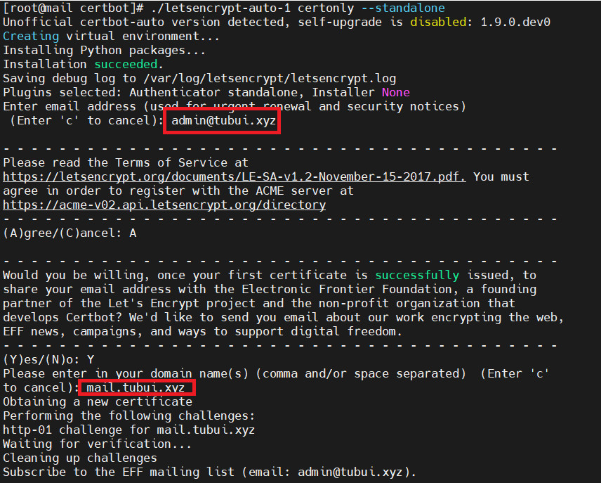
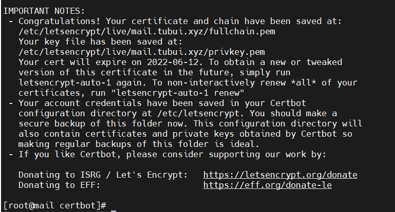
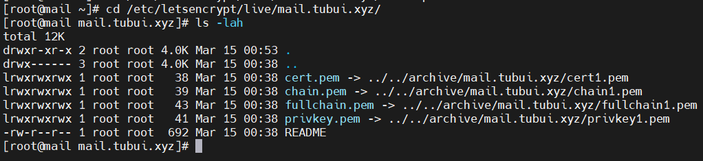
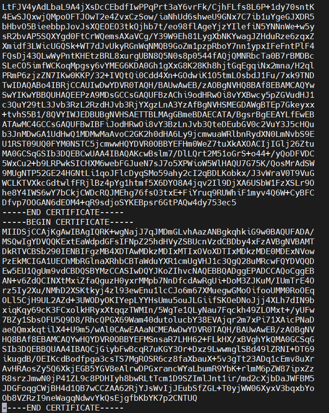
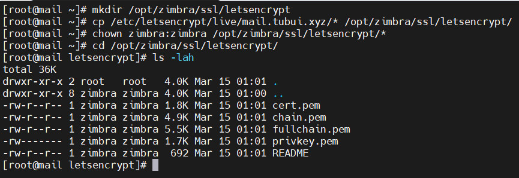
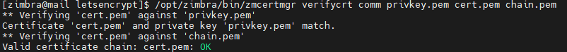
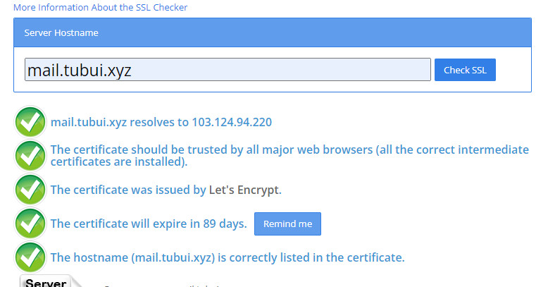
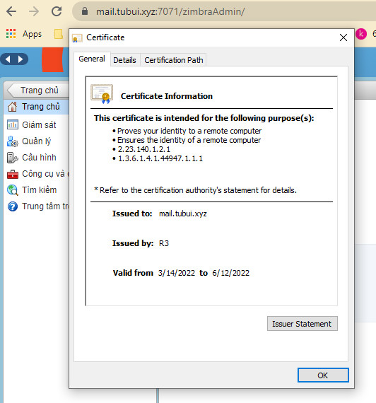

# Cài đặt SSL Let's Encrypt email server zimbra
- Email server Zimbra hỗ trợ việc cài đặt chứng chỉ SSL miễn phí Let's Encrypt cho mail domain đại diện cho email server
- Truy cập vào https://www.sslshopper.com/ssl-checker.html để check trạng thái chứng chỉ SSL cho tên miền
- Cài đặt Let's Encrypt cho `mail.tubui.xyz`



## Các bước cài đặt 
Bước 1: Truy cập ssh vào server zimbra và stop hết các service
```sh
su zimbra
zmcontrol stop
```



Bước 2: Cài đặt git cho server
```sh
yum install git -y
```

Bước 3: Tiến hành clone Let's Encrypt 
```sh
git clone https://github.com/certbot/certbot
cd certbot
```

Bước 4: Chạy auto chứng chỉ Let's Encrypt cho tên miền mail.tubui.xyz
```sh
./letsencrypt-auto certonly --standalone
```





Bước 5: Kiểm tra lại key đã được tạo ra trong đường dẫn `/etc/letsencrypt/live/$domain` với `$domain` là tên domain mail.tubui.xyz nhập ở bước trên. Kết quả hiển thị giống ảnh phía dưới



Bước 6: Mở file `/etc/letsencrypt/live/$domain/chain.pem` và chèn thêm đoạn mã sau và cuối file (Thay `$domain` bằng tên miền mail.tubui.xyz)
```sh
-----BEGIN CERTIFICATE-----
MIIFazCCA1OgAwIBAgIRAIIQz7DSQONZRGPgu2OCiwAwDQYJKoZIhvcNAQELBQAw
TzELMAkGA1UEBhMCVVMxKTAnBgNVBAoTIEludGVybmV0IFNlY3VyaXR5IFJlc2Vh
cmNoIEdyb3VwMRUwEwYDVQQDEwxJU1JHIFJvb3QgWDEwHhcNMTUwNjA0MTEwNDM4
WhcNMzUwNjA0MTEwNDM4WjBPMQswCQYDVQQGEwJVUzEpMCcGA1UEChMgSW50ZXJu
ZXQgU2VjdXJpdHkgUmVzZWFyY2ggR3JvdXAxFTATBgNVBAMTDElTUkcgUm9vdCBY
MTCCAiIwDQYJKoZIhvcNAQEBBQADggIPADCCAgoCggIBAK3oJHP0FDfzm54rVygc
h77ct984kIxuPOZXoHj3dcKi/vVqbvYATyjb3miGbESTtrFj/RQSa78f0uoxmyF+
0TM8ukj13Xnfs7j/EvEhmkvBioZxaUpmZmyPfjxwv60pIgbz5MDmgK7iS4+3mX6U
A5/TR5d8mUgjU+g4rk8Kb4Mu0UlXjIB0ttov0DiNewNwIRt18jA8+o+u3dpjq+sW
T8KOEUt+zwvo/7V3LvSye0rgTBIlDHCNAymg4VMk7BPZ7hm/ELNKjD+Jo2FR3qyH
B5T0Y3HsLuJvW5iB4YlcNHlsdu87kGJ55tukmi8mxdAQ4Q7e2RCOFvu396j3x+UC
B5iPNgiV5+I3lg02dZ77DnKxHZu8A/lJBdiB3QW0KtZB6awBdpUKD9jf1b0SHzUv
KBds0pjBqAlkd25HN7rOrFleaJ1/ctaJxQZBKT5ZPt0m9STJEadao0xAH0ahmbWn
OlFuhjuefXKnEgV4We0+UXgVCwOPjdAvBbI+e0ocS3MFEvzG6uBQE3xDk3SzynTn
jh8BCNAw1FtxNrQHusEwMFxIt4I7mKZ9YIqioymCzLq9gwQbooMDQaHWBfEbwrbw
qHyGO0aoSCqI3Haadr8faqU9GY/rOPNk3sgrDQoo//fb4hVC1CLQJ13hef4Y53CI
rU7m2Ys6xt0nUW7/vGT1M0NPAgMBAAGjQjBAMA4GA1UdDwEB/wQEAwIBBjAPBgNV
HRMBAf8EBTADAQH/MB0GA1UdDgQWBBR5tFnme7bl5AFzgAiIyBpY9umbbjANBgkq
hkiG9w0BAQsFAAOCAgEAVR9YqbyyqFDQDLHYGmkgJykIrGF1XIpu+ILlaS/V9lZL
ubhzEFnTIZd+50xx+7LSYK05qAvqFyFWhfFQDlnrzuBZ6brJFe+GnY+EgPbk6ZGQ
3BebYhtF8GaV0nxvwuo77x/Py9auJ/GpsMiu/X1+mvoiBOv/2X/qkSsisRcOj/KK
NFtY2PwByVS5uCbMiogziUwthDyC3+6WVwW6LLv3xLfHTjuCvjHIInNzktHCgKQ5
ORAzI4JMPJ+GslWYHb4phowim57iaztXOoJwTdwJx4nLCgdNbOhdjsnvzqvHu7Ur
TkXWStAmzOVyyghqpZXjFaH3pO3JLF+l+/+sKAIuvtd7u+Nxe5AW0wdeRlN8NwdC
jNPElpzVmbUq4JUagEiuTDkHzsxHpFKVK7q4+63SM1N95R1NbdWhscdCb+ZAJzVc
oyi3B43njTOQ5yOf+1CceWxG1bQVs5ZufpsMljq4Ui0/1lvh+wjChP4kqKOJ2qxq
4RgqsahDYVvTH9w7jXbyLeiNdd8XM2w9U/t7y0Ff/9yi0GE44Za4rF2LN9d11TPA
mRGunUHBcnWEvgJBQl9nJEiU0Zsnvgc/ubhPgXRR4Xq37Z0j4r7g1SgEEzwxA57d
emyPxgcYxn/eR44/KJ4EBs+lVDR3veyJm+kXQ99b21/+jh5Xos1AnX5iItreGCc=
-----END CERTIFICATE-----
```



Bước 7: `Verify certificate`
- Copy Let’s Encrypt folder trong `/etc/letsencrypt/live/$domain` tới thư mục `/opt/zimbra/ssl/letsencrypt` và phân quyền cho thư mục với các lệnh bên dưới
```sh
mkdir /opt/zimbra/ssl/letsencrypt 
cp /etc/letsencrypt/live/mail.congtynhanhoa.space/* /opt/zimbra/ssl/letsencrypt/
chown zimbra:zimbra /opt/zimbra/ssl/letsencrypt/*
```



Bước 8: Verify chứng chỉ, với phiên bản zimbra 8.7 trở lên (Với phiên bản từ 8.6 trỏ xuống dùng user root nên bỏ qua lệnh `su zimbra`)
```sh
su zimbra
cd /opt/zimbra/ssl/letsencrypt
/opt/zimbra/bin/zmcertmgr verifycrt comm privkey.pem cert.pem chain.pem
```



Bước 9: Deloy Let's Encrypt SSL certificate mới, lệnh bên dưới sử dụng với quyền `root`
- Backup thư mục SSL của zimbra
```sh
cp -a /opt/zimbra/ssl/zimbra /opt/zimbra/ssl/zimbra.$(date "+%Y%m%d")
```

- Copy private key tới đường dẫn Zimbra SSL commercial.key
```sh
cp /opt/zimbra/ssl/letsencrypt/privkey.pem /opt/zimbra/ssl/zimbra/commercial/commercial.key
chown zimbra:zimbra /opt/zimbra/ssl/zimbra/commercial/commercial.key
```

- Deploy 
```sh
su zimbra
cd /opt/zimbra/ssl/letsencrypt
/opt/zimbra/bin/zmcertmgr deploycrt comm cert.pem chain.pem
```

Lưu ý: Lệnh deploy SSL áp dụng với zimbra version 8.7 trỏ lên, với zimbra version 8.6 trở xuống bỏ qua `su zimbra`


Bước 10: Restart service zimbra
```sh
su zimbra
zmcontrol restart
```

- Kiểm tra sau khi cài đặt SSL Let's Encrypt



