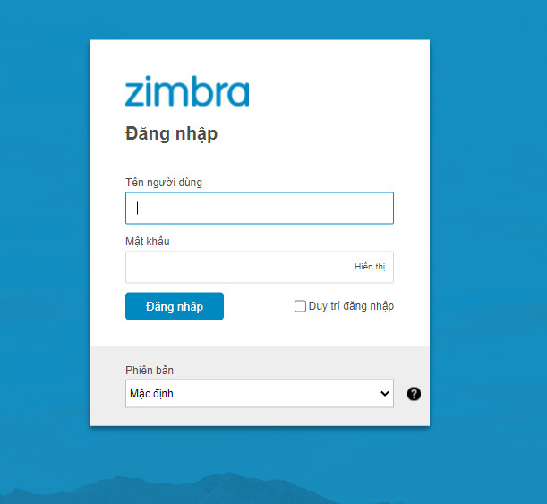
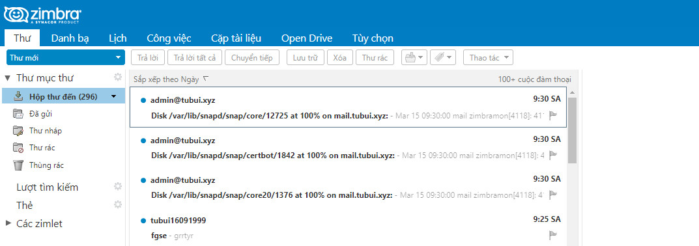
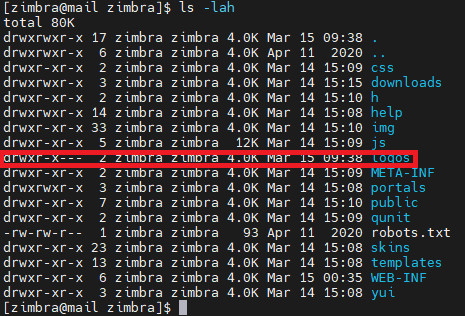
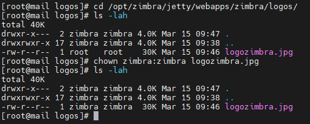
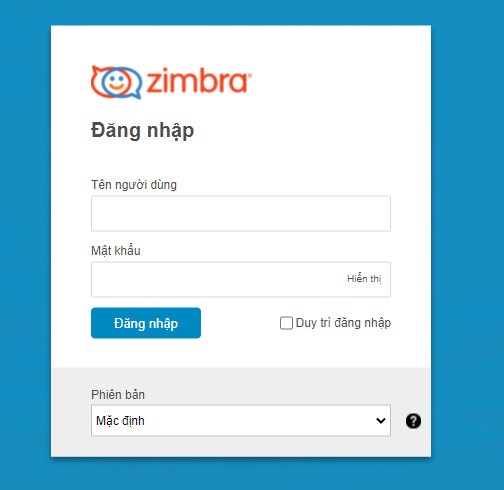
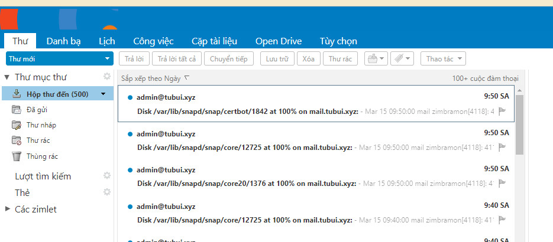

# Thay đổi logo trong email Zimbra
- Phiên bản email server Zimbra `Network Edition` hỗ trợ việc thay đổi logo trực tiếp trên giao diện web admin một cách dễ dàng, còn ở phiên bản email server zimbra `Open Source` có thể thiết lập thay đổi logo theo ý muốn thông qua một số thao tác
- Logo mặc định 
	+ Logo trước khi đăng nhập 

	

	+ Logo sau khi đăng nhập

	

	+ Lựa chọn logo đúng kích thước khuyến cáo khi thay thế sẽ vừa khung và đẹp hơn

- Thay đổi logo
Bước 1: Tạo thư mục và upload logo
```sh
su zimbra
mkdir /opt/zimbra/jetty/webapps/zimbra/logos/
```



Upload ảnh mới và phân quyền zimbra:zimbra



Bước 2: Thay thế logo 
```sh
zmprov md tubui.xyz zimbraSkinLogoURL /logos/logozimbra.jpg

zmprov md tubui.xyz zimbraSkinLogoLoginBanner /logos/logozimbra.jpg

zmprov md tubui.xyz zimbraSkinLogoAppBanner /logos/logozimbra.jpg

zmmailboxdctl restart
```
Lưu ý: Lệnh `zimbraSkinLogoLoginBanner` là thay đổi thông tin ngoài ô login, lệnh `zimbraSkinLogoAppBanner` là thay đổi logo sau khi login vào trong

Bước 3: Tải lại trang và kiểm tra 





>> Như vậy là đã thay đổi logo thành công theo ý muốn